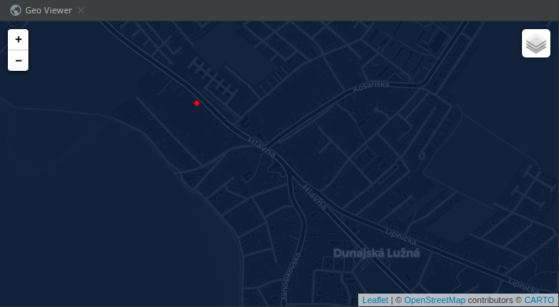
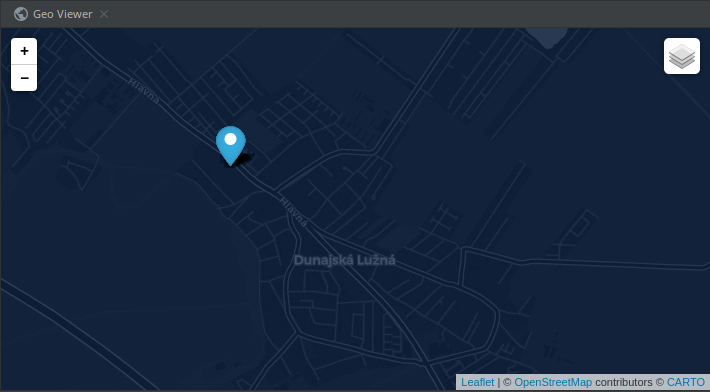
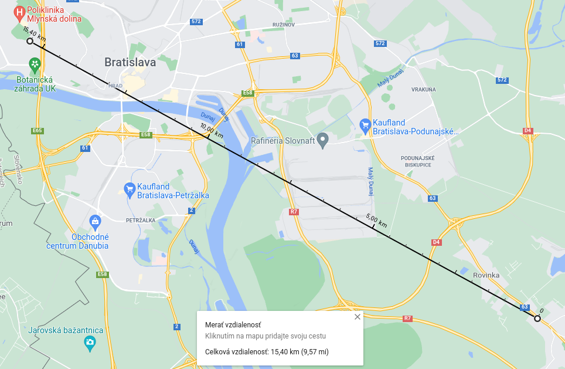
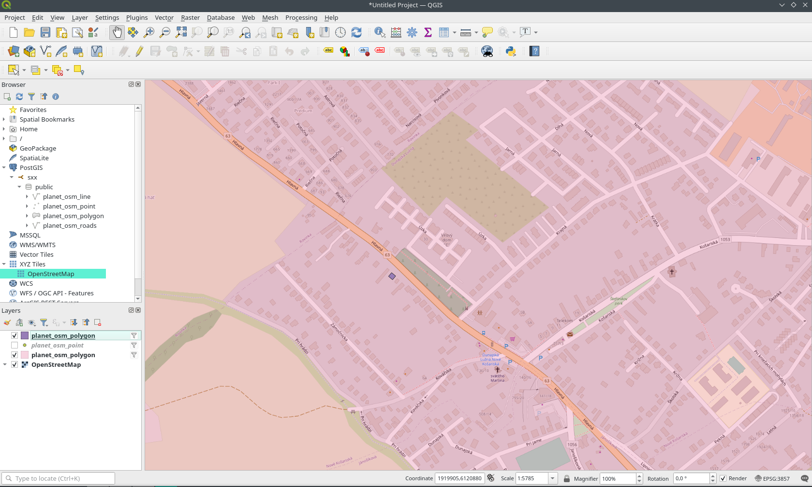

#zadanie 3
###autor: Filip Agh
###git: [link](https://github.com/filipagh/PDT-z3)


# uloha 1

```
osmconvert slovakia.osm.pbf > sk.osm
osm2pgsql -s -G -U postgres -H 172.24.0.2 -d gis -W sk.osm 
```

# uloha 2

hadam myslite tieto suradnice, neviem ci je ktomu co povedat, `st_centroid` na ziskanie stredu a `st_x/y` na suradnicu

```
select name, st_x(st_centroid(st_transform(way, 4326))), st_y(st_centroid(st_transform(way, 4326))) 
from planet_osm_polygon where admin_level = '4';
```

| name | st\_y | st\_x |
| :--- | :--- | :--- |
| Žilinský kraj | 49.17752905768327 | 19.177321920857167 |
| Prešovský kraj | 49.12365172843566 | 21.224595461701075 |
| Košický kraj | 48.697384329067646 | 21.266256940241764 |
| Banskobystrický kraj | 48.51572816850651 | 19.50392492773534 |
| Trenčiansky kraj | 48.858495744243044 | 18.213384781976906 |
| Bratislavský kraj | 48.31741208363053 | 17.17906589756936 |
| Trnavský kraj | 48.35301464227907 | 17.534836530917197 |
| Nitriansky kraj | 48.142012225316684 | 18.310838647219338 |


# uloha 3

st_area pocita velkost `geography` plochy v 4326 v m^2

```
select name,st_area(st_transform(way, 4326)::geography)/1000000 as area from planet_osm_polygon where admin_level = '4' order by area ;
```

| name | area |
| :--- | :--- |
| Bratislavský kraj | 2051.6740527689435 |
| Trnavský kraj | 4145.341158350747 |
| Trenčiansky kraj | 4501.797074561215 |
| Nitriansky kraj | 6341.249779583049 |
| Košický kraj | 6751.927549426961 |
| Žilinský kraj | 6806.9151049478 |
| Prešovský kraj | 8971.630508024544 |
| Banskobystrický kraj | 9454.543435236425 |

# uloha 4

pridanie nieje potrebne kedze sa tam uz nachadza

```
select 'Dom' as name,st_transform(way, 4326) from planet_osm_polygon where osm_id = 63143006 ;
```

| name | st\_transform |
| :--- | :--- |
| Dom | 0103000020E61000000100000005000000A1F48590F34031405389E22C360B4840FDB0941BFB403140C017FB0E340B48403AD0F9DF0041314043AD1665360B48400F98874CF940314070E3C379380B4840A1F48590F34031405389E22C360B4840 |



# uloha 5

hladame intersect polygonov

```
select kraj.name
from (select st_transform(way, 4326) as way from planet_osm_polygon where osm_id = 63143006) as dom,
     (select st_transform(way, 4326) as way, name from planet_osm_polygon where admin_level = '4') as kraj
where ST_INTERSECTS(dom.way, kraj.way);
```

| name |
| :--- |
| Bratislavský kraj |

# uloha 6

vlozime bod, `ST_SetSRID` ucri sur. sustavu, `st_transform` transformuje

```
INSERT INTO planet_osm_point(way, name)
VALUES (st_transform(ST_SetSRID(st_makepoint('17.25376', '48.08760'), 4326), 3857), 'my loc');
```

```
select st_transform(way, 4326)
from planet_osm_point
where name = 'my loc';
```



# uloha 7

`st_within` nam povie ci geo 1. je uplne v geo 2.

```
select st_within(poloha.way, dom.way)
from (select st_transform(way, 4326) as way from planet_osm_polygon where osm_id = 63143006) as dom,
     (select st_transform(way, 4326) as way from planet_osm_point where name = 'my loc') as poloha;
```

| st\_within |
| :--- |
| true |

# uloha 8

```
select ST_Distance(fiit.way::geography, poloha.way::geography) / 1000 as distance
from 
    (select st_centroid(st_transform(way, 4326)) as way
    from planet_osm_polygon
    where name = 'Fakulta informatiky a informačných technológií STU') as fiit,
    
    (select st_transform(way, 4326) as way 
    from planet_osm_point where name = 'my loc') as poloha;
```

v km

| distance |
| :--- |
| 15.42634150946 |



# uloha 9




# uloha 10

```
select st_x(c.centroid), st_y(c.centroid), 4326 as SRID
from (select st_centroid(st_transform(p.way, 4326)) as centroid
      from planet_osm_polygon as p,
           (select st_transform(way, 4326) as way from planet_osm_polygon where admin_level = '2') as sk
      where name like 'okres%'
        and st_within(st_transform(p.way, 4326), sk.way) is TRUE
      order by st_area(st_transform(p.way, 4326)::geography)
      limit 1) as c;
```

| st\_x | st\_y | srid |
| :--- | :--- | :--- |
| 17.099409275096463 | 48.150980221558584 | 4326 |

# uloha 11

```
select st_intersection(st_transform(r.way, 4326)::geometry, line.way::geometry) as way
from planet_osm_line as r,
     (select st_buffer(st_transform(st_intersection(malacky.way::geography, pezinok.way::geography)::geometry,
                                    4326)::geography, 10000) as way
      from (select osm_id, st_transform(way, 4326) as way, name
            from planet_osm_polygon
            where osm_id = '-388219') as malacky,

           (select osm_id, st_transform(way, 4326) as way, name
            from planet_osm_polygon
            where osm_id = '-388211') as pezinok
      limit 1) as line
where st_intersects(st_transform(r.way, 4326)::geometry, line.way::geometry) is true
  and r.highway is not null

```

# uloha 12

```
select k.nm5, k.idn5, st_transform(k.shape, 4326), road.way
from ku_0 as k,
     (select st_length(st_transform(r.way, 4326)::geography) as length, st_transform(r.way, 4326) as way, r.osm_id
      from (select st_transform(way, 4326) as way from planet_osm_polygon where name ilike 'okres senec') as okres,
           (select st_transform(
                           r.way, 4326) as way,
                   osm_id
            from planet_osm_line as r,
                 (
                     select st_buffer(st_centroid(st_transform(
                             malacky.way, 4326))::geography,
                                      50000) as way
                     from (select osm_id, st_transform(way, 4326) as way, name
                           from planet_osm_polygon
                           where name ilike 'okres senec') as malacky,

                          planet_osm_roads as r
                     limit 1) as aprox
            where st_within(st_transform(r.way, 4326)::geometry, aprox.way::geometry) is true
              and r.highway is not NULL) as r
      where st_contains(okres.way::geometry, st_transform(r.way, 4326)::geometry) is true
      order by length desc
      limit 1) as road
where st_intersects(st_transform(k.shape, 4326), road.way) is TRUE
```

| nm5 | idn5 | st\_transform | way |
| :--- | :--- | :--- | :--- |
| Blatné | 803065 | 0106000020E6100000010000000103000000010000003A0300001C89289A2166314004A1D7D6D42548406D581F97016631408698D89DDE254840C289DEB5ED653140B5CF6A3FDA254840E16A7AE8CE65314011500581D3254840BD2D08BAB56531407F4874DFCD2548402107398194653140C701BF73C62548402FA309AF7C653140A8F1FE3CC1254840FCF0A3E85165314009F586B5B7254840D89457034065314060C6C1A8B32548400C858DDC18653140192ACF1FAB254840B65A7C0DF064314076954011A225484028E5A6D8BD6431406CA452DB96254840FA10A38B9E643140ACC3CA18912548405918210585643140284DBE5F8B254840172B73DC656431407CBB527E842548400B2465ED47643140ACA210D37D25484048BE5FE23B64314044927C287B254840B7C3814638643140CCB20C5C7A25484083CE211C1464314090830246722548409F50D9D90B643140DEE0A8717025484026766B13FE6331403A70B9636D2548408A94ECA8F563314090F4CD756B2548403B2C7130EF633140B867A6FA692548405FE9E3B9D8633140B724C887642548401CF57424CA633140F303460E612548404647C723C563314022F883DD5F254840BF6F9018B163314031FB573F5B2548401F91BF1398633140E0F767B55425484084E7356C9163314065E679AC52254840B398689F8063314097B588C44D254840F9E3F9947A63314014C028A34B254840FCB461A473633140036B663E4925484087F76C746D633140C6510702472548402D65BEBB646331403186D86C43254840FF04C77A5F6331400EF8AA1741254840DA4DDF8D5A633140128AE1743E254840C853E26F546331406835A60A3B254840D3880C174B6331400543E0E534254840A7401D2342633140BD3745D52F254840E534B1D8396331408C28720D2A254840AC430F4733633140E758D07B2625484048DFA9612E63314039389A3B23254840F048AC0D296331400AA691841F2548401570B97B2163314044C14C9C1A2548400929511A1B6331401C4DD06D162548405DB50628186331406B3F6F0114254840282447EC15633140DDE79CA91225484006EE95BA14633140AC3B140B122548407902FA8212633140E4FB547E102548405A8774E8106331409FC924D90E2548400E347BC40C63314059E43ACE0B2548408F7A27D80A6331400313B9760A254840FC4E61B7066331402D066251072548401D2FBFFE00633140C923C45E022548405016B6A5F66231400D3EAFBCFA244840FBB5539FF1623140005AFD97F6244840ECF80180F0623140F8B038ABF52448408E53BE4AEF62314038BE4DACF4244840FD1587B4EE623140C7642831F4244840D037CDFBEB62314047AD561FF2244840471B4B25E6623140331BE9B1ED244840E4EFF7C20863314083087135E82448403E16780313633140C0F9BD51E6244840085097FB3763314082E51DFADF2448405BE0D5D2516331403E375927DD244840D14C77C75A63314076013D06DC244840F051461A646331407767CBD9DA24484042F70A866D63314046428329D9244840E880E6EC88633140DB4FB63FD4244840A2A80E37BE633140BEAAC6C5CA2448409100E820CD633140B17CC724C8244840F671F382DD633140F3296D0AC424484071BFFE89E56331400CF089A7C02448408FB4C677F063314075AFF315BB2448405D6293A0D36331409C84354DB1244840BD6E3379C0633140C80EF796AA244840C65A654FAD633140197164E1A32448401D3CD334A363314036072FCFA024484099C3704E9563314058B5C1949C2448405183E3BF93633140776E211C9C2448400FF8F321856331406FFF529A962448401A96B59A75633140E27D8EEF9024484047062448676331406555A4C98B2448407C242BDE51633140A2D2240A842448400DEE8D753C6331408AEB35657C244840609D73BC13633140355DD4D56D244840AA730AEC09633140F96C07816A24484004B2C8620A633140D72E219669244840173858660C6331407C7B339665244840693DCE080D633140FF6F0A5464244840A8E81A39086331408EEAFF74622448405AB231F6FD623140CD58E3705924484035C6DB9DF262314094186C5E50244840BD11FE1AEA623140AAE67D1A49244840CB81BBB4E562314028B0485744244840C9BBEEECE262314006D76852412448401F4EC359D662314022026316372448406C3AE7E9D26231400051926E3424484060949528C96231401C42A4E62C244840079B0697C36231406710678E2824484039AC714ABB6231403F791F7A2324484052587C03AC62314094607333182448405132083E9F62314036A531940E24484068DB74FC91623140FF8FE80103244840D2A98A4363623140393BD76E0824484023FACB1A3F623140DE591B990C24484014B25ECF136231406D005F9611244840ACED60B7EC613140D20D90D515244840DBBF8BADC0613140AB49364D1A244840D0F696CE94613140720BD09E1E244840E2250E488C613140E0044D6F1F24484042DAE5E980613140938F698B0E244840D843981E7661314003066E45FE234840E9D269C86B6131400D8BE576F0234840FF8617FE68613140F25ABF16EC234840FD4600985861314076EA9528ED234840920343E9576131405CA84BA4EC234840BC4921814A61314091844A80E2234840E16FAF233D6131405AD538ACD8234840C065F02333613140350E5360D1234840F42DBD4D26613140A7443833C6234840AC361E4F16613140C1A8C84BBA2348409A503DD6026131406268523EAB23484050673AA6F96031409F93858AA3234840E9B80616EB6031408DBE0B7299234840B7DFB2A4E1603140B41CCA479323484029FC71B4D8603140C3A45E1E8F234840C3F8B57AC2603140EA65291385234840B075EEE2C0603140268BF09383234840356A011BC0603140BB536B2F83234840B1EF91E9BD6031402421451282234840C35891C1AF603140CA0EAA4F7B2348404A19C5F5A56031401DEEB098752348405D6760B1A56031407EE4D472752348407A86B39AA36031401A2C6476742348405C20258686603140708F932679234840EF248D7E71603140843BF2667C234840DA4DBE155F603140B21D4D4F7F234840E31F0CD24E6031400202D348822348403BD48DA63D60314038EA880C852348408314FAFE296031407AAE2A5C88234840225568D41860314065FE5D058B234840A44E81290E60314038F6A8B28C234840C701E332FE5F3140F3EE67AC8F234840890A99C9ED5F31403183E78A922348408E65CBFCDB5F31405B98F19B95234840ADA67C7DCC5F3140ABFBA789982348409E74492ABD5F3140E9B519369B234840A5F38792B55F3140084508999C2348406AEF5C91A65F31402F0E0BF79E2348408568A25AA45F31407F4952E49D23484045646F35A15F31405BDB695D9C2348406E430B71955F3140CE9598BF9623484052AAF1DC895F3140ED8EED8490234840D08ABCA5745F314026D77218852348401BB811E7685F3140BF5133127F2348400F7323A65E5F314005B23FC57923484010E6441B545F314065B9F6367423484090F516CA4B5F3140AACF76E76F2348408FAFC68D445F31400E1903726B234840F1C4422B3E5F3140298BA40468234840FDE2A760375F314097D5EEC463234840030E298D2F5F31406FC213D85E2348404378C0EA285F31407FB6468B5A23484001563CE71E5F31403374B1E95323484083987A51155F314035D506B24D234840675346EC0C5F314078D6C00C482348404608540B035F3140B8A8D69F41234840BBE60682FE5E314056BB26283E234840BE02FA0CF85E3140F8072C583923484065F76409F45E31403F81098436234840EF2ED325F15E31400BCE9B7A34234840A35B0690F05E31404CB334E73323484036F3BECEEC5E31409BE91231302348400A8BA1DCE75E31404D3C22DA2B2348400AF7CB86E15E3140C817862425234840C2D6E500DB5E3140E0C659E41E2348402BDADF30D65E3140EE8448581823484080A64E64D35E3140A8385EEA13234840E9371C38CF5E3140F58B25D90D2348403D1ACE0ECF5E314029DAAB9C0D2348409D8D9E7ACE5E3140B470DBC50C234840B18C1762E75E31401A659FCB0B2348401D75A94F555F31406A5D04A908234840B558CE4BAD5F31408DEAF315052348401A06612DB25F314060C8E71B05234840AFF3A604BA5F3140E79DA0240523484019A79F8BDC5F31400319764A05234840584BAD28EA5F3140FA66E407052348401FB201D90A60314080C2FEB3032348401034536513603140FE00B20C03234840E2121072196031402D04476A022348408D2D39E02D603140C7B0C66BFD224840C0231666396031402F06DEA3F9224840A85312DE5B603140358B0AB2F0224840DD93AC2896603140EB03163AE1224840C24F08F8BC603140A2C63872DA224840EF3A1EBFF2603140275D6ECFCF22484063F54C7B176131405FED1606C9224840EFEAD4361B613140D9929655C82248402285784334613140DD72F1B4C3224840295027B53F6131409FB94FDBC122484060B9CFFE4861314040ECD830C022484053F8DA6769613140E4DE0CE7B92248405016EBB179613140FA5C0669B6224840447DDDBC8B61314063E9B388B2224840D91E01A9BA613140FF78E037A42248406AC1B0F73A6231403BEAA2F879224840D76FF76B3D623140AAC1BB29792248406CEF592C42623140CBD1049977224840FCCEF2DE4962314021DBC5F774224840CDE8A9FA616231406D8242566A2248402B284F9C706231402B4307C761224840C2F024C97F623140A75947D858224840A6C1046490623140ECC587D0502248405FD15F4A9E623140D29E0D544B224840DCEDE0F7B96231401520A07F42224840BA4B0442D9623140CF6579253C2248402BB407A8DB6231409E71DF6F3B224840BF9DA0CDE56231401624BAFB3A22484029DF396EEB623140B0213F9B39224840F69DD1C50763314007D778F5312248408E3B208F0C633140FE73C5AA30224840E7C31E1746633140BDFAF8B72422484037DA311C50633140C4D7DD8B222248406EDA43497C633140FD9800B51622484051B2592BAA633140F557A3650B224840E14ED1C5E6633140194FC50FFA2148403CC284ACEA63314031888CF9F8214840AD0729BC2064314097588AEDE9214840B30CC1F33B6431409E7A7953E2214840B37EEBC245643140AD723989DE2148409EF8563253643140AEEF2806DB214840C3AA51C75764314048EB2637D8214840C6808C546164314054C90DCAD3214840674FAB207364314013B5A8BAC721484003D15546826431402679D1A9BC2148405A4C7AFE8964314070DEDA21B72148408FD6069AA4643140B9D02BE7A621484053DD7C3AC5643140021D6CD38F21484062EC7C51D9643140EAB0B3B78521484084889538E6643140CF6A579F7D21484096C515F40865314075B0F0BE6C214840424A353B0C653140C9436F266B214840F10E991F1665314062BF1958662148401BBE3E0D286531405462C5585D214840430991D1396531406A4437DF55214840B6D754844E653140E65339424E2148406FB8E07B636531406516F7644721484015E1B3B784653140434247083C21484069CF76FCB3653140DC974F8D2B214840EBE33A8CCF6531408B0BBB89202148407F032C47E66531401A47F57518214840EA348624FA6531408CE75AB912214840700C22634D663140A01E048AFF204840208B77C262663140154A7539FA20484050F070F398663140E4891DDEEC2048409870FD30B66631408FA8A699E5204840DB6E3A3BCE663140C4219232E0204840E7688193E16631409705A653DC2048408C36790BE36631404BA82301DC2048406F5DA5B1E86631405C071CC2DA204840128C141B13673140047EC4CDCF204840AF22737E20673140EDEC9AE4CB204840837A6A77466731406B7583CDC02048401ED10FDE67673140CFBF6C38B920484050DF549870673140A7D5473DB72048407C62F75C7C67314000D7A20CB5204840108D9D0292673140202836F2B120484074F01FBFB767314083F91DFAAC2048401DC0014EB9673140FCFEE8C5AC2048405C361838CD673140C2FAE377A9204840E958197FE8673140819FD6B1A420484032E37A28EF6731406FDB7261A3204840D0987E64F3673140CE98578BA22048407E6D3D83036831401BA58E819E2048402844185E1B68314054131BE897204840CA069A8640683140B7CC159F8D204840FC39F7AF4468314099C454118E204840074D8DD5906831406C3C826A962048407C32E9F6A7683140F9CA282399204840AAA35AFCCE683140200B578E9C204840D5381D98E6683140CABD937C9D204840970544760469314080B7C684A02048402586A94525693140BDE9A340A32048405ACD152E3C69314023A2428DA5204840A3C6C9265569314061369C7FA82048406BBD8D366A693140011C81C9A52048406DEEB8267769314010403280A2204840ADF6D5387D69314029415B5BA12048400B3069D5836931403C3D0B6DA02048404E06941B97693140AA78A43F9E204840B373C9909A69314043FDCDDA9D204840781AC96F9E6931402CF37C699D204840D0EBDE93A4693140AA889C64AD204840550F2757AD693140E8B3D46AAD204840E52A360BB069314096F8AE73AD204840AC6C71B0CA693140AE65A8E7AB204840E6CE6195A26A314039BF41C7A2204840F267AF87B16A3140690F7066A3204840F949C8B7C16A3140C3180589A32048404A4D6BC3D26A3140DAAE439EA32048403CB118D4E76A31401E435082A320484006F433F6E96A31404F01A785A320484097BFFE73F76A31408EE85F99A3204840BB32A6810A6B3140D5754DA2A220484068DD8687126B3140B52174D9A12048401B1285EB6B6B3140C72618E38E204840B7D80D4EEE6B3140B264A43B732048402C16A9B1016C31402CD067126F2048404D6923700F6C31400F70A62D6C20484056677272166C31402F0914856A204840361DDE4C446C3140F38BB4AB5F20484036BF64CB496C3140881FB89451204840446BDFC0596C3140C22F8C5B30204840E194B3D24D6C3140846C360224204840D264114C476C3140FF3925311E20484012CDA1583A6C314055B78DA312204840438CA7E2326C3140839BC9FB0B20484099A7106C2F6C31400C013FE5082048407B9E445C1F6C31405C825891FA1F4840C19C6DBDA46C314046B91F9AEB1F4840B65D9426A76C31403D36B754EB1F4840AC56F21CA86C314005821639EB1F4840E24304C1AF6C3140490D8D58EA1F484086151D74AE6C3140CDEAA5DFE81F48400CB511F0AA6C3140FB9477DEE41F4840571E77BDA96C314090443080E31F4840BEDA475DA66C314063D595A7DF1F48401AE58747A46C31408A169048DD1F484085620D8EA36C31407286190DDB1F4840D26A635AA36C3140B61F486FDA1F4840CB2A2F93AA6C314060C7C5CDD81F4840A79969FEB46C31404175886CD61F48403480E6E9B86C3140114FE42BD51F48406602609CD86C31402BB2383ECC1F484072A58B06E96C31405D089C4BC71F484092CD5570FE6C3140F607D5F3C01F484074049C08026D3140474E0FE7BF1F484089FFA5BB126D314014290051BB1F4840F1D40E56346D31406D1FCEB9B31F4840939B80254A6D3140C3E176B5B01F484069F40AF4526D314027B5758AAF1F48408EBE0F03576D31404CDB20A2AE1F484012BD1F7F5B6D3140E6520CA2AD1F4840FB7E730C626D31404C17772BAC1F4840A16479578C6D3140F59CAF26A51F48409C6BABE69A6D3140787283CCA21F4840C529CEEBD16D3140EA016C6A991F4840089C32E4E16D31408E867FA9961F4840170C408E046E31409D86A67B911F4840F3CC4E49136E3140143C2CE08E1F484049D22D08226E31402E2284108C1F484012851351376E3140A91F068F871F48400D4B1194516E3140CBDCC110821F4840B7D077B3616E31406FD889367F1F4840113228CB796E3140BCAE895C7C1F484094367DB9886E3140038837717B1F48402D3F3D03936E3140768C73277B1F484019EBC5A8A26E3140A6166ADA7A1F484056B82411AB6E3140ACCCEE1D7B1F48405444A6BFB36E314090FF58FE7B1F4840BA8F683DBC6E314054171DA17F1F484043998A3FC16E314000F173AE821F4840E5DB6C30C76E3140055900FC871F4840D95A0A08D06E31401077704F8D1F4840DC1FD30DD36E31409C3149F28C1F4840D2E02874D66E314011851A898C1F484043ACD728D76E3140675A7D208D1F4840567BD0BDE06E31405E99AD1F951F4840EF27180CEC6E31407E7A51239D1F48407E0C6BFAF86E3140AD7BBA3DA61F4840BD92BACC066F314017600FC2AF1F484074AE674D136F3140E24BD371B81F484087C7D7FD206F3140B41EBDA7C11F48408D6554152E6F31400B8F899ACA1F48408C78BD1E3A6F3140BDBBAF2FD31F4840F10571F3426F3140146A2D22D91F4840031DEA92446F31409B2D492BDA1F48400C556C2F4A6F3140882CB5BDDD1F4840DF0787BC536F314099D0CE69E41F484028076DD65C6F3140A83308EDEA1F484018B2D91C666F31409DF2A33CF11F4840B8610862746F31400AD79103FB1F4840D0350A417F6F31401C1CE2AA02204840DA4AC13B8C6F314032D0D2FF0A204840D4B92E12966F31406640B90712204840062BFE2B9F6F31409146B08B1820484019707023A46F3140288D8DBE1B2048403837A666A66F31406AAB0B341D204840F10D4987AA6F31405C2884D71F204840521EEB54B36F31409AF4C04026204840998245A7BC6F31407F55A9CB2B2048407CED75CAC56F31403859AED9312048409906D709CA6F3140B4F6650D352048409AA59406D26F3140F76F42D13920484012C5CB3AD86F31408FAA9DB33D20484014E88A51DF6F31401E01BB0C42204840C6AC9ED7E66F314047A64DEA46204840DB5202F6ED6F31409FC210DB4A204840DF992519F66F3140E2E0D1C64F204840FE6ADFDBFC6F31406DFB4E6E542048402CBED666057031409ACA751F5A20484061CB17870D703140C218E3245F204840D018EE17107031406208ACCF602048400163888810703140BF3E0D1961204840758FF3E710703140A36E435761204840909C1752147031403302C39063204840CBAEC7EE14703140B01819F66320484018A61EA4157031408164266C642048403443C9EB1E703140A4E33AA16A204840A3B209A824703140368FB8826E204840A7D231102870314011AD885771204840481810092C7031405A447CA374204840FD53119D337031405AB874247A20484080EB1D0D36703140D67E38EA7B2048402AEBDABA3C7031408E067EFF7F20484083E9FC334170314051770B8C82204840E6184A2A43703140CDB3E7AA832048405B95565949703140939B1F32872048408CA811B5497031402F959A6587204840FB9550CF4C7031400D1F932B8920484083807EAE58703140C76387D7912048404C37CD495F7031408B233434962048409F40F8D3607031403450D2389720484070D406DF637031408F5AEF3A992048402B431165677031406B8BCB899B204840C70C6CFB6870314072E85A939C20484021BD24DA6A703140DC74BCCC9D2048402AA1AF7C6E70314061B0B52EA020484006F3B21F71703140B68F3CE9A12048405B0F13D87F7031401C55FCACAB204840973511C387703140C4FFDB81B12048406D89E56F87703140DCFDBCB5B12048403C38D74092703140DD8BCA04BA204840D9CA4DF6A0703140A2489E09C42048403867DDBBA9703140269918BFCA204840C8AC71DCB27031408E7C97D7D0204840AE54D8A1BA7031405101D06AD62048400AE78766BC70314057FB733CD82048404513D167C270314063C18165DE2048409C129FA2C8703140D93ACE3DE42048409F9F4F7EC97031409FAFBE0AE520484011019812CE7031404A7C6C2EE9204840CD6CEFE4CE7031402CBEA8ECE92048408F774860D3703140A49DCAF8ED204840F70983A4D3703140E501E136EE204840C652AC15DC70314040DDB953F52048406C469424E570314031100165FC204840F520440DEF70314073230C980421484068C31016F87031407CEBD5040C21484064BBBFBF01713140CAABA04B132148400BF8D7AC0C713140782195441C21484065C88F9E1771314020514516252148402191E35B2271314051BB15AC2E214840FFDD667B287131408DC3DEB933214840076E0652307131401D0E30A13A214840DE03DBC7387131401AFE18704121484024865A394071314053421779472148401A44D85E497131400FC80A764F2148400959634E54713140DE8A0E6F582148403963DEC9627131409887A1C665214840DEDB9F5C64713140D6E7834267214840080AD8A479713140736DFA5B7B214840560D1D6D80713140C26ACF0D822148407E9BB0668B713140E6B247AA8C214840E3BA544C96713140600D898D9821484067ED715F9D713140D888EC669F214840C99F1B79A5713140046BB52DA7214840CEEE17E0AC713140225D77B9AD214840CA564F59B37131404A263F6AB421484006FC29B3BA713140EA3E87C7BB214840EBBB812BC37131406632A5C9C42148404E24B49FCA713140F7D91805CD21484099F91DABD1713140FCDC9447D42148401A30153BD7713140DB4275CFDA214840596CEF80DC7131405BA00616E121484040AAFAF7E1713140C6424DDAE6214840C970FE75EA71314002153D73EF214840200AF9CCF1713140848E9911F7214840A86A43FBF8713140FBAA66AFFE21484028CBC9D5FE7131404B9EFE8605224840BCEB349B05723140C30F3D530C22484039A206360D72314070202B8F14224840502E5D6915723140693C8A001D2248403D9978721D723140308599A525224840E8E4A1C725723140666221662E2248404F231B86287231409B634D13312248405B93CF8F317231402FC2C152392248401F332A3432723140426C956E442248408EF22E153272314016EA769348224840873101B032723140651638EC4A224840FC7037C53472314046D5B11553224840D267495936723140898800CB5B2248403A463B08327231406CF2017C672248402D941C94277231407CE7A5C67222484034628CFC22723140065D790B77224840B3BB4A301A7231406628A1677E224840C9CE2B2C0F7231404C79689F862248404D7681D4077231402B05769E8A224840A7CDF06FF77131403CB90799922248409E1EEA30EB713140E9620A9B98224840DECEEC62DA713140D6170BDD9F224840EE4ECE92CD7131408702981AA52248406F7A30A1C5713140EA649FC9A8224840BF655731BA71314005939915AE22484026503B06B77131404CF1DA24AD224840F01B6950B17131407A3A8569AD2248407F5BED41AB7131409A76D423AE224840622F24D8A57131405879F783AE224840BB9A45D59F7131405360FFA0AE22484016E848759B713140B17DB1ACAF2248409810B3F08671314046BBF4F6B422484097953B65627131406584AB5DC12248406A05E34C52713140B582023FC7224840D9D66019407131401839C64ACD2248408AD420F23B713140E1CA6EACCE22484008C8D57C327131400ADEAE0AD22248409EF75C262D7131401B4F9597D3224840103EB4B92671314069705B57D5224840F0D448B3217131401DA5CDCAD62248402C32C5F51A713140FD3E1E97D8224840E41D345212713140FC2BAA3EDB2248403751FDB2037131407E4EC7CEDF224840E56F454DF4703140FC8FE569E42248401F4C54CCEB7031402B9E1946E7224840ED7474C6E670314007E633C7E8224840598E8DFBE0703140FC8D7946EA2248406262C00CDD703140C03E347AEB224840F7AF3D0DD87031404FA50A9FEC224840FCC71E22D2703140A9D9E69AED224840A8A377BFCB703140AD1B91A3EE2248402975244BC57031407B4FAECBF0224840E5E3C8E1C070314011C74C4DF2224840932A38EABD703140B91ABA0CF3224840C2A3050EB970314054C9794CF422484011FC88BEB3703140BA265A63F5224840D7E385B3A4703140621B3862F9224840BF49B6639F7031406F4541A1FA2248407CED2EAE9A70314029CFBCE0FB224840F562797A8A7031408C1D0225012348402E329B428170314054FC507C05234840676D60D9757031402A9037520A2348406523F44F6F703140DFE2F2B40D234840913C955E64703140E42C748C122348403B93FF4B647031403D99B49512234840BB3410FD5A703140FEF4B1FD1623484073D55D4152703140492284F91A23484055360CF846703140F0B7915320234840AC9012FC3B70314048E317AD25234840348E9B1530703140358CF5F82A234840E36276222A703140C07350852C23484097B48516227031404C74057C2F234840F411B97A1A703140FDED06B63223484051619CA312703140E8A06B2937234840A39F39E410703140D80E28543923484063A858300E703140FB1A26B13A23484065C419B508703140FBF294BF3E234840DFA29C2C0570314003889A13412348407B081E6800703140EBF4418043234840CABEDB59FE6F3140040F9568442348400FCAD442FA6F3140E69177F7452348408312F2DAF56F3140EB64E492472348401C727668F06F3140F457775849234840915E04F2E66F31401489AE5B4C2348409402E245E16F314051196B994E234840529EEA8DDC6F31404FF24A4E5023484013D316C8DA6F3140AF04848551234840AE085EDCD86F31402598E9C95223484006CBAD3ED66F31400362003A55234840F6A39D2FD36F31403A8A615B572348402B6B04AACF6F31406B46B9955923484056571D05CC6F3140C1D827325B234840A0E01BEDC46F3140DD0A64F65D234840EA0B0C38C06F3140FB4996915F234840FF6B5EE6BE6F3140A9350B3B60234840E859E48FBC6F31405FE5DA6F612348405C09E7D1BA6F314031B1F93D6223484005C0D51AB76F31403D6B5BFB6423484030B8CB51B26F31409DC2EDB567234840C1E0C711AD6F31407500F78A6A234840F6E7AC05A86F31405952368E6C23484064B2C715A16F3140D28F57456F2348400304458D956F3140080BD727742348403C81B40F8D6F314088F04B4577234840F3C23E30856F3140D7DB062F7A2348404E94E0B17C6F314078FB913F7D234840EF3E77B7736F314084D7D6AA8023484045EC86C76C6F3140817AF661832348406613410B656F3140487F038E86234840FF4801825D6F31405468C60289234840B55015E9566F31408CEAD7518B234840AD07A1F0506F31409753D9458D234840A240BC0B456F31404C63FE9E90234840EC297952256F31404D4B0AF3982348405DF9C7F2166F3140AC195B969C23484064389061106F31403FBBA7559E234840F6D303630D6F3140FD52528A9F2348401F33887E0C6F31409C16F67AA1234840CF100A6BFC6E3140703E8D5FAC23484040C44BD2F26E3140AC6BED30B223484024A8C1B2E66E314038D9EA11B92348408C359CC8CD6E3140FF070048C52348404C0FC402BC6E3140BF7F9803CE234840DE92A66CB06E3140FEB692B7D3234840953D03199D6E3140FB99D849DA2348406CFC365D8E6E3140BDB543CBDE2348406D04A008816E31402A64DEE5E223484095B35527726E31406E7C84B4E923484054B0A5A2646E3140DC512BD8ED234840BADD1A81556E31409EAB1461F3234840D10D4318436E3140DF597ED0F9234840F48465433D6E31403A467514FC2348407FD2B057376E3140B41EA3A0FF2348401003A0B4316E3140EE68F77A0324484013DDCB7F2A6E314020728AF007244840C993B942256E3140D44E45C50C2448406CDF20F6226E3140DFE1CD0F0F244840A53641C2206E3140206759451224484058E829A01D6E31402E9BFE7915244840421580321B6E3140AC879D5B1724484024E6434E166E3140064F4B931B2448402E622BF4126E3140ACEA158D1D2448403957D9B40E6E3140AF0BA0011F244840D039FEA3076E3140C2B7CB3621244840E90FB270016E31405F64915924244840404CEB83F46D3140C2C64B21292448407D47CA45E96D314072BD06132E2448408E1AB931E16D3140E3A93CCF31244840836FFF24DC6D3140732089AC33244840F3971EF1D66D314030ED17A3352448409F55CB13C96D31404F6FE8B73A24484082B5E420C26D3140129611973D24484055196453B56D31407EB348D5422448400579D2EAAF6D3140739B5FB74524484076F002FAA76D314082ED7D8E49244840A1D7D897946D3140052C9C0E532448401CD344E8876D31406664D0F65824484017F115037F6D31405F69324F5D2448409EE78B8C7A6D31400543F0AF5F2448408894D8AB756D314054F49C7261244840C0DC37C06C6D314066B5412766244840EDC9751E686D3140C2A72ED6682448403C46DFE6566D3140B8F0902572244840514136B24D6D314040FBA37D762448405903AC8A436D31402503254A7B244840BFAEC3123C6D314075B69C077F24484059723857336D3140E7D1A21E832448409D2007CD266D3140BFC9CE2189244840551CCD62206D3140E642442F8D244840050A266D196D3140E9D17E36902448400BC84014146D3140B2454CF891244840CBEB334F106D3140B695AF1F93244840D5813B7E036D314092E8215E96244840C2D512C1F76C3140BA61666A99244840EEECFE46F26C3140FA57B2EA9A244840A973588FE66C3140B85D32B59D24484075281DB7DC6C3140582FC219A0244840253302A0D66C314007507364A1244840ED90AE5FCE6C314068D0ABF9A22448403340B950CA6C3140322EFDDEA3244840616C2852C56C31401212E6F6A42448401A07DC0CBD6C314094E38ADBA624484004D3C10FB86C31408E009DE6A724484019E906E9B26C31401ACC9E0BA9244840CBB26C0CAE6C31405035DF23AA2448409C0C98E7AA6C31409C37CBB2AA2448401C28228BA56C3140191A4EA6AB2448404FDA3BCD9A6C314096C80739AD244840862DCC858F6C31400C00C49AAF2448405F20813F736C31409D584546B824484062BAD183646C31401F3B480ABD2448402E5C070E5C6C31400455A3B5C0244840ECEB566A576C314003F24090C2244840817D46F64F6C3140F4E730E2C5244840A3020483486C3140EEECF7F2C824484001C029C2466C314046B0FEAAC92448400B46D6D3406C3140E052B1DFCB24484088803026386C3140F2A9911ACF244840926A3322316C3140E2D96FB6D12448404BBBA9DD246C31401EBEE8A0D52448402DF2DFBE1E6C314089890444D724484073976012116C314061502B6FDA24484051FF5356066C3140229AD49EDC2448403525D6F1FA6B314004984BE8DF244840B1CECEEBD86B31408126DE0BE7244840A6225B98CB6B314095A6B3B0E92448401877D60CCA6B314024FA94FFE92448404D3023CDC26B3140AEA1444EEB24484007CB71FBB86B31406A35470FED24484064D38BC7B36B3140257BE568EE24484079B3769FAF6B31401E57227DEF244840868163AD9D6B314000A602B3F2244840CB32396A9D6B3140CA6D3BBFF224484037364C42906B314077F24724F524484059E5E8B0896B31402F48C055F6244840C7EDC80E876B3140295EA5D0F6244840FE61ACCB7B6B314085A04177F82448407E774CEA7A6B3140324E1D98F8244840AD26C9576B6B31408137409AFA24484024CAE5645B6B3140DE80CFE5FC2448403CFF1596546B31409F43FBE0FD244840D3012B214A6B314067245062FF2448403AC1A9FA3F6B31407C5BC9D70025484024D8B5433C6B3140F7AD306101254840EB4F74CE2F6B31404D28D82C032548404E58E68B156B31401B935FF6062548407F3087FA0C6B3140A6867F3208254840EC3233DD066B31405D59408209254840FCB5673AFE6A3140AC6F87EA0A254840EBB0A16CF86A314056CE99DC0B2548407FD378F2F26A3140575E70350D254840D1E5D049E86A314032DB1AD50F254840D858A067DE6A3140494A1F43122548403D2E72DDD46A3140217BBD9B142548404EB4512ED16A3140D0B5D3AD15254840E1D0DFFBCA6A3140122AA6741725484055FA2626C36A3140E81AC7B419254840980F9555BB6A31403C84CCF21B254840D2CA8E6BB06A3140FFB8FA141F2548401FF7FB7BAA6A31405915BFC820254840DF28018AA66A31408BF4CF9F21254840F2666222A26A3140697B0FEA222548404DE608309E6A3140175ADC1F24254840144563869A6A3140E70D403E25254840BCB77398936A31403EF0666E2725484029196F698C6A3140E6EB2DB32925484002563F52896A31404C0E7DB62A254840E1FECD02806A3140E34420C32D2548408F568454796A3140217111F32F254840826C7E43766A31401C23DBC9302548404CDA21EA6B6A314004B360A0332548401104D2C7686A31401ED1E87B34254840A3E1F4D7616A3140CA35D283362548403BFCCF835F6A3140AA39813237254840B6A10A425B6A3140A1C0128738254840BC4FD3EF556A3140838CC8303A254840E11780764F6A3140129B3C373C2548405AA810894E6A31400B4963813C2548409451853C476A314062514E703E254840127ED539406A314098F1A34B4025484043E05D483A6A31407450BEDE41254840D9A35C29396A31407A67B41F42254840E43394B0296A31405CC7A6A3452548404E167C98246A3140068D1DCC46254840E467E485216A3140554E6134482548408CF47273196A3140BD4E87144A254840369E3FDC0B6A3140D04843E64D25484038C1E378FE693140E9BAC2A9512548405AC9CEF9E5693140B28890015825484026D6E67ADF6931402D55F88659254840E74559C1D2693140DD04CE815C254840CDCC17ABCD69314031E96AB35D2548409881A935C8693140CC6A36E45E254840E694B9FCC4693140A75258985F2548402D053628C1693140F92A2D77602548409205C9A0B5693140DD5761166325484006E11D8BB06931400300283E6425484089C02C7FAA693140647488C665254840D95EBE879A693140EC2D13D469254840F7F4DE4C9469314014A853696B254840EEF310B592693140367CBECA6B254840D9CA8E7990693140796A90536C254840B48CAE7188693140B068E43D6E254840EA11629E826931408C706F886F254840BC9B09FF63693140452DA85D7525484020DE06AE53693140C664616D78254840149125254A693140C65842C87A254840416BF6D83F69314011B181787D2548409B3F8A0A28693140520EB7FE82254840AEF08352146931400A4175BD8725484059125F00FD683140AC8607AA8C254840E974ED5FFB683140AF0C11028D25484004158488FA683140A9155E2F8D2548401A19B0B7DC683140BCBA3898932548408FB18813C9683140238109DC97254840D9B2C292B26831408AF403A79B25484007244E9D9A683140D95711B2A125484010CE8B668B6831401B316F43A52548404EDC82EE886831402FA719D1A5254840EEF9DF30746831406431E478AA2548406B807FBE6468314073CB86D5AD254840C12D587F56683140484548EAB025484078B13C694168314025D66A63B6254840A46F2ABB3568314098F85E4FB925484078E4871021683140D500EDC5BE254840E5702E8F0D683140DA65CE0EC4254840C2975A41FD6731403CC6264AC92548404315897AF86731404AB4DAB1CA254840C6E7EE2FF6673140FBA38D5ECB254840C9116D66EE673140FBB29BA9CD254840CE205284ED67314037475B22CE254840896DBAF2EB673140A150C930CF254840DAD4CAE4EA673140E74F3F56CF25484093FF036AE4673140D84B59BACC2548402DD7CEA2E2673140DBA58402CC254840173C283DDD67314010CCAED3C9254840FB73037ADB6731408FFE7F1DC9254840DD1C2DB3DA6731401B9EFECBC8254840D70AE026D96731409F760F2CC82548400499E4B0C8673140BD858883C125484008C27D82A16731401C4D8905B2254840352E19098C673140A47799C0A925484078E2C5037A67314011341DC9A2254840058A1B87676731408590A8DD9B254840194E613262673140FAFD7D8C992548401C245ECA51673140C3A3B2029325484056858CD541673140B647A0928C2548405C08161633673140A0820CB586254840DEE223592567314093B8C84D81254840EE61EC2D24673140C1B6E6D68025484033A71B3621673140BE6D9DA481254840EDE40CE40F6731401ECDEE198625484062D1E379FD6631406FDAA8CF8A2548401D53C316EE66314037B51A75902548407F29DED2DC6631403883AE9B96254840AA95AB86CE6631406B872FB69A2548401D683037C1663140467B5FDFA02548400E84CD95BA663140CEA6ADF2A5254840511CF45BB566314001027376A725484086782CABAE66314003D14C67A925484060F03052AA6631409E9991BCAA254840C7F8C7718F663140A03F52FBB22548407A6B2E0A68663140CB3F4160BF254840335D89A6436631400CDA9868CA2548401C89289A2166314004A1D7D6D4254840 | 0102000020E6100000320000003D1BA842F25A314049EE82D6681D484008382971C25B314092AAF6FEAB1D4840A144F064DC5B314074AB2301B41D4840FE6A1F3C245C3140755B082CCA1D4840316BCE667A5C3140B9F3F987E31D48405C1D5B2ACA5C314054626C36FB1D484034E5F9C21A5D3140CE1990D2111E4840E5A1009BBD5D31400EF466333D1E48409BED6536235E3140C32D95CC561E484016E98F7A995E3140F89BCB7D721E4840EC4A2602305F31407D57C816931E4840E78D93C2BC5F3140FAE78D03AF1E484053234FED67603140FFB00181CE1E4840994E46F01A61314059C6BFE4EB1E4840DE82B6E6D8613140B3C859ED061F4840E0CB8E9E6C62314016E90B361A1F484073DDEFABCD623140BEB061AC251F48402CCDAD105663314006DFC6D6331F48403B4B3558DD633140A46DE3BF401F48405677764364643140A438832F4C1F48402822C32ADE6431402573F63E551F4840A745D84BAE65314022948283621F484054628D695C6631401CA333EA6B1F4840AFC1B11D4267314037FD47BB761F48406DEBB82B05683140189C1802801F4840E107E753C76831403DB99CCC891F4840E83BAEFCE8683140C6966F928B1F4840B448C961E669314065F0F8669B1F4840D9C534D3BD6A31409FF4A2E6AB1F48408455061F946B3140728247D5C01F4840D5264EEE776C31401F833CE1DB1F484052E5C5D33C6D3140E569DBA0F61F484059034AF9FF6D314080CA4B6E142048404573AE72B26E3140BF7D5E1734204840F8945286606F31409E085B12562048406FD5D06119703140B06A05627E2048408178B878D370314003205F0DAB204840E945483888713140C1CB984DDB20484085D72E6D38723140BB0C01E61021484091BA53F0CA7231406200A39641214840EDFDFCAD5373314084B3CC4873214840E9F92E00E8733140D0837AC5AE2148409F63F668607431406CEABB92E4214840E6CF12BFBD7431402E759C12102248404A52E3EF28753140AA87340642224840F845538726763140A72DEE76BD2248402B3410CB66763140611DD3A5DA224840A2C332ECE6763140FB4FCADB1123484083FCC79D2D7731402B14ED612F234840677A2EF8D9773140746E04CF73234840 |
| Čataj | 808881 | 0106000020E6100000010000000103000000010000000C0200002C51B418FB7F3140529F3C9A182548402D54C940C67F31400EFCEE1A1825484020687E03917F3140FF2FE24D162548403928CE988A7F31407DAE8FD11325484027AF8EAFE97E31403A8042D3CA244840DBE11E3ADF7E3140BE1852AACC24484002D51BFBC47E3140C9E1CE15D4244840F6FC5676AC7E31402A795D83DB244840FC7831EE927E3140F73D79EEE12448405A2E9449747E3140B0CC7A69EA244840E6D0CE9C577E31406A94E90CF32448409525DA5E4E7E31405FA77D48F72448402971FA164D7E31402E4073C5F62448408A3896074A7E31409A7315A1F724484012B260B7ED7D3140F5DFA38FDC24484013A6FA73CE7D3140EC5E2364D32448404FE2D2EA977D3140E41A86D8C42448405463B8088E7D3140A2D17C33C2244840BE713CB06B7D314086A336CDB824484096D17582267D3140CF27FD72A7244840A44CD31A127D3140E39F3F60A2244840B4E4710ABD7C3140E0498A638D2448403EA93D07727C3140304843CE7A244840649043096D7C314088B34791792448408FD7F7EB317C3140655021E46A24484031349377087C314034BEDE8760244840E3A689DACD7B31407CB2C71A5324484061E740B0AC7B3140E93D1EAF4B244840F6D9344C917B31401941E28645244840270AD7253C7B31406B18944F3224484094CF22C2EF7A31404190612C212448402A9FA087667A31401613535DFE23484040223926657A31404D14E103FE2348403B956DA8297A3140AAEC5DE4EE234840F0D74755E27931409982AFF2DC23484007C16602DF7931400294121CDC234840370AEB13BC79314013CB5197D2234840C136764C7B793140B5E5152EC1234840D2B28FA6257931402E80CB1DAA234840677E33580C793140F7092545A3234840B336B1E90A79314031322CE2A2234840B88DBA67F2783140CC709A409C2348406E6B81FDF0783140F5CB86DE9B234840E189C74CE57831401528DFB498234840B8A383B0DE78314069C3D2FE9623484068CC01648A783140865E33C77E23484036AC31E953783140CDEE43E36E23484013D4CBB137783140A09AFD99682348408019E0521F78314012F3340163234840DC0ED52319783140060E5A916123484076383C3010783140DED8EA7C5F2348403921385C0E783140E007D80F5F2348404D3BE5350E783140BF6507075F2348400F49EAE105783140CC8092175D2348408B9929A0F87731404FDC09035A23484076AB18CDF4773140D646AE20592348404D5FA5FEDE773140FC8FC914542348401F21F2DFCA7731402745F86D4F23484078C484287C773140959BFC863C23484095E2D56975773140210F4FEA3A234840148611B44A77314010043DB63023484095B99F40387731403647A74D2C2348400A941C2235773140304EAA8E2B2348402326B5462F773140723A4D282A23484003257F28277731403E89A34328234840A139A233187731404717D1C6242348401E09E2D6DC76314045339D4C16234840CE4E5B12D8763140635691261523484083B90B98A076314044D903C807234840B61B07BE9F763140E8D63A9107234840EB6D95689D763140D9091AFD06234840713DDCC99C763140E5611DD506234840B702E66B70763140869B1CCEFB224840DCC9A20A39763140D4AC3866ED224840A304D0D21476314041FEBB09E4224840AFEFECFBF975314061B80A0EDD224840D362C5E2E775314097C01B3BD82248409934A8D6E3753140F18ED50BD72248401F562554DA7531408F9C080DD4224840CE347BBBC2753140F2C5239FCC224840E7E3CAC9AB7531406A0397AAC5224840EBB494C29675314087C7583BBF224840766923A2837531403189AC75B92248402C39C3306E753140B91DEECDB222484046BE968953753140B11B7BDBA822484034F8852638753140C1CE27199D2248403ADC21FB2475314057DCDDB894224840127E85850F75314077BD29E28A2248404E2483000575314090138C1C86224840F9DB716CFC743140CA203C7F8122484087D2CCB4F074314065AE77327B224840C9475BE4DA7431403CD1B9327022484094582BF5C9743140A7FA13C1662248406692B45EAD7431403BF331FF55224840ECE41917A674314088E7757651224840A31FE3149C7431406B94C3634B22484008868E9A91743140F016BFB6422248400A41FE279074314060AA769E41224840B735F137887431409B0005273D22484044BB8EF3847431403887852A3A224840DE101F0882743140022E38563822484097C496BE7D743140E074879835224840ABC99A517D7431401075E359352248402349F0FE7174314060764BDB2E224840A3730F876E743140C18CE4662B2248407F2FCB146A743140F11622FA2622484071F548CA6774314099AAED9C2222484081B8C9A86474314025A1EECD192248400E5A109A64743140FE57997B192248406C06788A647431407EFB442C19224840FCAC00DF6574314008DAC2BE18224840DAB624B77274314061C2A3A3142248402FF2FCAC7274314088988770142248404A9EEDBF6E74314017408499FF214840A970C1946D743140F225EEC4FB214840FD7830E96C7431403407C18DF921484030B5D9C96C743140F26E6B26F9214840650329296B7431403D9874C8F3214840975B3372677431402444934CE7214840B3783B7466743140C9FB2BEEE32148404EDB1A41657431405A7CFF22DF214840B8D2952865743140609DF5DADE214840EB72400E6574314086AC5891DE21484008BCA7BD64743140078D2EB2DD2148405AE97C88627431408240D46BDA21484077CE9A5862743140943A1126DA214840D1B54F0062743140D63A17A0D9214840CFCEA3CB61743140CC4D5A53D9214840415CA1D3617431404EE400D2D8214840358AD0DE617431405E18CF3DD8214840B5D305E761743140BA73B5BBD72148407D9D6FEA61743140BED99D90D7214840AAE968F16174314013839A1AD721484089F57FFF617431406AA83C55D6214840FD452A4A62743140AFF8BB15D2214840215BDEA85A74314065F3C268C9214840775AF5744C74314090EFE73CB5214840ED4FDDEC447431401BC836F8AA2148402B354C433D7431403F3039AF9F2148403AB72EE43B7431400ED6A4809D2148404283EDC03A743140D2DB883F9B214840A6D4FD7A3A743140BD408BF79A2148402ADF4AE7367431404F4AB24E97214840336D192A35743140D1108440942148407032AFA832743140B3A9E8BD8F2148400E42B6462F74314058DD6F718B214840A152F37F2774314021007C907E2148405A44CDEE26743140877878667D2148400D0EEA0421743140FDCE67F4742148403941B2411D74314012462DDB6F214840939D164D19743140473F73526A21484039D3FD2514743140CF082579632148405B66A2BF127431409F16BFB961214840FC0C83CD0F7431402416AA5B5D2148407E0B11DD0B743140F8782CAD5721484062037A4B027431406D6A3B8A48214840BD0D6EA7FC7331406BF1725E3F21484007EEDDE0F7733140408B7D2D39214840D7FDD2ABF1733140206BCEF53121484033906DDEEB73314061B52CD927214840483A9BCAE6733140F966507F16214840F3381D78E4733140E613C44E0F2148409FF60F3DE2733140A87306010A2148406CF048A7E173314096A8300E0921484008720A51DE733140553BFDFD00214840B85C5560DD733140EF3422E2FE204840A6BF78A2DC7331405F247111FD20484074FE7E64DB733140B082B137F92048405E468E18D97331408F291D08F220484021D1A189D87331403F409D49F0204840B8B336C4D6733140D5C46A9FEA20484020919072D5733140D2E32748E720484044159F45D3733140443E06C2E1204840E9DCF953D2733140082B16B9DF204840E26B5A77CB7331407F318415CF204840FD18A508C6733140B1C886DFC220484081FB7FEBC2733140A08D9097BA2048409BF29815C273314087B5DBCDB920484071163CDCBE733140AE2DA2CBB620484030E0D7F1BC73314018F61DCFB42048402FBF9767BA733140B37DB729B220484096B3E5CDB9733140C8B3E28AB120484077454792B97331406906AE3EB120484029207402B973314013C9A385B0204840A61DE335B773314061E9BC68AE20484007CB555E8B733140F851A10E74204840FC21184184733140BA9465316A204840D906E4DB7A7331403F34031B5E2048406A4A318F6973314046D855724620484058E4A1CD5F733140ED849202362048405140D5ED5C7331402D999F44302048401675BDDF5773314039ECDA7727204840D7C385EF4D733140D99996601620484001869F584D7331402CAC6B81152048401A6522D046733140FA57E51E02204840CC08A51646733140A6631DF1FF1F48404A334A0F357331406ECA6D14EE1F48400F263E0633733140D209381CEC1F4840AC51993331733140E2AA4024EA1F48409FB14FF42E7331404A5F79F4E71F4840595D5F592D733140A7F9BD0FE61F484002F7B07426733140EF3974C5DE1F4840672FC42A1E73314068F2D7A8D51F48405388D36C1473314067640699CB1F4840E1B84BE80A73314098BD5A77C11F4840D528276803733140A4C01285B91F4840291E182C01733140A1A97242B71F48407631C224FF7231402EBB2625B51F4840F1FFC3BEFD723140AEE77BABB31F4840F40884E7FB723140E70C35A4B11F484039F937F8FE7231408D020929B11F4840CDEEF106047331404276671BB01F48401EDC09D7157331402C04DD18AC1F4840BD95D08E187331403BC2718FAB1F484010B7F5821F73314084F2B6FDA91F4840A9B4D3452C733140A5450A1BA71F48402F9CF6AE447331409E18189FA11F4840A8B970D54F73314072CD201AA01F4840E8ADF8F471733140563CAA559B1F4840C25B871094733140E1A831B6961F48408D2A7E96BF733140ED48BA8E901F48402AD067ACEC73314098D0F1E7891F484016A2DE9FFC73314014B43EE9871F484068D213771B743140F800F87B831F4840B0E375B122743140B35DB05F821F484089A635D03274314018928D9C7F1F48402313B989367431400CCF12F77E1F4840B6FFBC9A86743140168E9CAD711F4840E978DD18C3743140F769D91E721F4840359C48BECD7431401B3CBB0A731F4840DC8BA306F3743140C87E331E761F4840D00B16AD41753140D04E6B0E751F48408A2AB2EC8B753140693C71EB6A1F4840AF935E6BD975314015D07872611F484044C46118267631405BC5EBEE641F484084881774767631406AB74B17641F4840DE8F79ABC4763140180168E05D1F484038D1FBB6C9763140092CCD865C1F4840BB95B6D8DA7631400E939BFF561F48402104EE40DD763140C130C927561F4840429E673C18773140103B5097411F484057446AF118773140CC76755A411F4840566A744B3A77314050EB2FFE361F48403F181FCF697731408B9FB9CC241F48400DD6A2947D773140977AC5DC1A1F4840E363B22EB07731407D1FFB6A061F48402F132DFBD47731403DC71F42061F48400264DBA2D5773140E5C8FC42061F4840BCCD03CCE3773140505BF356061F4840F28472630A783140A9BE8BAA091F4840346CE03612783140AE47BD7F0A1F4840E62C5E4D367831408CC0455C0E1F484005D873A43E7831405F7213410F1F4840FF71FFCB45783140E9109704101F4840433C7E2C49783140143E2D63101F48405CB4A05353783140A85D696B111F4840604615D15B783140A4801C49121F484027AF93B3647831407C046832131F484032ACF98876783140D741BE1A151F484048081F437C78314010982DB7151F4840D60756C7A8783140B1BE28791A1F484002687203B6783140C905FCF11B1F484011E5D3A6C2783140D7030A751D1F4840A2B1BE07C7783140AC85F6FA1D1F48405250D624CA78314083D575181E1F484034B29C79D7783140777233971E1F484054935D55DD7831403CEF25CF1E1F48400DA8BBA4E3783140F4F15E0F1F1F4840339E743614793140107BE8D6201F48402D8AE9CE14793140A41657DD201F4840CBFA04A02C793140BC5BFEFE201F48401EDF9F7739793140D7121511211F48409D5467743E7931403318EF1B211F484024D90EF83F7931400E437C15211F484095050C9E46793140B57CE005211F4840A3A3BF3B4C7931406A7CDFF9201F4840C7240A3F517931404E0532EE201F48400A21B6145679314084FC51E3201F4840E5C102855B793140D9E95DD7201F4840EBECD3EA6979314079649EB6201F484008947E4E72793140332FF1A3201F4840F6ED71377A7931409602DB91201F4840D002242782793140093BFC7F201F4840BAEEDBAB89793140B471366F201F484092432EB18E793140A06A5A64201F4840534BAD00937931408DED735A201F48403AAA98D897793140220DA54F201F48401ECE9B4D9D793140C0471443201F484022DC5213A27931403EFA7038201F4840E78DB68EA3793140F0770737201F48402C089EDBA679314067C8B263201F48405C78D5C5AC793140F93722B8201F48403E7FCB38B6793140CC83323E211F4840BA7BACCAC4793140A660970D221F4840251C8C9BC9793140BC202252221F48401B4B3202CF793140D6D0889E221F4840CF106D89DB79314006E2F250231F4840489E2744E87931405535C705241F48405CAC9BEDED793140A7739A56241F4840063DCCD3F67931401E5116D5241F48404EB47D64F97931401C5969F9241F4840D417B33CFC793140EC7B8E21251F484044B0EC55027A3140FC854178251F48409A393DE90F7A314005CC5C39261F4840CC3B5C94177A3140628ADDA6261F484006DC4B2E1D7A31403A846DF6261F4840CED11F021F7A3140F9DEA914271F484051255DFA267A31406517DF99271F484070BF34212E7A31402F358211281F4840752953DB367A3140869C06A3281F4840BA24240E3E7A3140B52E5A20291F4840FCDF5167457A3140E0B49396291F48404526DE464C7A31408498A3092A1F48409D6984B0537A3140FBB4B2852A1F48402F771CDE5A7A314060108CFD2A1F48405704B43A7B7A3140241825652D1F4840BE3213CE7A7A314020AFA3202E1F4840BCE304F9797A31409046F1902F1F48404F5ED107797A314031918CFC301F484046EDD182647A3140FC8CBDB8451F484021780EBA647A3140FC87CCE3471F484066D6C291787A31403A81CF14581F4840FF90AFD38D7A3140B6C3C373691F4840C1E7E3208F7A3140E040B2686A1F48401D3A3B3E927A3140C75C3EB36C1F4840F68BFDE8937A3140A9C120ED6D1F4840F0A1F0DE957A3140D019F95C6F1F48405F8968D9977A3140248275E4701F48404927BA9FA17A31404E448D147A1F484033F04143B47A31405C1DA3D58B1F484048AC4975C47A3140857B2B669B1F48408C971A94DC7A3140934C02C0B11F48407979FB2CE37A3140E6E02521B81F4840E041DFF7F87A314019015365CD1F4840C0B111060A7B314036866160DE1F4840058FF054157B3140EDFEF6B7E91F484028FBCC8A167B31408A5595D6EA1F4840262C67692E7B31401EC500010220484040B1DAFA327B3140D929E75A062048405B2C88BF3B7B3140B5BD81B40E204840F38A13EB487B314090944E2F1B2048407D3001D3727B314095AE7FD9412048407ED83E1F927B3140365119675E204840045E8417947B3140C8C895FF5D204840489078AF967B31409A8EBC065F2048404FEADF5E977B3140AA6E4A4B5F20484074C626BF9C7B31408CDD714761204840B8DCDE63A57B314017CFFC79642048400ECA355AD77B31404BDDC8BB7C204840161D0A26E67B3140FC089E1F852048404A9B93A4FB7B3140D687A5B99020484041CD7754FD7B31400ACE57A3912048400099AE4C2A7C31403455986FA62048404C0D64184B7C31408ACE217FB3204840DA4792BB4D7C3140243F0E7FB4204840D8C76EDD4B7C3140FBAEF101B52048400B82A8C1637C3140074F0150BF204840C48B6EF2637C3140EDB8C363BF204840C1358A7A687C314065170B33C1204840781412A97B7C31406FD967DEC8204840362AD8EC8D7C314020F61D72CF204840A85499CDAB7C31407EF4AA35DA2048401E1346CCC77C3140BAFBF191E5204840284A82F3DD7C3140B8D681BEEE20484028743BE2E77C314082EC30DBF2204840EBA6D995ED7C31406E0EBA38F520484037EC9A9C027D314099A90367FC20484035EFA7E8097D3140E628A2E4FE204840A0E2909D1E7D31401CC5C32E072148402AC7E79F2A7D31402645A7DF0B21484090AD68BA307D31408766425A0E214840CC31B9C73A7D3140431D0EDE112148405BA83BF04D7D3140C644BFBB18214840E13D1261567D3140CB93FE9F1B214840615A3468617D3140DA2DCC891F2148404B74A509637D31401AC9FB2720214840018EA5C9777D3140ED077E58272148400B3E605C9D7D314080D71E7634214840891A88CEAF7D3140FF4831D93A21484042FA2F91B67D3140132D0D343D214840B5F6015BC47D3140E99C30B94121484008EB4278D77D314043E8532948214840D25401F1F07D314023CBEA89502148400F79A011FF7D3140C8D4321D55214840900136B0107E31409BA41D5B5B21484087B9089B2B7E3140DB2A3DDF64214840404646CE327E3140E9EE315567214840B5D4240B367E3140826BB934672148406E834A463B7E31400800D61D6721484097AA299A3B7E31405B27421E672148402815ACC53E7E3140D2C85D2267214840AC499FEC5B7E31409FDD060172214840DB2C04AA757E3140D8D196A37B2148402CBF65488F7E3140FCAB2C20862148402039064CB37E3140F13D1AE9942148403AEC06E2C27E3140350B47039B214840C668D7FDDA7E3140C72AEF86A4214840DA2B77B6F27E314025E028D9AD2148400282A76B077F31403C6BA00EB62148404BC0F0F31F7F3140B4198E9CBF2148404CC06027357F31404E7037E5C72148405CCD2AFD487F31402544C888CF214840F9906DAA587F314045A65C47D62148402A3A40C56C7F31404B204AD4DE2148400ED7CC168E7F314007C1960AED2148406B154434987F3140B93969A3F121484031FAEE9E987F31403599CBD2F1214840220C9287B27F314020EA8368FD2148401787D7D5CE7F3140FD8C26470A224840DBB391FFE57F3140D8A5F0B614224840E4BD2E14F97F31404B7407491D224840DDB9AC66F97F31402895C86D1D224840A72A3CB10A8031406226E74825224840B02A637A0D803140A2AB417B262248407ECB19EF2280314063B87432302248405E1A332E3F80314084F432083D2248401F3079D14F8031408FF20E7344224840E2A9CB7D678031406184EC694E224840BA5E2DF27480314098E22F5A54224840DC0108B27D803140C0BC226658224840E7E8080092803140B5C418CE61224840800F81DEA08031403FB7AFCE6822484063E77560A3803140900A0D046A22484003EEB277B8803140E11554AE73224840F4B4D771C0803140F142D84C772248409D1E8C45D88031405913C526822248408787C1FFEC8031401FAA4F188C224840991C1C9CF18031406C79A2608E224840F645EE63FD803140E2DEB6DD94224840C25BD824138131404367B001A122484060E40EFC1B813140F5D28BF8A52248402CBA749C26813140E63D763BAB224840067DA7DD3F8131404B6CE4A8B7224840DC21AE134B813140BED0A13BBD2248404D141E1063813140596B4976C82248400EECD8B96E813140FC74C8F9CD22484057FEFF357F813140C95CD3AFD522484005244B998A813140E5E65604DB22484046D069988C8131409393FD9CDA224840FA22E18E9B8131409413D1A2E1224840F5FD98A1A88131403FC392BCE7224840291F1018BA813140511957EFEF224840F67514FDC981314078438A5BF722484017FA32A5E0813140F6C487D101234840FEBDD0AAEA81314045EEF380062348406F166409F6813140C79EE3C60B2348409019448CF7813140F08C46790C23484002E0DB2405823140F5F141C312234840D3CFB8690A823140712EE23915234840E655949D0C8231404861604B162348405FE1EE5910823140A4615AFF16234840D14B874714823140380A95C51723484021E0E2E3188231409B5B85B3182348405E45C1541C823140F62276521B2348408049CDE225823140F771C87520234840379AA8DC2E82314091C2594C2523484040114B1433823140DF9B3B98272348405962823834823140F2836C382823484024A443CE3B823140BFC9BAAA2B234840E89646975A82314020254D4339234840C29FF1846F8231405F1590A5422348404962BE7A87823140E4A710944D234840B211A1C58E8231408E6753C750234840F568719EA48231406D6D4AD35A23484042599429B0823140CF154E156023484096AC93C5BB823140E6487A7B652348409760B055BD8231401D0A76276623484080E5F382D3823140177480E36F234840F7A23E1DE78231403FCD5B7D78234840ACFFCC05F982314074C494EB7F2348407915762E0D8331403829E709882348408F5BDE8E1683314067730DCC8B2348409034BA8D28833140B8AA263493234840D8760D083B833140F453B4D09A234840466C966C488331407B6A941FA0234840658B633F5D833140821A856EA82348406CD1BDA774833140987D72C7B12348406004EBBD7F8331404A850B0AB6234840B783608584833140B2F01A4CB823484018B7679185833140027A2ACAB82348404C0B355D6F833140751AF809C02348400C93D8425E833140385B7815C6234840FF958D5D4283314078D64CB6D023484025A9F8BF1E8331406C579FB2E123484097B9E3780683314056A3559DE9234840FA3EB069ED8231400D6E2FF8F3234840DD286DCDDD823140DBA229E8F7234840FF9A66F3BF8231406FE0E9AA02244840EE9CEBE9A68231403ED0E4720C2448408EF1B1FC7D82314091A9F2881B2448400DFD4C6D4E823140880D20722D24484092DA99A837823140EAB87546362448402099FA011182314027E7A4CF42244840E5D65514F78131400EB9B3FB4B244840E9CFDD14DF81314000F41F5255244840E5059EE4B28131407CF53CF968244840CE18FD0B96813140D90E2C11772448405AA4AA7193813140D0C4C147782448404E4026C191813140EC185E1079244840DA67A63D6C813140F0DD0C838A2448401733C9D9518131404E36576B96244840059E42E73E8131405CF41FE59F244840A420F2723C8131409014AF1DA124484022FCEA3A33813140169F41B5A5244840E7ADC81D25813140C3BF5408AD244840AA73279E128131407AD94B26B62448403FA125870B813140D60654E5BA2448408C5485560181314042C608A8C124484060EF1DDCFA80314092D17F6BC72448402D8F4F8BF5803140599280DFCA2448403F518543E880314033D9DF6DD32448402BBC5D05E580314037E77D1BD5244840ABF4B89FD68031409F0BD18CDC2448401D17B061C28031409D53B4CDE524484037C457B8B18031406FED5BBEEB2448404956B89B82803140C144A8B0FB244840E1C200186A803140D42A3C0C0325484096CFDA1157803140BC7C887808254840FDFA6C044880314084A7B29C0C25484004BE903946803140C0A4F01A0D2548407226A835338031407546F94F122548406A444C4D1E803140F52EE28E15254840C0F5F9980B803140F31DA3A7172548402C51B418FB7F3140529F3C9A18254840 | 0102000020E6100000320000003D1BA842F25A314049EE82D6681D484008382971C25B314092AAF6FEAB1D4840A144F064DC5B314074AB2301B41D4840FE6A1F3C245C3140755B082CCA1D4840316BCE667A5C3140B9F3F987E31D48405C1D5B2ACA5C314054626C36FB1D484034E5F9C21A5D3140CE1990D2111E4840E5A1009BBD5D31400EF466333D1E48409BED6536235E3140C32D95CC561E484016E98F7A995E3140F89BCB7D721E4840EC4A2602305F31407D57C816931E4840E78D93C2BC5F3140FAE78D03AF1E484053234FED67603140FFB00181CE1E4840994E46F01A61314059C6BFE4EB1E4840DE82B6E6D8613140B3C859ED061F4840E0CB8E9E6C62314016E90B361A1F484073DDEFABCD623140BEB061AC251F48402CCDAD105663314006DFC6D6331F48403B4B3558DD633140A46DE3BF401F48405677764364643140A438832F4C1F48402822C32ADE6431402573F63E551F4840A745D84BAE65314022948283621F484054628D695C6631401CA333EA6B1F4840AFC1B11D4267314037FD47BB761F48406DEBB82B05683140189C1802801F4840E107E753C76831403DB99CCC891F4840E83BAEFCE8683140C6966F928B1F4840B448C961E669314065F0F8669B1F4840D9C534D3BD6A31409FF4A2E6AB1F48408455061F946B3140728247D5C01F4840D5264EEE776C31401F833CE1DB1F484052E5C5D33C6D3140E569DBA0F61F484059034AF9FF6D314080CA4B6E142048404573AE72B26E3140BF7D5E1734204840F8945286606F31409E085B12562048406FD5D06119703140B06A05627E2048408178B878D370314003205F0DAB204840E945483888713140C1CB984DDB20484085D72E6D38723140BB0C01E61021484091BA53F0CA7231406200A39641214840EDFDFCAD5373314084B3CC4873214840E9F92E00E8733140D0837AC5AE2148409F63F668607431406CEABB92E4214840E6CF12BFBD7431402E759C12102248404A52E3EF28753140AA87340642224840F845538726763140A72DEE76BD2248402B3410CB66763140611DD3A5DA224840A2C332ECE6763140FB4FCADB1123484083FCC79D2D7731402B14ED612F234840677A2EF8D9773140746E04CF73234840 |
| Igram | 821128 | 0106000020E6100000010000000103000000010000006B020000407DEF01137A3140DA3B6C9312264840E1BAF6B9047A3140301E9A5815264840EB26DB6EF37931405DE8123710264840991631AEBB7931402D24BCCFFE2548408F6083AE937931405A6D4D86F2254840C8CC81C175793140889E3694E9254840B05F1A156879314092B16730E5254840C4337DE42079314034BF38DDD2254840B68E8B66FD78314081AFE663CA254840071D7349D6783140DAABE01FC1254840F7BA0D38C2783140A3BBD514BC254840D76DD657BA78314013079398BA2548406818B58F95783140B6578ACCB1254840D38A53EB54783140DD31469CA4254840E19B08CC27783140AF5556729B2548405C8A7DF3067831406FACA2B894254840D553D81DE47731405C4D72B98D254840C4A45EFDB677314059D1ABC3842548402E29265F957731400F1630FB7D2548407D6A5641847731409821F0A37A2548402AD9C4AF607731407F59155573254840D861E3C144773140F1D0997C6C2548408335515D2277314057B3569A632548405CF46E4302773140732E96D55A2548401C0CF779DA7631402A0C49055025484029136CD8BA7631404983564147254840D6CE90D8AF7631404B3F4D3644254840227665A599763140C85D44F13E254840C00231618A7631407D0208683B25484007FF826C7D763140637179E3372548403E9B8DF95C76314044BD4F0A2F25484038D486843C76314083BE9F962625484070F8FB151F763140AF189FDF1E254840DE62B3E0017631406F6F5C7018254840B5A61386F6753140368F470216254840CD5761F1E07531403290864A102548404C6B43F6C17531404F4D59DF08254840E7C70708A975314012D629C602254840630C8447A3753140BD51DF8E012548402570EC828B753140B59E4D70FC244840CA1119D4767531407F459215F72448406D035C8C5F753140FBCA27A9F12448406B8B8E044E75314021605E66ED2448403C9A688330753140B76849DCE6244840035EE14D107531406DAAFDC8E1244840AAF39DE9E97431402FCC3D15DB24484077CF621ED67431409BAADA3ED6244840E3CA59E4BC7431408AAC70E3CF2448404BA914BE90743140E28757ABC52448407E188D6B7374314056068CB8BE244840072B7F485774314096359C65B8244840BE405920337431405836D953B0244840EA5FFCB1237431405E57FCD8AC24484073DA95CF1D7431409D373F53AB24484091B1007AFD7331406CBC9362A3244840C8D01751ED7331405052DA639F244840012AA432D3733140EA732EB898244840B67B2343B2733140FACA47C690244840E829C47499733140310AB5158B24484049D908229773314043273E7A8B24484053FBAF0C86733140871C066D8724484047D99FC365733140876CA7EC7E244840B7549CF3467331408D20CA3F772448406A02A7D11D7331401FB003846B2448408F14C76302733140B363B6B563244840A80C833AE672314032F50B7E5B2448403A1D711CC6723140A9DFBCA15224484046CD0263C07231404EB61CF55024484031FF6DBB9D7231407C24F60E472448405A96E68D7E723140496AE80C3E2448407EDEDBE85B723140C17661FF3324484026BDA4DF3C723140B6AC1D252B2448407442C50827723140E26370CF24244840E396D0AE04723140A9686BE91A2448400F560515F9713140917264A917244840C33BDD65D5713140BEDAF9090D244840568C96B9B97131408AEAAE7604244840D9A691019871314065CCDA50FA23484060CE22F271713140F89B5AA7EE2348406DC06EBE3C71314073E3A721DE234840DBD61C840F71314038C7C24DD023484005A012D4F47031401D004421C8234840204E1468D170314066877949BD2348403D6D78F4B27031409101BFF6B32348403664D98B8A703140C8EE17C1A7234840AD22FE5B9370314005280F62A4234840CC5C5A73407031408435B9EC8A234840F6B747D0F86F3140A75A322273234840C3277598E06F31404A3C39ED6A23484052D79200CC6F3140DC440CC563234840FF6B5EE6BE6F3140A9350B3B60234840EA0B0C38C06F3140FB4996915F234840A0E01BEDC46F3140DD0A64F65D23484056571D05CC6F3140C1D827325B2348402B6B04AACF6F31406B46B99559234840F6A39D2FD36F31403A8A615B5723484006CBAD3ED66F31400362003A55234840AE085EDCD86F31402598E9C95223484013D316C8DA6F3140AF04848551234840529EEA8DDC6F31404FF24A4E502348409402E245E16F314051196B994E234840915E04F2E66F31401489AE5B4C2348401C727668F06F3140F4577758492348408312F2DAF56F3140EB64E492472348400FCAD442FA6F3140E69177F745234840CABEDB59FE6F3140040F9568442348407B081E6800703140EBF4418043234840DFA29C2C0570314003889A134123484065C419B508703140FBF294BF3E23484063A858300E703140FB1A26B13A234840A39F39E410703140D80E28543923484051619CA312703140E8A06B2937234840F411B97A1A703140FDED06B63223484097B48516227031404C74057C2F234840E36276222A703140C07350852C234840348E9B1530703140358CF5F82A234840AC9012FC3B70314048E317AD2523484055360CF846703140F0B791532023484073D55D4152703140492284F91A234840BB3410FD5A703140FEF4B1FD162348403B93FF4B647031403D99B49512234840913C955E64703140E42C748C122348406523F44F6F703140DFE2F2B40D234840676D60D9757031402A9037520A2348402E329B428170314054FC507C05234840F562797A8A7031408C1D0225012348407CED2EAE9A70314029CFBCE0FB224840BF49B6639F7031406F4541A1FA224840D7E385B3A4703140621B3862F922484011FC88BEB3703140BA265A63F5224840C2A3050EB970314054C9794CF4224840932A38EABD703140B91ABA0CF3224840E5E3C8E1C070314011C74C4DF22248402975244BC57031407B4FAECBF0224840A8A377BFCB703140AD1B91A3EE224840FCC71E22D2703140A9D9E69AED224840F7AF3D0DD87031404FA50A9FEC2248406262C00CDD703140C03E347AEB224840598E8DFBE0703140FC8D7946EA224840ED7474C6E670314007E633C7E82248401F4C54CCEB7031402B9E1946E7224840E56F454DF4703140FC8FE569E42248403751FDB2037131407E4EC7CEDF224840E41D345212713140FC2BAA3EDB2248402C32C5F51A713140FD3E1E97D8224840F0D448B3217131401DA5CDCAD6224840103EB4B92671314069705B57D52248409EF75C262D7131401B4F9597D322484008C8D57C327131400ADEAE0AD22248408AD420F23B713140E1CA6EACCE224840D9D66019407131401839C64ACD2248406A05E34C52713140B582023FC722484097953B65627131406584AB5DC12248409810B3F08671314046BBF4F6B422484016E848759B713140B17DB1ACAF224840BB9A45D59F7131405360FFA0AE224840622F24D8A57131405879F783AE2248407F5BED41AB7131409A76D423AE224840F01B6950B17131407A3A8569AD22484026503B06B77131404CF1DA24AD224840BF655731BA71314005939915AE2248406F7A30A1C5713140EA649FC9A8224840EE4ECE92CD7131408702981AA5224840DECEEC62DA713140D6170BDD9F2248409E1EEA30EB713140E9620A9B98224840A7CDF06FF77131403CB90799922248404D7681D4077231402B05769E8A224840C9CE2B2C0F7231404C79689F86224840B3BB4A301A7231406628A1677E22484034628CFC22723140065D790B772248402D941C94277231407CE7A5C6722248403A463B08327231406CF2017C67224840D267495936723140898800CB5B224840FC7037C53472314046D5B11553224840873101B032723140651638EC4A2248408EF22E153272314016EA7693482248401F332A3432723140426C956E442248405B93CF8F317231402FC2C152392248404F231B86287231409B634D1331224840E8E4A1C725723140666221662E2248403D9978721D723140308599A525224840502E5D6915723140693C8A001D22484039A206360D72314070202B8F14224840BCEB349B05723140C30F3D530C22484028CBC9D5FE7131404B9EFE8605224840A86A43FBF8713140FBAA66AFFE214840200AF9CCF1713140848E9911F7214840C970FE75EA71314002153D73EF21484040AAFAF7E1713140C6424DDAE6214840596CEF80DC7131405BA00616E12148401A30153BD7713140DB4275CFDA21484099F91DABD1713140FCDC9447D42148404E24B49FCA713140F7D91805CD214840EBBB812BC37131406632A5C9C421484006FC29B3BA713140EA3E87C7BB214840CA564F59B37131404A263F6AB4214840CEEE17E0AC713140225D77B9AD214840C99F1B79A5713140046BB52DA721484067ED715F9D713140D888EC669F214840E3BA544C96713140600D898D982148407E9BB0668B713140E6B247AA8C214840560D1D6D80713140C26ACF0D82214840080AD8A479713140736DFA5B7B214840DEDB9F5C64713140D6E78342672148403963DEC9627131409887A1C6652148400959634E54713140DE8A0E6F582148401A44D85E497131400FC80A764F21484024865A39407131405342177947214840DE03DBC7387131401AFE187041214840076E0652307131401D0E30A13A214840FFDD667B287131408DC3DEB9332148402191E35B2271314051BB15AC2E21484065C88F9E1771314020514516252148400BF8D7AC0C713140782195441C21484064BBBFBF01713140CAABA04B1321484068C31016F87031407CEBD5040C214840F520440DEF70314073230C98042148406C469424E570314031100165FC204840C652AC15DC70314040DDB953F5204840F70983A4D3703140E501E136EE2048408F774860D3703140A49DCAF8ED204840CD6CEFE4CE7031402CBEA8ECE920484011019812CE7031404A7C6C2EE92048409F9F4F7EC97031409FAFBE0AE52048409C129FA2C8703140D93ACE3DE42048404513D167C270314063C18165DE2048400AE78766BC70314057FB733CD8204840AE54D8A1BA7031405101D06AD6204840C8AC71DCB27031408E7C97D7D02048403867DDBBA9703140269918BFCA204840D9CA4DF6A0703140A2489E09C42048403C38D74092703140DD8BCA04BA2048406D89E56F87703140DCFDBCB5B1204840973511C387703140C4FFDB81B12048405B0F13D87F7031401C55FCACAB20484006F3B21F71703140B68F3CE9A12048402AA1AF7C6E70314061B0B52EA020484021BD24DA6A703140DC74BCCC9D204840C70C6CFB6870314072E85A939C2048402B431165677031406B8BCB899B20484070D406DF637031408F5AEF3A992048409F40F8D3607031403450D238972048404C37CD495F7031408B2334349620484083807EAE58703140C76387D791204840FB9550CF4C7031400D1F932B892048408CA811B5497031402F959A65872048405B95565949703140939B1F3287204840E6184A2A43703140CDB3E7AA8320484083E9FC334170314051770B8C822048402AEBDABA3C7031408E067EFF7F20484080EB1D0D36703140D67E38EA7B204840FD53119D337031405AB874247A204840481810092C7031405A447CA374204840A7D231102870314011AD885771204840A3B209A824703140368FB8826E2048403443C9EB1E703140A4E33AA16A20484018A61EA4157031408164266C64204840CBAEC7EE14703140B01819F663204840909C1752147031403302C39063204840758FF3E710703140A36E4357612048400163888810703140BF3E0D1961204840D018EE17107031406208ACCF6020484061CB17870D703140C218E3245F2048402CBED666057031409ACA751F5A204840FE6ADFDBFC6F31406DFB4E6E54204840DF992519F66F3140E2E0D1C64F204840DB5202F6ED6F31409FC210DB4A204840C6AC9ED7E66F314047A64DEA4620484014E88A51DF6F31401E01BB0C4220484012C5CB3AD86F31408FAA9DB33D2048409AA59406D26F3140F76F42D1392048409906D709CA6F3140B4F6650D352048407CED75CAC56F31403859AED931204840998245A7BC6F31407F55A9CB2B204840521EEB54B36F31409AF4C04026204840F10D4987AA6F31405C2884D71F2048403837A666A66F31406AAB0B341D20484019707023A46F3140288D8DBE1B204840062BFE2B9F6F31409146B08B18204840D4B92E12966F31406640B90712204840DA4AC13B8C6F314032D0D2FF0A204840D0350A417F6F31401C1CE2AA02204840B8610862746F31400AD79103FB1F484018B2D91C666F31409DF2A33CF11F484028076DD65C6F3140A83308EDEA1F4840DF0787BC536F314099D0CE69E41F48400C556C2F4A6F3140882CB5BDDD1F4840031DEA92446F31409B2D492BDA1F4840F10571F3426F3140146A2D22D91F48408C78BD1E3A6F3140BDBBAF2FD31F48408D6554152E6F31400B8F899ACA1F484087C7D7FD206F3140B41EBDA7C11F484074AE674D136F3140E24BD371B81F4840BD92BACC066F314017600FC2AF1F48407E0C6BFAF86E3140AD7BBA3DA61F4840EF27180CEC6E31407E7A51239D1F4840567BD0BDE06E31405E99AD1F951F484043ACD728D76E3140675A7D208D1F4840D2E02874D66E314011851A898C1F484024F0A487DA6E314070CA090E8C1F4840B45790F1F46E3140BECCE8F6881F484004DB457A096F314037C70D8D861F4840D299B0F11E6F31406C71560A841F48408D695AA9266F3140F31EE02B831F48400B5EA029356F31400380F6AF811F4840BAD42E813F6F3140D5B74DA2801F484085122DEC566F3140E16CE3B27E1F4840168A6E91696F31407FF289237D1F484005D4D806766F314070B680757C1F48403C800FDD836F31409EF228BC7B1F4840B790F650926F3140FCE43FF77A1F4840CC124D76A06F3140CCDAF23E7A1F4840F1B7209AB06F3140B14AC66F791F48402E91CA50C06F31405FB09E43781F484032253DDCCD6F31403182B262771F48405B3158D9DF6F314003881070761F4840551634BFEE6F3140307917E0751F4840DF412A5B0370314065F994C9741F4840DE60C852197031400F14EFF7731F48405CB8547031703140BB030D1C731F4840A8F999D03A70314054090EAA721F48406D10B5D94F70314099437EF0711F4840F76302AD5B703140E2E87C74711F484056C61F0B737031403D2B0DA3701F484030915B477E70314078322A0C701F4840756478CD9970314046862EE66E1F4840B1C42165A6703140E97866AC6E1F48409141B7BAB5703140CA0F559F6E1F484088D5D6D7C37031405F27B88F6E1F4840B09C29ECCE7031408DFF2A056E1F484042DDC9C8DF7031400DA9153C6E1F484089D719FCEF7031400A6AD71B6F1F4840214F659CF9703140F6FD38A26F1F48402FAEC0BD0671314011A5A3A3701F4840D5E592581071314047E8C76B711F4840706DD1DD237131409188AC49731F48407A7BFAEA3871314034F5FB02751F48407F8FC11950713140CF17230F771F4840104163B36071314013FF81E8781F48402EF4E9D8707131408DC580B37A1F484020C0A3717A713140CDBC36A27B1F48404468FD1A90713140F0E32B847D1F484053B21078A3713140CCF276487F1F48407D0583D2BD713140E5C0D12A821F484036A70BBED5713140A889D8BA841F48403DB905F2ED7131400D6BC299871F484092A0BC4F04723140C0510A5B8A1F4840C94CA8052D723140E8B665348E1F4840C418A4613072314077D36E7B8E1F4840FE9D10C834723140ADC7DD2C8F1F48409EB720843C723140B4279981901F48402A37B6D846723140363FB30E921F48406BAC1AFF6F723140493EC7AB981F4840D9294098917231404C66154B9D1F484056A3591AA87231404FDFC85AA01F48401E57E17EBE723140F8DDB428A51F4840F40884E7FB723140E70C35A4B11F4840F1FFC3BEFD723140AEE77BABB31F48407631C224FF7231402EBB2625B51F4840291E182C01733140A1A97242B71F4840D528276803733140A4C01285B91F4840E1B84BE80A73314098BD5A77C11F48405388D36C1473314067640699CB1F4840672FC42A1E73314068F2D7A8D51F484002F7B07426733140EF3974C5DE1F4840595D5F592D733140A7F9BD0FE61F48409FB14FF42E7331404A5F79F4E71F4840AC51993331733140E2AA4024EA1F48400F263E0633733140D209381CEC1F48404A334A0F357331406ECA6D14EE1F4840CC08A51646733140A6631DF1FF1F48401A6522D046733140FA57E51E0220484001869F584D7331402CAC6B8115204840D7C385EF4D733140D9999660162048401675BDDF5773314039ECDA77272048405140D5ED5C7331402D999F443020484058E4A1CD5F733140ED849202362048406A4A318F6973314046D8557246204840D906E4DB7A7331403F34031B5E204840FC21184184733140BA9465316A20484007CB555E8B733140F851A10E74204840A61DE335B773314061E9BC68AE20484029207402B973314013C9A385B020484077454792B97331406906AE3EB120484096B3E5CDB9733140C8B3E28AB12048402FBF9767BA733140B37DB729B220484030E0D7F1BC73314018F61DCFB420484071163CDCBE733140AE2DA2CBB62048409BF29815C273314087B5DBCDB920484081FB7FEBC2733140A08D9097BA204840FD18A508C6733140B1C886DFC2204840E26B5A77CB7331407F318415CF204840E9DCF953D2733140082B16B9DF20484044159F45D3733140443E06C2E120484020919072D5733140D2E32748E7204840B8B336C4D6733140D5C46A9FEA20484021D1A189D87331403F409D49F02048405E468E18D97331408F291D08F220484074FE7E64DB733140B082B137F9204840A6BF78A2DC7331405F247111FD204840B85C5560DD733140EF3422E2FE20484008720A51DE733140553BFDFD002148406CF048A7E173314096A8300E092148409FF60F3DE2733140A87306010A214840F3381D78E4733140E613C44E0F214840483A9BCAE6733140F966507F1621484033906DDEEB73314061B52CD927214840D7FDD2ABF1733140206BCEF53121484007EEDDE0F7733140408B7D2D39214840BD0D6EA7FC7331406BF1725E3F21484062037A4B027431406D6A3B8A482148407E0B11DD0B743140F8782CAD57214840FC0C83CD0F7431402416AA5B5D2148405B66A2BF127431409F16BFB96121484039D3FD2514743140CF08257963214840939D164D19743140473F73526A2148403941B2411D74314012462DDB6F2148400D0EEA0421743140FDCE67F4742148405A44CDEE26743140877878667D214840A152F37F2774314021007C907E2148400E42B6462F74314058DD6F718B2148407032AFA832743140B3A9E8BD8F214840336D192A35743140D1108440942148402ADF4AE7367431404F4AB24E97214840A6D4FD7A3A743140BD408BF79A2148404283EDC03A743140D2DB883F9B2148403AB72EE43B7431400ED6A4809D2148402B354C433D7431403F3039AF9F214840ED4FDDEC447431401BC836F8AA214840775AF5744C74314090EFE73CB5214840215BDEA85A74314065F3C268C9214840FD452A4A62743140AFF8BB15D221484089F57FFF617431406AA83C55D6214840AAE968F16174314013839A1AD72148407D9D6FEA61743140BED99D90D7214840B5D305E761743140BA73B5BBD7214840358AD0DE617431405E18CF3DD8214840415CA1D3617431404EE400D2D8214840CFCEA3CB61743140CC4D5A53D9214840D1B54F0062743140D63A17A0D921484077CE9A5862743140943A1126DA2148405AE97C88627431408240D46BDA21484008BCA7BD64743140078D2EB2DD214840EB72400E6574314086AC5891DE214840B8D2952865743140609DF5DADE2148404EDB1A41657431405A7CFF22DF214840B3783B7466743140C9FB2BEEE3214840975B3372677431402444934CE7214840650329296B7431403D9874C8F321484030B5D9C96C743140F26E6B26F9214840FD7830E96C7431403407C18DF9214840A970C1946D743140F225EEC4FB2148404A9EEDBF6E74314017408499FF2148402FF2FCAC727431408898877014224840DAB624B77274314061C2A3A314224840FCAC00DF6574314008DAC2BE182248406C06788A647431407EFB442C192248400E5A109A64743140FE57997B1922484081B8C9A86474314025A1EECD1922484071F548CA6774314099AAED9C222248407F2FCB146A743140F11622FA26224840A3730F876E743140C18CE4662B2248402349F0FE7174314060764BDB2E224840ABC99A517D7431401075E3593522484097C496BE7D743140E074879835224840DE101F0882743140022E38563822484044BB8EF3847431403887852A3A224840B735F137887431409B0005273D2248400A41FE279074314060AA769E4122484008868E9A91743140F016BFB642224840A31FE3149C7431406B94C3634B224840ECE41917A674314088E77576512248406692B45EAD7431403BF331FF5522484094582BF5C9743140A7FA13C166224840C9475BE4DA7431403CD1B9327022484087D2CCB4F074314065AE77327B224840F9DB716CFC743140CA203C7F812248404E2483000575314090138C1C86224840127E85850F75314077BD29E28A2248403ADC21FB2475314057DCDDB89422484034F8852638753140C1CE27199D22484046BE968953753140B11B7BDBA82248402C39C3306E753140B91DEECDB2224840766923A2837531403189AC75B9224840EBB494C29675314087C7583BBF224840E7E3CAC9AB7531406A0397AAC5224840CE347BBBC2753140F2C5239FCC2248401F562554DA7531408F9C080DD42248409934A8D6E3753140F18ED50BD7224840D362C5E2E775314097C01B3BD8224840AFEFECFBF975314061B80A0EDD224840A304D0D21476314041FEBB09E4224840DCC9A20A39763140D4AC3866ED224840B702E66B70763140869B1CCEFB224840713DDCC99C763140E5611DD506234840EB6D95689D763140D9091AFD06234840B61B07BE9F763140E8D63A910723484083B90B98A076314044D903C807234840CE4E5B12D876314063569126152348401E09E2D6DC76314045339D4C16234840A139A233187731404717D1C62423484003257F28277731403E89A343282348402326B5462F773140723A4D282A2348400A941C2235773140304EAA8E2B23484095B99F40387731403647A74D2C234840148611B44A77314010043DB63023484095E2D56975773140210F4FEA3A23484078C484287C773140959BFC863C2348401F21F2DFCA7731402745F86D4F2348404D5FA5FEDE773140FC8FC9145423484076AB18CDF4773140D646AE20592348408B9929A0F87731404FDC09035A2348400F49EAE105783140CC8092175D2348404D3BE5350E783140BF6507075F2348403921385C0E783140E007D80F5F23484076383C3010783140DED8EA7C5F234840DC0ED52319783140060E5A91612348408019E0521F78314012F334016323484013D4CBB137783140A09AFD996823484036AC31E953783140CDEE43E36E23484068CC01648A783140865E33C77E234840B8A383B0DE78314069C3D2FE96234840E189C74CE57831401528DFB4982348406E6B81FDF0783140F5CB86DE9B234840B88DBA67F2783140CC709A409C234840B336B1E90A79314031322CE2A2234840677E33580C793140F7092545A3234840D2B28FA6257931402E80CB1DAA234840C136764C7B793140B5E5152EC1234840370AEB13BC79314013CB5197D223484007C16602DF7931400294121CDC234840F0D74755E27931409982AFF2DC2348403B956DA8297A3140AAEC5DE4EE23484040223926657A31404D14E103FE2348402A9FA087667A31401613535DFE23484094CF22C2EF7A31404190612C21244840270AD7253C7B31406B18944F32244840F6D9344C917B31401941E2864524484061E740B0AC7B3140E93D1EAF4B244840E3A689DACD7B31407CB2C71A5324484031349377087C314034BEDE87602448408FD7F7EB317C3140655021E46A244840649043096D7C314088B34791792448403EA93D07727C3140304843CE7A244840B4E4710ABD7C3140E0498A638D244840A44CD31A127D3140E39F3F60A224484096D17582267D3140CF27FD72A7244840BE713CB06B7D314086A336CDB82448405463B8088E7D3140A2D17C33C22448404FE2D2EA977D3140E41A86D8C424484013A6FA73CE7D3140EC5E2364D324484012B260B7ED7D3140F5DFA38FDC2448408A3896074A7E31409A7315A1F7244840DF3C505D577E3140C5FBBDD3FC244840BC486B1B6D7E31406A3FD3D504254840E56BBA3F7C7E314090C770810A254840517DD82A617E3140B1E87C6B0E25484034C4898F4A7E3140A7182EF4112548406AE43BB7307E3140C71128D315254840D16B48CB137E3140F3E4CDC7192548409F241E13F87D3140EDFB2BFF1D25484062A93E7ADF7D3140857DFA9121254840BB19424ACC7D31403210C13625254840260771F0C47D31401196A49C26254840C53CC89EB27D314045622A0B2A2548402D5C56D1AD7D31402DD077F12A25484058A92890AA7D314097AA588D2B254840F6EB7C69A67D3140D4CFD6502C254840790BF0B4967D3140D1A3F0342F25484075F481428F7D3140E49330A9302548407365F373887D31407372CFFC312548407E505A7E877D31403B71002D32254840F02EE635847D3140CEC094C232254840E69807E2747D31403D7FCA7A352548401DC6D9075F7D314078085B3939254840111AA1E8457D31405F1DE2A83D25484000F9491F367D31406DE5FE0F40254840BF0E1AC0207D3140BCB5DE66432548402AB399E8087D3140F2BA6307472548400BC27C40F57C3140A5D4E0DD492548406844DE66CD7C3140577A47F8502548402FA3752DBB7C31406FB5CF7355254840D7A2AEAFAA7C31400C8EB44759254840A446C8449B7C31405C0ED8035D2548407E377B1F887C31408E6740A561254840ACB5C0E2737C31404F0B425E66254840E658D94F647C314010BE264E6A254840FDD8BD01517C31406428FDEE6E254840B2AE04013C7C314038E681C17325484059722E922B7C3140A766901179254840CFB8183F197C3140630A5A2F7F254840CECE9B920E7C314076E79F3483254840591E64B1FE7B31405010467D89254840D415FD9FEC7B3140D937F25F90254840DC2C7A28DE7B31401873C42896254840D2145034D07B31402C9211079B2548400AE433E0BD7B314008C5533FA1254840C0F91DB5A37B31407470B246AA254840E7413F338F7B31409476E0F0B02548404993CDC1797B3140CBBAB3CDB7254840A749F392627B3140D622D320BF25484029C9FDF2527B3140442BD508C42548407B028BBE417B3140D37042CDC9254840587C165A2E7B31404370F32AD025484042F8F0862D7B31407C348C61D02548407B896D6F1C7B3140369B0BCED4254840278FC2E9097B31401BA1768AD92548403B0438EFF87A31401CA425E1DD254840DB865C2AE07A3140A5773584E4254840FCD2E22DCD7A31407D12EF32E9254840B1E4CCECB67A314011A83FA0EE2548406EC5CFAFA27A3140C94693B5F3254840A6C31C18917A3140B7B8BB24F825484003ED17CC7D7A3140144026D3FC254840F30E917E6A7A314066CBCEB501264840C644CE93597A31408A3F7D200526484079FF8587417A314029FF55E109264840B52A96202C7A3140FBED9AD40D264840407DEF01137A3140DA3B6C9312264840 | 0102000020E6100000320000003D1BA842F25A314049EE82D6681D484008382971C25B314092AAF6FEAB1D4840A144F064DC5B314074AB2301B41D4840FE6A1F3C245C3140755B082CCA1D4840316BCE667A5C3140B9F3F987E31D48405C1D5B2ACA5C314054626C36FB1D484034E5F9C21A5D3140CE1990D2111E4840E5A1009BBD5D31400EF466333D1E48409BED6536235E3140C32D95CC561E484016E98F7A995E3140F89BCB7D721E4840EC4A2602305F31407D57C816931E4840E78D93C2BC5F3140FAE78D03AF1E484053234FED67603140FFB00181CE1E4840994E46F01A61314059C6BFE4EB1E4840DE82B6E6D8613140B3C859ED061F4840E0CB8E9E6C62314016E90B361A1F484073DDEFABCD623140BEB061AC251F48402CCDAD105663314006DFC6D6331F48403B4B3558DD633140A46DE3BF401F48405677764364643140A438832F4C1F48402822C32ADE6431402573F63E551F4840A745D84BAE65314022948283621F484054628D695C6631401CA333EA6B1F4840AFC1B11D4267314037FD47BB761F48406DEBB82B05683140189C1802801F4840E107E753C76831403DB99CCC891F4840E83BAEFCE8683140C6966F928B1F4840B448C961E669314065F0F8669B1F4840D9C534D3BD6A31409FF4A2E6AB1F48408455061F946B3140728247D5C01F4840D5264EEE776C31401F833CE1DB1F484052E5C5D33C6D3140E569DBA0F61F484059034AF9FF6D314080CA4B6E142048404573AE72B26E3140BF7D5E1734204840F8945286606F31409E085B12562048406FD5D06119703140B06A05627E2048408178B878D370314003205F0DAB204840E945483888713140C1CB984DDB20484085D72E6D38723140BB0C01E61021484091BA53F0CA7231406200A39641214840EDFDFCAD5373314084B3CC4873214840E9F92E00E8733140D0837AC5AE2148409F63F668607431406CEABB92E4214840E6CF12BFBD7431402E759C12102248404A52E3EF28753140AA87340642224840F845538726763140A72DEE76BD2248402B3410CB66763140611DD3A5DA224840A2C332ECE6763140FB4FCADB1123484083FCC79D2D7731402B14ED612F234840677A2EF8D9773140746E04CF73234840 |
| Senec | 854964 | 0106000020E61000000100000001030000000100000037050000E740FDFD52593140F51075C1A6234840A6147ADA4E593140FEB31C50A7234840A48338194C5931408D5515EDA2234840720E0BA345593140F45667D98F23484054237EE945593140B49C71107D23484044ECEEA24459314059BEA93B6C23484030D546FF445931405EC32A8A6723484036B68073415931401416AC485C234840C73AB4E53E5931403D50BB794723484030A74B823359314073B9BB4C3823484004BFB88826593140D06644692B234840F3F04B2D235931402E404EBC23234840C459E07A1F593140082EBE8F20234840BFA9F0DF1059314061B27ACD16234840A34FF82FF1583140DAB5B14507234840B9D64C07EA583140BA5D67F3FE22484065A9F8F8F3583140B0E9D354F6224840589F83BDF35831405EB5C69AEB224840EC739691F35831405A79A20DE3224840B3142E8CF45831401584C1EEE02248408984DDBEF8583140DF55CBE1D7224840597C451AE9583140BD72B83BBF22484002DBFA90E6583140302C9AB0B2224840346194EBE658314058C65F7FAF224840FDB5A103E95831402B361443A222484032B4E5F5E8583140B4136E929522484027E5987CE95831404F99C71092224840E7EA6154ED5831404B0480AB7F22484095EEC5E6ED5831400414042A7B224840E1F42B5FEE583140927C306577224840838DF7DBEF58314076F8109E6B2248406C20B8DBEB5831405C9F32A95D224840B5182AFDE9583140C210392457224840E290D94BE7583140FCBC4E15542248406FA8D5DDE05831400FEA96C84C22484035533850E05831406D30D27B482248401CB0CC4DE75831400DF672262522484022DB396DE7583140ECF362441B224840FEAF5EC1E758314046692D1F0E22484004882A3AE95831408EBDCC3A0B22484064245CD7EE583140CE87454BFF214840B7C92053EF583140A79DBF87FD214840EDF42BBEF2583140C7DBA047F121484014EFC464F158314093DFEDC5DE214840E13F38D7F358314041956E46D62148400CA4BE07F35831402F8A1C57BA214840DD7013EFF4583140E6B93167B02148409020193EF558314069BAAFCFAE21484022493EABF5583140F262558CAC214840E710D0E70159314095308C8E952148400DF968D8FF58314095B82D22912148406B851F76FB58314062BAA4EE84214840D47C55F9F7583140C5236C5380214840F013CD82EE58314079685D4A752148400BF7610AEC583140D65D34816621484066D84D5DE6583140535E8EB75A214840B044239BE15831403CC016344621484097510054D9583140062A58A235214840152B9D6AD8583140AA0DFC9B2D21484011B7B926D8583140D91AA51926214840AF4868F7D6583140A767A6661E214840655CB31ED75831403DDE2E5A1A21484022FEF0F8DC5831400767A7A411214840BAA884BFDE583140EF1113C608214840C5932C5ADA5831404D466731FC204840D7F68299D3583140ADE57A05F12048407D20F32FD2583140BAF9ACCCE8204840337B17C9CD583140893860E3D9204840CCC64008CC583140F9C34BA2D4204840778A1D6ECF583140365747C2C1204840BDDA3FE9D3583140EEA507F8B420484044FE853ED55831408BFEB8EFA720484005655874D3583140DCEA91E99F204840361EC985D1583140C3F7A2E79420484088227C34CC5831403814727E8A2048401D8ABDC2C25831404E3D8B307F2048400CAD9A15BA5831407851BE7A7820484099E8B673AE583140793A30E57220484026B2B322A7583140EE9B531E7120484098F9B6EB84583140DB3A52106C20484006D6AAFB77583140C81FAA126A204840785F39E96D583140F1A2E0496820484005DA2FBC2B583140FE047DB35C2048408218CA831F583140FB6F5EA75A2048402529A3B60C58314039B19D86572048406ABA150CED573140952849845320484061017457D85731408C8A762251204840DEABA05BCC5731407A9E2C555020484008300F5BC157314027C3A94C4F2048404D06D09CA95731407A782EAB4B204840B4201C8286573140D21CBA454520484031E194247757314048251FC2432048402A3C4C336A57314002A65E99422048404254A3875C57314003DA98E640204840B41444BD53573140C6712AF23F20484059D1890B1557314058563514392048408441463DDC563140AFD04A692F204840C3092D22B85631402503BB0727204840ABC6B780A35631400E6A1B36202048404209DFE9835631409F02A63C19204840511913186F5631400098426F1120484035DB254F6D563140476920F610204840185313C968563140B21CFCC20F2048406792D1AE675631402DBD85780F2048408354BA0A675631407C00794C0F2048409DB34BAF5F563140B21E35B30C20484091EC945E51563140B3BDA3EC07204840230264EE225631407D024BFDFD1F48402C18D7280656314063E4DDA0F71F48405C52C1AAB8553140ED38AD57D21F4840E8362328B655314022EEA403D21F4840754CC44DB45531406021D1C5D11F484015A39542B755314079F65430D11F484085C0D7BED955314058CEA7BDC61F48406807F2FE1756314085687EA0B11F48404E365978185631405FB03D76B11F48406FA83A252B563140CD079BECAA1F4840153556C387563140B017C2828B1F4840D30C42668C563140AFDB2BCC891F484026BDDB3898563140504E0034861F48402D0BCCD1AB563140CF6AE8B87F1F4840B2DE7F8FB956314063850B107B1F484085F22933D35631401BC2AF5E721F4840717DF738DF563140A7C651186E1F4840345C0C9409573140AE01CCFF5F1F4840514FB0A4115731404CF734455D1F4840873DE3361D573140151C8C5A591F48406AD794FB5B57314037CD8E1B441F48408068253177573140E88A08E53A1F4840FE10CB4378573140DED078883A1F4840AC8061E0A9573140CF6D84B4291F48405BE35957E4573140B5AA743C161F48401FCA0457EB57314001508EE7131F484019EE480F11583140FF665CA8071F4840BF862721335831403E9DB075FB1E4840DAE17F867A583140DDD1C0D6E21E484046510F65A35831405453D5E4D31E484066173764B35831408091CDA4CD1E4840D6815870C35831405A74215FC71E48402D08C1D30D5931406BD93529B11E4840414E9333245931401FBAB8F3AB1E48409ED433A833593140D9E9681BA91E4840E92EFF614A59314048D2C2CEA51E4840FB6057374B5931406560DBAFA51E4840AB4EBEA64C5931409275B77AA51E48409AA663D64F5931404643ED03A51E4840FF3EFBAD5059314030AC18E5A41E48403D721641525931408E014EAAA41E484004D1CFE453593140B4A2066DA41E48401564F7C86859314061C7CD129F1E4840AE81506F6A593140821D469E9E1E4840132745EB99593140F5A19B7E911E4840F03931289C5931400857C6E0901E4840312B5BB0A85931403E6B17178D1E4840C7F23254CD59314028B86305821E484033D3FAAFF2593140017EE53E781E4840E04B8F40085A3140D3E498D5711E4840341B32DC135A314053B622626E1E4840E0FA6FAA425A31409BC13D845F1E4840505CE6CF665A3140F2C1E029531E4840476297D68E5A31404905C29D441E48400139554EB55A314080BA35A2361E4840E332AB89E45A31404B3E8D48241E4840930D6718055B3140B9D04430181E484004586A060D5B31401AFB9B3E151E48405A336CE7235B3140C59EE5FA0B1E48403AA67BBD3E5B3140DC36BC0A011E48403BD1B5405B5B3140CDEB0B21F61D4840C3DFCE21865B31402D8DF674E51D4840A46F2467975B31406B0E3252DE1D484099897526AB5B3140EB2338A1D61D4840E83530E5B15B3140A7BF5301D41D4840A8C9D801B55B314086159FCBD21D48406AD9686EC55B3140690E1266CC1D48403204EEEAC65B3140140FA0D5CB1D48401874ACD8CB5B3140435932F6C91D4840240BEE8CD25B31403EDA6C6AC71D4840E1C03480D65B31402CE3A3EAC51D48401BCA4601D95B3140B62317F7C41D4840598695ACD95B31408BAA72B5C41D484031AE770CDC5B3140DA8D74CEC31D4840BD8F7BB4DD5B31404BE53D2DC31D4840A9754C70E05B3140ADFF5B23C21D4840D4559BF3E55B314029F0750EC01D4840A9033280E65B314004BFB2D8BF1D48406E5B9C14ED5B3140AFD08E5CBD1D48409D400BBEEF5B3140B2442B5BBC1D48405428F34EF45B3140EB44A1A1BA1D48409EC1641AF65B31408298EEF3B91D48403D3E4431F65B314031C195EBB91D4840521CFF93F75B31409F0CAA65B91D4840A57C83C0FC5B3140464A8C71B71D4840DA2B908CFD5B3140096FD924B71D4840320AB7DBFD5B314041D9D806B71D484047B8EBACFE5B3140B7100BB8B61D4840471EC964FF5B3140677B4372B61D4840B467FBC9005C3140B05CAAEBB51D4840BEB84BA5085C3140FE6B4DF3B21D4840B9375E780B5C31408ED4FCD7B11D4840642B6A4D0D5C3140B1D4BF20B11D48400C7EB919385C3140A0DA3463A01D48401B41F217485C3140A007EFDA991D4840C35FCC26495C314008079E73991D4840611F31B96A5C3140C4EEC9B08C1D484024F847DBCC5C31409DBFA95F671D48402A3E0CCED55C3140AD399A94631D4840D2A7349DD65C3140509DF844631D484094A127F0DD5C3140F2E45373601D48401684FD83E15C314005B283125F1D4840AD326F03175D3140F22062794A1D48407D1FFDCA2C5D31405E0B2A7E411D484072BCFD6A4D5D314018E5969F341D4840F47F827B595D3140851976352F1D484088E8CDC7605D3140CB1DDAEE2B1D4840C395C558685D31407372622A281D484077FB3C84765D3140F82C3E1A211D484078D8D120915D3140A69CA892151D484026C2E359965D3140AA12D94C121D48403B806C6E9C5D31404CA5C374101D4840EFB633A49F5D31400F7ABE7B0F1D48408231978DBE5D31409B746B1F061D4840E79C6424D65D3140E5C4A9BAFF1C48400F85724FDD5D31408469D6AEFC1C4840EAC9F47AD25D3140A2FA8A72F91C4840B82370F1D35D31408F275BF6F81C48407E7162ABE15D3140CC6C130BF41C48401443B41DE75D314047BEB117F21C4840412F34FDEC5D3140F9B2ADFCEF1C48403276C74EF25D3140224E5A14EE1C48405A2FDC2DF35D3140EA447BC4ED1C484044F83B9BF85D3140F7EC73D2EB1C484010500D9BF95D3140084D8677EB1C4840DC54E6EEF95D31404478EA58EB1C4840C1E1BCBCFE5D31402087ED1BE91C48408E994928FF5D314067E562EAE81C48400CC9FF31075E3140BC0D5F2BE51C484003E90F7B0C5E3140160EC6B5E21C48409A07ED901A5E3140F4E5B123DD1C484038E132161F5E31402ABD945ADB1C484000167DC4235E3140CAEB5F81D91C4840B89CED84285E3140967F6CA0D71C48406EF666772B5E314023A73276D61C48400F3580832D5E3140C2C6B2D3D51C4840FACFA111385E3140ED471990D21C4840BC7723CA425E3140295D7B3FCF1C48409C476224465E314041973636CE1C4840A91059DE4E5E3140A2611804CC1C4840D2C7D172545E3140877B3465CA1C4840A9744B33575E3140AAE91798C91C48404C04C2275A5E3140811F6DB4C81C4840AD8DAAAD605E3140FCC02ABDC61C4840F324AE40625E31407D5A2F44C61C4840B910A7FE655E3140FB00D4EDC41C48408A52B8D7705E31408C23010FC11C484099F382C0745E3140FC2921AABF1C484018AE7425795E31403E313911BE1C4840C166360A805E3140C5D31290BB1C4840F9850DAD865E31406CF58926B91C4840B4A6D2548D5E3140751FA6BBB61C48404B59CAE88E5E31401DA12A28B61C48405FBD86F7945E31404E02154CB41C484006FED2699A5E3140CA3C3ED4B21C484010B4C92FA05E31407E622046B11C4840600C72B8A65E314022FF4083AF1C484048C02C23AB5E314071D86152AE1C484091AA10EEB05E314061CAE8C2AC1C48405BB7B4B1B25E314045CA0C37AC1C4840BBAEFB03BA5E3140102092F1A91C4840C6F3A2D4C05E31407CADD0D3A71C484056147C99C35E3140249BAEF7A61C484013F17D2BC85E31407205A59DA51C48400F2C6839D05E314054D46E3BA31C4840DF324C6AD85E3140F27A3CCEA01C4840D10AF1F9DB5E314045ABA4C09F1C4840CF40DB11E35E3140453069889D1C48401EBCCB29EA5E3140E3D675EC981C484031FE1460DD5E3140B886BCAF951C4840D28CDB10D45E3140078A3611941C48401BBF1D13CC5E3140007D3C08921C4840BFCB7715CF5E31407CE4DCDE8E1C4840B879573FD25E314074EB141E8D1C4840B61B7252D45E3140836F27F78B1C484003F44232DF5E314018A359A4861C484000E8E85AE35E31400FA78D9B841C484044E9DBC4E35E31401B26AF67841C4840C3C7D368E45E3140DB812618841C4840C6117BE3E45E314080B9F4F0831C4840B84CD74DED5E31406B365A3B811C4840340BB581EE5E3140F60207D9801C484011DA77E3EE5E314025525BB9801C4840095737A8EF5E314049DB5866801C48406ACA8A42F35E3140BDF60FDF7E1C4840070CB04BFC5E31409706F9487B1C48401A004EC61B5F3140F78DB9CA6E1C4840ED7DCBDB295F3140E318676E691C484087BFB6D72F5F31403BBDB965671C48400FD55F3B345F314070200EE8651C48401F9B59E53D5F314074CEFC9F621C484050A36D2A3F5F314005825631621C4840D10D4F0D405F31403173DCE3611C4840D433682A425F31401DE49FF7601C484001E2998C425F3140D43C0E6A601C48400EF4E4E1425F3140D3014AF15F1C48408E29C13A435F3140705517745F1C48405D854490435F31407CE492FA5E1C4840988C375F415F314013FD0D625E1C48400F91BD16255F31402C983AB7561C48401CF3F1B3245F3140F6B47F9C561C4840200C1B7B1A5F3140A640D0D7531C48402FB079D8FD5E3140CFCB08144C1C48403AD699D7FB5E3140256637894B1C484056227D20F55E3140ED8DE4B6491C484037EAB2CDF25E3140C5B4AF15491C4840DE94DF2DDD5E31400892E138431C48402DBF8F4CD05E31400A0A30BA3F1C4840D73EA5FACF5E31409D9DCCA33F1C4840B7966EA3C25E3140B5DBF4053C1C484033AF607BC25E3140A8C18CFB3B1C4840D67DDD2BB35E314019E2ADD4371C48401F9D78BCB25E3140360A81B6371C4840BCEB190FA55E31405D3E5E01341C48405A3105E5A45E31403F1723F6331C484085793438985E31401A810886301C48409ACA1F0E985E31409F57CD7A301C4840F3187069955E31407D0B34C32F1C48406206AE088B5E3140A9D3BE1A2D1C4840ECF767E08A5E314057E516112D1C4840DE4CC3F47E5E3140753D89042A1C4840AC3BEE847E5E314021B7DCE7291C4840FD833870705E3140A5C3684E261C4840D3DF08D26F5E3140232A9B25261C4840A63D2E176A5E3140948AE6AE241C48406D8FD3E8695E3140467DC5A2241C48406F28606A625E3140798D78B8221C484098E6EC2A625E31409910C0A8221C4840DB3DC705575E3140C0ECA5CE1F1C4840EE723BB5565E3140D8FD55BB1F1C484036F0191B565E3140B5632E941F1C4840E44864264C5E3140AAA5FC051D1C4840AB2B26944B5E3140895CE1E21C1C484061235B053E5E3140D8995368191C4840819113563D5E3140B66CEE3B191C4840FFC52C1F3D5E3140FA9D012E191C4840CBC56FD7395E3140C4338956181C48401F72BAB86B5E3140F0225AC9031C4840D46572F6135F3140817B6BFEBE1B48409E07218A165F3140E44DECF0BD1B4840EA5DC655475F3140FD3FBAFCA91B4840B8E9C0E6495F31402117A8F0A81B4840153CC9054D5F3140B2208FA9A71B4840B1824FCC4D5F3140DE931F58A71B4840F951A533655F31406240CFBF9D1B4840A4695438945F314026ADAB788A1B4840C746FF2F985F3140794263D8881B4840E09FCD694C60314028CAC0F33E1B48401B6E1621536031401A5BEC323C1B4840EF9EC01D72603140220CC8B82F1B4840EE7CA2F66E603140776B034B2F1B48404F6014B5706031403128AC8A2E1B4840A922848072603140BA36B1C42D1B4840FA20862862603140161CDDC12C1B484059ACAA9741603140A2E7E2CD2A1B48406F9F8F1F20603140A2A711E9281B4840F20E69F40C60314068E2201B281B4840CFD30274FD5F3140701F3D2F271B4840334ACE07D35F314047BC9EB3241B484038FEE600C65F314024C645CD231B4840909FAA89B85F314085843FE3221B4840F126B95FA65F31403C952E60211B48402F720C379B5F3140A2AA45A21F1B48402ECA7476925F314050F24F441E1B484045A4E3008C5F31403B3F5B161D1B48407265A38A6D5F31406ABDA985171B484081A34EFE405F3140885CF2FC0E1B48400699A9751E5F3140B1611343081B484067D5D0A1F95E3140944AF2E5001B48404230DACED65E31402C1989F4F91A4840B6DD3A10B45E314005E6580BF31A48400B8FD3AA8E5E314089C147CFEB1A484059638D616C5E314045B68626E51A48407D3ED5E1475E3140B14B912EDE1A4840769139B43A5E3140533EBA61DB1A4840355C92612D5E3140CE7DCD70D81A48409D6F6066265E3140AEA0BDE5D61A4840819CA9800F5E3140E4608296D11A48406861CC81105E3140C674941FD11A484048B08FC4115E31409C40348AD01A4840A78A2E90135E3140D4DBFCDACF1A48408CF26D930F5E3140A54264EBCE1A48401AB5F7D9225E3140CB7890D4C61A48401BAD152E2C5E31407F7908D0C21A4840EACF21B2345E3140228CF107BE1A4840C2E2FFAA555E3140E64AAF54AB1A4840F501D2B88B5E3140C0D725AC8A1A4840C9E680DA8F5E3140E9DB95F8871A4840347779C0905E31400CDB7162871A4840A33CDE1C915E3140E4A88D26871A4840074700A0965E3140B755FE8B831A4840208AA952985E31402EAD5170821A48404C052AA89D5E3140A5379EF57E1A48407E97E03AA15E3140C1528E0B7D1A48403D265B01D55E314027C2545F611A48409DA75162DD5E3140BFD1B3E05A1A48402E50887FE45E3140EFF28E4F561A48407F04C0A9F35E3140443405284C1A4840D3489EFA225F3140D67170BC2B1A4840CBAB1638365F3140DF63E9111E1A4840EF1704A26A5F3140271E0215FD19484036063651935F31406B04DB32E3194840D0798001A55F31405E24E3B5D61948409385A2C7D55F3140166F0B7AAB194840134CB71CD85F31405F2E4680A9194840462B8709DB5F31407FD648ECA619484046A4A9E9DE5F3140F64B7B46A41948405A6AB7BBE35F314019BABBF8A01948404CC13E51E85F31404496222E99194840EAB976E3E95F314092814B0C991948401ABD16592360314040262F3094194840A9D2BD3A2E6031406BA496449319484087F9F8D44360314027583E4F91194840C55FD3454A603140EAB8F58490194840C0F1F0C46860314091DCF0C58C194840540C7ABD6D603140A1CDB6298C1948402C27F06B826031408345824B89194840ECD7675B8F60314045190B8087194840270ECA40A060314089F02428851948403E813C53A1603140A294F108851948402D53AF50A9603140645869208419484049C3C997BC603140072826F08119484076A3BFB3C2603140AEC8E06E811948401578C132C56031409C733E3A81194840A6077DCFC86031403A755BEE80194840154163D0D6603140FB3503B980194840C5137C9CD860314002A212B2801948402F8DDF84E86031400AE02975801948404EB0503CEA6031407163106F80194840E7412339FA603140DA5E0F328019484083361A6D026131407874A712801948409037D9800B6131404F2870BF7F194840BB4C66D80B6131409A5BB8BA7F19484098A605391D6131409021ADBC7E19484033FD99C51F613140B067A4977E1948404DADE29B2E613140B55EB3BE7D194840DE5BBEFE3F613140D046B8C07C194840142947A24961314085B609347C1948403A930D6F516131403E7940E27B19484093F4BCD353613140F83F8EC97B194840C48CCFD15F61314036EEDD847B19484000D3DC5C66613140B13164A67B1948409AF6F0E96C6131406546BDC87B19484035BE80256E613140E95D43CF7B194840A9C44842776131408B8B31747C194840317AAA637F613140506591087D1948403515F7A786613140E86B826A7D194840238E4294896131401D115E917D194840E2EF2712956131400D194ADC7D1948408323B67898613140D1B288CD7D194840FD7E65CAA561314038E469927D194840EDE1AD80AA6131407D3842837D1948401026106BAF613140FC3A4A747D19484013EFEDF4BB6131406E6C3E977C194840D915F10AC0613140F2334E4F7C1948403E4939EACF613140503AB28E7A194840396BCAAAE0613140189A17B47819484056B3E86AF16131409129FCDA76194840BE3DA038FB6131403B3CB2C575194840FF6DB1FC016231401252ABD6741948407A6A0B4C12623140C2FE919672194840EDD84A2D156231409975D43072194840D079988C216231406864AB3A701948404C66C39F24623140FC9A8BBD6F194840BAE9A184306231402E8783A06D1948408EB66D0647623140196F77A169194840A71B938E4A623140A400BF006919484096C657524B6231400E3B63D768194840553A8E0D536231400629F535671948406A9B081A57623140285B295C661948409342B1D157623140B077703566194840CF4897365E623140466AEFAA641948407679EBBD696231409F4A55FC6119484082E2B9E86F623140997C841960194840935D15697B623140CC86BC825C1948403A446F4F896231406909C52B58194840E5468D3F91623140F202267855194840489E9EAEA06231406DA3E53650194840423CC444AC6231404C17DC454C194840DF96C173AF62314041C4A2234B194840AA9E1E8CBE623140081504C5451948406614FEA1CD6231409DD2116740194840F24B98C3DE62314056DA144F3A19484064D8AF1BE0623140DF61E9D439194840EB8D1DF7E7623140CAD5FE4036194840B8E2EF06F762314000AE0D642F1948403DCA7E10046331406ADE1C742919484059EB8BB909633140FC0039E0261948407B908B791563314067DE12AD22194840678273A91F633140844801091F19484018892BAD2D633140244193921B194840CC8B4DBC3A6331400E2C2259181948408493A7B03B6331403392E41C18194840D7A4CAB9416331409050ABF2161948406B3B64504C6331402DEF79E71419484005EDED1C68633140F142B9AC1019484033BD777877633140ACC07FEB0E194840F903A2928963314021A93A2B0D194840E5545D868A6331400022E6170D194840EF93ADE28B633140CDF6DAFB0C194840989B9C898D633140A2EB3BC90C194840BFBFC0BA8D633140283A04C40C194840B14F1362916331402159CA6A0C19484086BC3F1B936331406724963F0C19484002267FCB956331404E0D5FFD0B194840451C36A597633140EF8E70CF0B1948408B72F785A063314074D789F30A194840545E962DAB6331402BCE1EEC09194840B01F432EB063314061067271091948408CA3739FB2633140201D8235091948402B27348DC1633140DC193DBD07194840DA3A9917C6633140D628964B07194840FC6EDCE5C7633140FFA1091E07194840D063639BD3633140C4F93FF7051948403081DCC8026431407A600040FE184840428A67C42964314048E7D5DFF718484085BB3D0F2B643140664534AAF7184840FBFAEFB140643140A3690320F4184840F1E83CFF416431407A33B4E9F31848408F3CF8EA4264314059F128C3F318484035FB973148643140E4BBD8DCF2184840ADB7B5684B643140DBAEF350F218484091D0D6D54C64314096C99512F218484091772CC64E6431404579F8BDF11848408F7BDCC450643140A9E0CA66F1184840855E5E06556431407379B305F118484095F3F2065C6431404DC3E665F018484066B42DDC636431403D3416A2F4184840A73E85796C643140C55C8E60FA1848400F8D36AB796431407954AE74021948408689700186643140B1B0D69D071948403DE18AB494643140F38ABCF70D1948402C97AE259B6431403A92DCF50F194840C7BB0C23B06431402BEBD12716194840AA9A3F54C56431408E8627B01B1948406A0156CED66431407F714EA81F1948403BFE0340E1643140585F5C5221194840562DD214F5643140FBD8ED89241948405D802B530A653140206CD0412719484095FD50E81D653140CFE35BA829194840C47E23A23065314014B1153B2B194840DA6C71234B653140E80274382D19484050C72E8C6965314046A378102E1948400A82EB4D776531406691986C2E194840518F9FC88D653140522DDE002F1948408C1B60C9A065314080E0A7D62E19484050A6173FB66531401EA15F8A2E194840C172B992C7653140CDB5FE422E1948405E8AF57FDA6531402B5CBC052D19484045E64E83E165314051BC1E8B2C1948400F39AB51E7653140516403392B19484079F1827CF06531404744705F2A194840EC6FDA53FF653140E66B2479281948403F99E56B0A6631406132F16C271948405D7BF167126631406F3EF987261948405284E96322663140FCF8C76A2419484072129E102B663140A77173212319484047F13F4639663140D97D23C1201948401A37F2CE4A6631403FDF214E1D19484017C513AC4F663140CB597E731C194840DDE1A19C58663140C03447F41A194840AAE862955F6631409A0C9AEA18194840433AFB88676631404FF7B7C4161948405F028A6E7066314087D66B7214194840F4071A977366314024C53CB313194840D0BDCF2E84663140C9F304130F194840B22BB4F684663140806961DB0E194840B767D4598E6631401CB80BDB0B19484088E6B6F49B6631407FC790D807194840D03DB039A06631409BECD5A00519484071C3181EB4663140692A5F3EFA184840976A5041BD6631403DA946D0F2184840F793C19BBE663140378904BAF11848403FE60DA9C16631400364C585EF18484038378FA8C4663140210DB670EC18484013F6A206C6663140614F867BE9184840B06746BBC8663140333B2394E41848400993D31FCE663140410AC696D918484081877E0DD4663140D6D1564CC8184840666011D8D46631401A5A3B22C718484057DCD2D5D9663140A0B73AAEB318484029F78E64DB6631403C338CF8AB184840CC87181EDF663140797E12BCA81848408CDCB54ADF66314078AF15FBA5184840FB2156F8E3663140171D60D1A3184840B242EE73EC663140157D5EB99F18484099A76489ED663140033ABEDC9E1848400B3F7D83F4663140F7B3538D98184840AA33C4E9F8663140BCB6C730961848400D9EA51FFE663140C4B40CC8931848401D3354A702673140DBDECE569218484030AB08530A6731400CA093D08F184840B485DD560E673140E632D7778E18484099CF3C9016673140967D1E4B8C184840A7B81FE21F6731407FE44B288A184840598FDC4B2C6731400E5993DC87184840AC4F89D334673140A8E1765E86184840845EE4AE37673140EC9106CE85184840E2550F87456731402BA4FD4683184840642F9E024A67314082856BC9821848403A2BC1B84E6731408ACAB0D081184840E05AA2F75A67314012B2FAAA7F184840BEE05CD65F673140DF924FCA7E1848408DBFEDDC6D67314053E133B47C184840A43BB15AAC67314082ABC8AE7518484008DB72D2CF67314056A7E496721848408FD4FF66D867314005217FDD7118484034DBCC79E86731400A1187B6701848406D8B4A2CF1673140478AD5CC6F1848407A3701111C683140B814B0816B184840177CDFDA436831408354D3ED67184840A195B0CE4C683140490B060E681848404B1417BA5568314006BFAA5A6818484096B6EF1067683140A4B15CF768184840484CC7957468314073677E6069184840B267F84191683140AA382D206C18484056832DFB97683140CE72931F6D1848401E5C2B789D6831408B7682BD6D1848404A112905A3683140DA9F83D76E1848405EB3264AB66831406A87B95F72184840C07716D9C0683140471B200476184840085FB224CA683140549CEC4F79184840F0DEF5DAD2683140CF8B7E5C7C184840C3E05914DE6831406F31E99C82184840FB870B02E9683140A34F74AC8B18484040C5FE22EA683140A07B31278E1848400CA4998AEA683140779FAECE90184840D123E493EB683140D3ABD86595184840BF72AE3FEC683140D78C7C1B97184840819902B0EC68314004BD83DB9918484035B1EC2EED683140AE024EB79C1848403C6E531BEE68314069D6AADE9F18484019FAEA06ED683140EDB7D791A118484068AD8F9EEA683140493E3CACA61848400CD8241FE9683140F9A55871A9184840592F9D67E66831409446AEC7AC184840B0548EA0DE6831402C75F25AB4184840F680DCC7DA6831402010350AB7184840DE1B3E93D86831404360B1AEB8184840774CDFB3D56831403E86C4BABA184840E350EC76CD68314065A69263C01848406D292B09C168314022E7C7D1C81848409C672598B768314048DC9B4BCF184840B09D7BDBB568314042208CF8D0184840AFE32A62B36831406D986BBED2184840EF579ABDA9683140E94EB225D81848404C04AD30A668314039A90C55DA184840BD35BF4F9B683140595980DFDF184840EC55CF6C91683140B618EE68E4184840EE2671518E68314058CE78C5E518484060F7650482683140403A5D5BEA184840E31FA6989268314097F6FA75ED1848400B5D261D816831409A291252FC184840807376D274683140ED7BADB50619484090F0E5596A68314027D75F4A10194840DA8E645C516831405BC5E32E1A194840DFEA707A40683140993D283724194840CE97A56C0A6831406B8FCCAE35194840FDE929FBED673140A9A9ABE63F194840F4CEEBC1A5673140704DCB3D59194840D55AA3A484673140311C872963194840A462DA3B696731408480BE1A6B19484073049C2662673140F6A6CAFA6D194840E61F317B5E6731403745F75A6F19484012110AE25B673140DD2E65E2701948407EF4C270596731401A4C53E2731948405E92F8F655673140C43D2A9A77194840AE688D1353673140E1BCAA287B194840E8E5DDF84F6731404DA87DF07E19484089CE7F754D6731402D493FE68A194840D30301CC4D673140BD32785D91194840861BA8A04E673140EA4383A096194840995F63614F673140FB80C49D9E19484029B86F3F4F67314098DFE049A1194840B04153CA5067314056F9CBE6A5194840BDAA99F052673140A358C29EAA1948400711379159673140B6CE7DCEAE1948405385ABAD616731401B81A59DB31948403704D52C756731408454C7B2BC1948406DE5FCD87A67314017765EEFBE194840CA952F098D6731407CEFC16CC4194840EC83231DA2673140D6181E3ECA194840EEB7DBB3BB6731401D12DB6BD119484098669E43C96731408ACBD6E2D41948401A6678FFD8673140D45A9202D819484064032923F6673140F58B4E66DC194840177BD90E126831401AB307A0E01948402706EAD128683140801F2B1AE419484039A5D7843E68314060E3F45DE719484077359B465C683140186CEF8DEB1948404E79F14B7A683140754B6B1BEE1948407D7428C986683140984F0B44EF194840349F6C719468314012A3AE66F11948403EEBB0B9A6683140EC96A4F4F2194840BD72AA8FC3683140B263866EF2194840B3AF893EDE6831408C75CC26F21948406133A115DE68314096FCEF27F3194840977AEE95DD68314041853444F6194840D4DA9046E5683140A5038029F319484081EBE8440169314097E05036E81948400F787A1108693140284B1F85E519484085C8DA3519693140B0E97859E1194840BA5F55451C693140C6F47383E019484036DCF16B20693140138B968DDF1948408E06E54B256931400DDB7782DE1948407BE699882A69314095D21778DD1948409384B59D2E693140DFB34BBEDC1948404C59363341693140C4C82F01D9194840A57F7ED54D693140624037E5D5194840A78557A45469314058192025D419484040B539A95A6931408CCD5AB3D21948409ED23D39626931407D3BD284D0194840F747452C6A693140239B3F70CE19484093304F6B6E69314066CD6D93CD1948409B9EEACB75693140CC78C2B9CB194840C9F64B8583693140544A5B47C819484058029FEE90693140085D7A1BC3194840F4E4E5B697693140C3E7603AC01948406F380F99A26931404422008EBB1948409DD33F32AD693140CC5176ACB61948406B2BAC69D2693140014ADF82A719484008FF1383D76931401D11B07BA51948409B51C1C7D86931408FB45DE5A319484008D398D6DD6931403FDE4CBF9C19484095C4C9E9E269314060B6A83293194840739F084CE56931408BAD3920911948407E97DAB4EC69314049D92D478D194840AFAB4A39F0693140B5B832748C19484039AC9CD8FA693140306BFE398A1948405BAD7A06016A31408ACD44C7881948400A10B5DA0A6A3140C58027BE84194840C40A69200D6A3140010A98C782194840E45788840E6A3140947AB8FB8019484020BBE2940C6A31402381F0E0781948409BD2C3D3096A3140D29A7375721948408BD5C8F6076A3140E0590AE96E1948407B879197FC69314086E2B2826619484068978F75FE693140694BDC91641948405B2C6843F26931402752DF735E1948408DC84D9BE5693140447D0BA1551948401B6D2416E46931407DD07BDA53194840BCD21FF4E1693140040EB90552194840B2DD37D7DF69314095AC009C5019484027B52536D36931407414C8C43B19484041ACE44AD36931400EE61DB239194840F461C656D36931401E61F90338194840BA93EEEFD3693140854F12AC31194840BA97A23CEE6931400AC978FD1F19484028E0928CFD693140FD60CE2518194840FBD9E7C4006A3140FE6CCC5D16194840B118AAC5036A314039A15A1615194840544053F4346A3140FACE4B5CFD184840ACA125B54D6A31404C451DD9F418484035DD49275E6A3140DB7AA677EF184840BE1A2F086C6A3140C66E85C1EB184840C89A5F26826A31408AFE18E2E7184840B4DE1864956A3140AEB66E83E2184840C4442ABC9B6A3140D2077997E11848405A2BB394A06A3140A42B41E3E0184840124D8249A76A3140645209F8DF1848400A2213C6C66A31408659F9CBDB184840756EC15BD36A3140F4768CA4DA184840795C3BF4E26A314037A42BACD9184840045AE750F46A31409381E0E6D8184840CB8D7C0B006B3140E5DFBE6FD818484011327FC5336B31409154BC1ED8184840BEC2B5E27B6B3140A4A6F6A2DA1848403F0AE758856B314080F0D52CDB184840FF289FD9A86B3140EB88D779DE1848408524E068B76B3140F36782F8DF1848409445AA18CA6B31403C4D0FCDE11848401F65827E086C3140AE926854EC184840AF572A0C1B6C3140CEE26350F4184840BEBC47CE2F6C3140E40A67B70019484086E3C467346C3140047F7F01061948406D19F8EA356C31401D0508E40B194840BF85DBAA376C31404060C6D213194840110AF2222E6C3140F6B86DAD2C19484014102C6B276C31408D5C28233D194840B72305571C6C3140B9E2792E471948402B23390C1E6C3140EB6D75B157194840280B57491E6C3140AAD09B035B194840F23A2516216C31408528D7E95F194840AB8DEAF9206C31404D8EA67E6A194840A3BB7DEC1F6C314012D4FE0B7319484001D2BCAE126C3140D6B496417F194840F1F02388076C31403B7002318519484079CF0810ED6B3140E2CB8D88911948401C8C89B8E46B3140DEFE0F4C9419484099AC0B18DA6B314096B6BA9B9719484020F2D1D1C36B31402E6BA3F79E194840EB0EF33DB66B3140BAEA65FBA219484046DC10B98D6B3140C42652B4B21948401F69161E876B3140D98A6BCFB71948409E1CE8F8816B31405529160CBE194840C6F70021786B3140A30D3A55CC1948409CA0EECC766B3140BF355B06D21948401CCEB6F77C6B31408DDFF307EF194840E7E325E2866B3140894E993FF9194840A7BADE35996B31407ACAD601061A4840CF2A08EEAF6B31403F73E8880D1A484036C94DF8C56B314094DF1DB0141A4840A13BDD6CCF6B3140FF13B89E151A48409DBFDB99DA6B314027A3834E171A4840F4CEA673F46B314083346FCE1B1A4840BEF92B90276C3140DF51964D231A48405669E90C246C31405ADBD419281A4840A88CC203236C3140F78DA687291A4840188DB6121E6C31409ECF2649301A48400794C3B41D6C31400C133AC9301A4840313AD8BF206C31400AA24A1D331A48403108CBEA266C31402234BDD3371A4840A90E986F406C3140FEBEDE714A1A4840EE5D3D71466C3140E3A434674E1A4840A1B2D24D496C3140FAEB554A501A48404A275B7E4E6C31409258FDB4531A4840BDFF358E516C31402BA160BA551A4840B17438EA526C31406291BCA0561A4840CF5E4B526B6C314043C02FD4661A4840595B6EC8776C314011FB3CBA6E1A48405763F181906C3140CDA9F5B5821A48403561567C9D6C314036742425901A4840758433E9A36C3140404FB666941A4840906F01F5A46C3140BCAB9D11951A4840BE1F026DA76C314094CFE2A1961A48404F1EF6EBA86C3140DF34BF94971A48404D658A79A96C314052F2FEEE971A4840BA6EE7E9A96C3140142326DB971A4840247873CCCE6C314029EBA459911A484066863983EC6C3140C5F3431B8C1A484090DCADA9F66C3140218BF5508A1A4840E195293F1D6D31403F869482831A4840199566D0206D314056683BE1821A48405E9983D44E6D3140CFC570C37A1A48401A05671B536D31408E1B17027A1A484096671F665B6D314037DA9C8B781A4840B83F32FE5F6D3140520339BC771A484059C2A923646D31405D939B00771A4840CD9643D1686D3140284C5E2D761A48401C245D306B6D3140048A80C2751A4840440E591C746D314047977C01771A4840710717ED816D3140DB56D2F0781A48404A817B20836D31405B16651B791A48404CEE98B7026E3140E2F350C37F1A48401B92A73E276E3140D637B06C801A4840C6FD031E3D6E3140641116D2801A48400F2F16523E6E31405BFEF930811A4840814DFB05856E31401BF75015971A4840FC08AC31856E31403E85DC22971A4840D15F6CE2A56E3140766EC741A11A48407D491A73C76E3140CDA8E427AD1A484052C626A8E16E31402F994373B61A48408536AAFD006F3140E4ACDD8DC11A4840C30CECE8126F31403D97B2E8C71A484081B6C98A3F6F3140CE867072EB1A48400C282805606F3140F5C5E0A4F61A484056AFA9917C6F314059071F7C001B48406822B33B866F31405B20B7D0031B4840159434FE956F31404B9B0940091B484094202DF1A16F3140355735FA101B4840AD58ED89B46F31400CA543FF1C1B48400389AF7DBA6F31404AD4BFD8201B4840CC6E35B2E46F3140686838223C1B48401EEA169FDD6F314062E30A58421B4840181D7B43DD6F3140D87334A9421B4840DD034040DC6F314031E0098E431B4840CCD3991CD86F31405CDCDA52441B4840F96B313A7C6F3140854CF567551B48407E844E915A6F3140466DBCA95B1B48401F1501E10F6F31406FD398E2581B48402EABC4F10E6F314022807E13581B48407E831B93096F3140CA188852581B48401EE4E09A2C6F3140B0A8834F711B48405FEC1C47366F3140FF053517781B4840DA08BEC8446F3140F503686C821B48408A4E92C04A6F3140D7B81DAD861B4840E6DE4074916F31405FD70A0EB91B4840B9675B50926F3140ACC728A2B91B4840D5451561996F3140931D7361BE1B48401F6559829B6F3140FA1C84CDBF1B4840320A209A9D6F314077033633C11B48403A193CE59F6F31404B552B8CC21B48403748A6C0A06F3140E0D48751C31B4840EF78D7A3A46F3140B35B73EBC51B4840B631330CB16F3140E30D373DCE1B48408500A1B7F16F31402B97FFAEF61B4840E51001B32E703140B062FF2E1C1C4840F480241B36703140FB77AC6F211C4840FC06F0CF42703140473DACCE2A1C48408BAD8CA847703140C3CA8F612E1C48409BD4C20257703140A3B04023391C4840AEC17A4A827031406FF1A995561C4840C296FB63A6703140CEB891046C1C4840BE9D59C2EB70314009A0B4FB941C48404770BF2A3A713140D73E4436CB1C48402572041F33713140E3AAB413CD1C484023B48F7D30713140B509D687CD1C48409E42714FDA7031401A18275DDC1C484050939FCFF7703140597570D2F41C48403FDDB97BFD70314085024695F91C4840CB06ADEE287131402A80C2731B1D4840184DF22863713140126E2F424A1D4840AEC0390B747131406D7118B86A1D484056F5913174713140BFD70D5D6B1D484009EB230F74713140BEDAB1D36B1D4840B43BE6F772713140F14F60AB6E1D4840A27287D472713140DE51701D6F1D484031687E696E71314010826BBA7D1D48403FD916AA5E713140D4C8A414B01D48405278139C6271314041124926D11D48406E8805B865713140289217C7EA1D484023035DCB6571314054F3CD76EB1D4840083E03E06571314078F60222EC1D4840FB80D2FA657131408C09E4E8ED1D48405376910B6671314063F72D07EF1D48401FADDB9C67713140600309CEF81D4840FEDA37F96F713140F4A2166D131E4840E70BB4D87D7131407DBB30F2331E4840A285327B94713140C7FC5E67651E48403C18248A9E713140419F14D4771E4840ED0408D39E713140D1B90C58781E484020FD09109F713140875D69C6781E48404F516C4E9F7131403A8DD937791E4840CF806896A17131401E6E186C7D1E48405908C127A2713140471689757E1E48400F85B147A3713140944D4382801E48407A372768A37131402A0E6FBE801E4840C765B42487713140853BF1D77F1E4840128E7BCC4771314005D041007C1E484036F96AE1247131409CE174AA7A1E484018AA180A1371314032809AC9771E4840EB40C21CDA703140583A1AB26E1E4840970C246DD1703140BDF68F036D1E4840A9251B83A6703140315F135F621E4840BA4E1309937031406231C0D65E1E48407142FDC985703140C9696D785C1E48406354CD4E79703140CE64E7DA5A1E484023E9104B617031408F458BC7571E48409EAC25C642703140336F8EBC551E4840484A1FD634703140367364CD541E4840C125062921703140AB06D67B531E48406FF9B2DB05703140523216C9521E48403043D5C5DB6F31409F0DBFCC501E4840CA2CECACD16F3140F0B1DBCD501E48408F6224BEC16F3140959CC0C9501E4840D7BA9FB7B86F31404B2BB6C94F1E4840F8427BDCB56F31405C3B1B0E4E1E4840E0C74F3C9C6F31408F29E4C53A1E48407A666298806F3140264AB99F271E4840A1097EA37F6F31405D0A4FF3261E4840B84701F77A6F31405656D507241E48409205BA2D756F31405CDFE1781E1E4840392481BE6F6F3140C3FAA4AF191E4840BCBBCAA3686F31402E236FF7131E484052D87B17566F31404FB6017C081E4840A5F6D3604B6F314048C8511B031E4840F4694561356F314085DD5E2AFA1D4840ADA700992F6F31401ABCBD58F81D4840A7B233A8116F3140EF6CE8E3EE1D4840323EAADE0C6F3140ACFF6785ED1D484052868C71026F3140A3243125EA1D484096648264EA6E314030201149E11D4840465CF564E76E314024B72067DF1D48401413E548DC6E3140586F6558D41D4840AA323413CD6E31406D29DAA8C71D48401FDBB45EA26E314084761FD9A51D4840267CC9AF836E31407A0811568E1D4840A6A3F1D07B6E3140311AE892881D4840D3054BDC226E3140E45522E5451D4840C5D372A1056E314056217387301D48401CC32B90FB6D3140901A4736291D4840DB1C2630CF6D314091EF31E6071D48403CB991CEC16D314009CF31CAFA1C4840F859AEF5AF6D31408B6E725EEC1C4840E689CC26AE6D31407C8A26E8EA1C48404AA3DC23AD6D31400558E6B8E91C4840D6A6F51BAB6D3140140A9359E71C484071FBA150AA6D3140071A8E6CE61C4840E8D773F3A36D3140354447FAE11C4840B9C7F208796D3140D802BCE6C01C4840175A40C6446D31406F98EC09971C484074FF0896436D3140CF9CDE18961C48404FFC001D436D31404FF231B6951C484000FB784A3C6D3140656B1439901C4840F7E5C43B3C6D3140C8A43B2D901C4840DC73197E1D6D31406CDA6D56761C484034402CDF0D6D3140C76A3423691C484052D01364066D314038629651621C4840E4101756036D3140AF668DD75F1C4840BB168A73F56C314016A1F22D611C48408B80029AEF6C3140DFED938C611C48401D45A1ACEA6C314030740AD3611C4840015A32D6DE6C3140ED04B94E621C4840A102E897D56C31403DB7D502631C4840CD0FC45BCB6C3140BAC55BD5631C48409497B549C56C3140742C525A641C4840A4D15211B56C314010F5C8B4651C48406FF638F39F6C31407B8E7F5A671C4840021C95EC916C314096F60A89681C48406438C266866C3140988BA66D691C4840175481E37D6C314065FE63166A1C48403F6F1784776C31400D0149946A1C48401870B23F6F6C3140942C7C376B1C4840B020EDB0616C3140FD3E39406C1C484007E1294B546C31408E675C216D1C4840EAC1FD44406C3140770C03956E1C484089B94FA2356C31407FD825616F1C48409184948B2A6C3140618EE61E701C4840A2A157FB166C3140813A9492711C484079015D2E046C3140D88E46EE721C4840EE2AD0FEE96B3140CE9A32D9741C48402A2E2047D66B3140173E3440761C4840E91A0342C86B314076B3733A771C4840F2B83D8CBE6B3140B0A150FB771C48406634BBB1B46B3140D5E618AE781C484036A8D8D3AA6B314037200E7C791C484031018EE2A16B31405C3059307A1C484054D28168976B3140D0D404FD7A1C4840187D15C78E6B3140C02446BF7B1C48409F4A16E5806B3140F2F1D4FB7C1C48405491EED3686B31406475DD2B7F1C4840FE7A4732606B31409038DDEE7F1C48400DE33652566B3140F2DD64E3801C4840019FEF1F4A6B31404BD3B615821C4840D3E4864B3B6B31402E66EDC5831C484065CB6A3B2B6B31400A45BE8E851C4840D2380B7C1D6B3140A1349A26871C484087DF62CB0A6B3140D9310E39891C4840D967DAFBEC6A314072A0B4998C1C4840FD8AA5BAD46A314044FE88668F1C4840CD69701FC56A3140BB0D3523911C48403AD0CD7ABC6A31401E83DBFF911C4840333CFC099A6A31400E3445E8951C48405B300FBC886A31409B1CD2C8971C48409F08D9EE7D6A31404554F8EF981C4840B6929AF46E6A31404F28E4859A1C4840E06027AF656A3140355981889B1C48407B62A46C5C6A3140B63D71719C1C4840DDE92865526A3140EBA2EF7F9D1C48407C041EB9496A31408924AE7D9E1C484076CD9505446A3140F3B9F8239F1C48408E178AAF386A3140F7367B4DA01C4840B4FD2BF9356A3140613E2294A01C4840FAE89DDA356A31400EC47C5AA11C484091D446B6356A3140DA124744A21C484057FF905C2A6A3140A2859A4AA21C4840CB6B2B39246A314051D31767A21C4840EDAC2A621C6A314032E2F8C1A21C4840DFBED1FA126A31404B7C2876A31C484089A3A4CA086A31408A161384A41C484039B1F69EF3693140CC279585A61C4840CB915F70B86931401A25CADBAD1C4840D6EBF61D806931402B0E635BB61C48403C0D78B2666931404FB438CEB91C484048C881E15A6931406FF09B20BC1C48407CA320945B693140E28A9523BD1C484019AC544D5C693140F26C1C2FBE1C4840D8D49AC459693140CA648B7CBE1C4840E1E1E44956693140381F7DE6BE1C4840C8F2E5736A693140B0708D1DCB1C48407FAA45BC82693140E8D248D5D91C484077B17DC8A269314065FE06A7EC1C48402920FC21C369314094995D43001D4840DD7E8FF0DB6931405244EA98111D48407D907FDAF7693140A171C42B261D4840D088C8340C6A314063250780381D4840BCC2494C0E6A314000144B4C3B1D4840F62CD81B136A31409593F8B8411D484000BA6CD21D6A31402FD16FA54B1D48403C955EAF286A3140462C7C2F571D484099F656CC2B6A31401BB8705B5E1D4840E81B1D042D6A3140D7FADBD7611D4840B4ADE86D2D6A31402C217D0A631D4840C721557E2E6A314070BF5F296B1D4840B5CB1AA52D6A3140012F622C701D4840F4133F472A6A3140A3B86481801D4840099219471D6A3140EC382CFF9A1D484073EE97E71A6A3140C712CC5CA51D48400FC5CB95186A3140714C4228B91D4840550141DA186A3140464802E1C01D4840D8F554E2186A31402C30CF6BC41D4840A92D0F761E6A314033A895AACE1D48405B94123A266A3140F0780E5CDE1D4840DAE27FEC2D6A314008EAF571EF1D484061A280383E6A3140BB7428300F1E4840CBE575D63F6A3140361D4EB7151E4840679BACA1416A3140C8C12B101C1E4840ABD34C0B456A3140148D78A2221E48403D574E954F6A3140FA0F727C321E4840B004614E666A314038454D23491E484048D9DC81666A3140AAB9BB25491E484038B2CBCD7C6A31405E6EEBA65F1E4840E3A1F5D3846A314039038823691E4840F627CF8D8B6A314038167EC8701E4840A455712C946A3140CBFBE5457C1E484060C9C63F9A6A3140EFD1BA1D851E48409C8B03E5A26A3140E9D3F42E901E4840826CD262A86A314087C9A176951E484017A94B01AD6A314065EF0F3C991E4840515E178ABD6A314034F9853FA51E48404BF585F2BE6A314016AE1188A61E484046DD59A0EF6A3140D8B68994C21E484092EAF7A02E6B3140371F3ABFE11E484054FFA6CF426B3140A8AC97CEEC1E48400F06292D476B3140F371F432EF1E4840E28B5C745E6B3140B9BF5BF5FB1E484078919A74956B314043BB93B51C1F484033656FC1A46B3140590015EC281F484038C4A7B8BB6B3140DB23ABF3381F4840FBCBD7FDCD6B31402CEE198E4A1F48403EA1555CD46B3140AEDA55FF501F48403320AED2DC6B3140DA5FE38A5A1F48403D13E99BE26B3140286CA7A4601F4840CFDFF86FE86B3140FE374542651F4840CED6CCFAFF6B31405DC5B05B761F48406FDA3023296C3140833E8162901F4840D448A4E93D6C314064FA576E9B1F48404C64434C726C3140B5460BF6B91F48408F7007F48E6C3140F08B222ECD1F48407BDC1BC29D6C3140801FEA82D71F4840D26A635AA36C3140B61F486FDA1F484085620D8EA36C31407286190DDB1F48401AE58747A46C31408A169048DD1F4840BEDA475DA66C314063D595A7DF1F4840571E77BDA96C314090443080E31F48400CB511F0AA6C3140FB9477DEE41F484086151D74AE6C3140CDEAA5DFE81F4840E24304C1AF6C3140490D8D58EA1F4840AC56F21CA86C314005821639EB1F4840B65D9426A76C31403D36B754EB1F4840C19C6DBDA46C314046B91F9AEB1F48407B9E445C1F6C31405C825891FA1F484099A7106C2F6C31400C013FE508204840438CA7E2326C3140839BC9FB0B20484012CDA1583A6C314055B78DA312204840D264114C476C3140FF3925311E204840E194B3D24D6C3140846C360224204840446BDFC0596C3140C22F8C5B3020484036BF64CB496C3140881FB89451204840361DDE4C446C3140F38BB4AB5F20484056677272166C31402F0914856A2048404D6923700F6C31400F70A62D6C2048402C16A9B1016C31402CD067126F204840B7D80D4EEE6B3140B264A43B732048401B1285EB6B6B3140C72618E38E20484068DD8687126B3140B52174D9A1204840BB32A6810A6B3140D5754DA2A220484097BFFE73F76A31408EE85F99A320484006F433F6E96A31404F01A785A32048403CB118D4E76A31401E435082A32048404A4D6BC3D26A3140DAAE439EA3204840F949C8B7C16A3140C3180589A3204840F267AF87B16A3140690F7066A3204840E6CE6195A26A314039BF41C7A2204840AC6C71B0CA693140AE65A8E7AB204840E52A360BB069314096F8AE73AD204840550F2757AD693140E8B3D46AAD204840D0EBDE93A4693140AA889C64AD204840781AC96F9E6931402CF37C699D204840B373C9909A69314043FDCDDA9D2048404E06941B97693140AA78A43F9E2048400B3069D5836931403C3D0B6DA0204840ADF6D5387D69314029415B5BA12048406DEEB8267769314010403280A22048406BBD8D366A693140011C81C9A5204840A3C6C9265569314061369C7FA82048405ACD152E3C69314023A2428DA52048402586A94525693140BDE9A340A3204840970544760469314080B7C684A0204840D5381D98E6683140CABD937C9D204840AAA35AFCCE683140200B578E9C2048407C32E9F6A7683140F9CA282399204840074D8DD5906831406C3C826A96204840FC39F7AF4468314099C454118E204840CA069A8640683140B7CC159F8D2048402844185E1B68314054131BE8972048407E6D3D83036831401BA58E819E204840D0987E64F3673140CE98578BA220484032E37A28EF6731406FDB7261A3204840E958197FE8673140819FD6B1A42048405C361838CD673140C2FAE377A92048401DC0014EB9673140FCFEE8C5AC20484074F01FBFB767314083F91DFAAC204840108D9D0292673140202836F2B12048407C62F75C7C67314000D7A20CB520484050DF549870673140A7D5473DB72048401ED10FDE67673140CFBF6C38B9204840837A6A77466731406B7583CDC0204840AF22737E20673140EDEC9AE4CB204840128C141B13673140047EC4CDCF2048406F5DA5B1E86631405C071CC2DA2048408C36790BE36631404BA82301DC204840E7688193E16631409705A653DC204840DB6E3A3BCE663140C4219232E02048409870FD30B66631408FA8A699E520484050F070F398663140E4891DDEEC204840208B77C262663140154A7539FA204840700C22634D663140A01E048AFF204840EA348624FA6531408CE75AB9122148407F032C47E66531401A47F57518214840EBE33A8CCF6531408B0BBB892021484069CF76FCB3653140DC974F8D2B21484015E1B3B784653140434247083C2148406FB8E07B636531406516F76447214840B6D754844E653140E65339424E214840430991D1396531406A4437DF552148401BBE3E0D286531405462C5585D214840F10E991F1665314062BF195866214840424A353B0C653140C9436F266B21484096C515F40865314075B0F0BE6C21484084889538E6643140CF6A579F7D21484062EC7C51D9643140EAB0B3B78521484053DD7C3AC5643140021D6CD38F2148408FD6069AA4643140B9D02BE7A62148405A4C7AFE8964314070DEDA21B721484003D15546826431402679D1A9BC214840674FAB207364314013B5A8BAC7214840C6808C546164314054C90DCAD3214840C3AA51C75764314048EB2637D82148409EF8563253643140AEEF2806DB214840B37EEBC245643140AD723989DE214840B30CC1F33B6431409E7A7953E2214840AD0729BC2064314097588AEDE92148403CC284ACEA63314031888CF9F8214840E14ED1C5E6633140194FC50FFA21484051B2592BAA633140F557A3650B2248406EDA43497C633140FD9800B51622484037DA311C50633140C4D7DD8B22224840E7C31E1746633140BDFAF8B7242248408E3B208F0C633140FE73C5AA30224840F69DD1C50763314007D778F53122484029DF396EEB623140B0213F9B39224840BF9DA0CDE56231401624BAFB3A2248402BB407A8DB6231409E71DF6F3B224840BA4B0442D9623140CF6579253C224840DCEDE0F7B96231401520A07F422248405FD15F4A9E623140D29E0D544B224840A6C1046490623140ECC587D050224840C2F024C97F623140A75947D8582248402B284F9C706231402B4307C761224840CDE8A9FA616231406D8242566A224840FCCEF2DE4962314021DBC5F7742248406CEF592C42623140CBD1049977224840D76FF76B3D623140AAC1BB29792248406AC1B0F73A6231403BEAA2F879224840D91E01A9BA613140FF78E037A4224840447DDDBC8B61314063E9B388B22248405016EBB179613140FA5C0669B622484053F8DA6769613140E4DE0CE7B922484060B9CFFE4861314040ECD830C0224840295027B53F6131409FB94FDBC12248402285784334613140DD72F1B4C3224840EFEAD4361B613140D9929655C822484063F54C7B176131405FED1606C9224840EF3A1EBFF2603140275D6ECFCF224840C24F08F8BC603140A2C63872DA224840DD93AC2896603140EB03163AE1224840A85312DE5B603140358B0AB2F0224840C0231666396031402F06DEA3F92248408D2D39E02D603140C7B0C66BFD224840E2121072196031402D04476A022348401034536513603140FE00B20C032348401FB201D90A60314080C2FEB303234840584BAD28EA5F3140FA66E4070523484019A79F8BDC5F31400319764A05234840AFF3A604BA5F3140E79DA024052348401A06612DB25F314060C8E71B05234840B558CE4BAD5F31408DEAF315052348401D75A94F555F31406A5D04A908234840B18C1762E75E31401A659FCB0B2348409D8D9E7ACE5E3140B470DBC50C234840F92DEFF6CD5E3140A9FA77FC0B234840C5C50FDCC45E3140E328331E0C234840C644707C975E314075265FF50B234840628E46567F5E3140A2D4B2DF0B2348402796CE0F495E31402B785E2E0C23484006893A98285E314016A639A10C2348406DB002931D5E314049E2D1930C234840B294CFBD145E3140DFF68F890C2348403FACC9EF005E3140F69DCD2F0D2348408E845B44EA5D31403612458F0E234840D95871C0D45D31403DCE2FD511234840006581C4A55D31406871DBF818234840580AEB2B975D3140C21F41DA1B234840464C7B95845D31405046585E1E2348403F2315BA5F5D314082487A9D23234840C74E86A7365D314023BE0F392B234840AFDE6BFA285D31407CEE54052E23484010399225275D31408C27D85D2E234840FD0DFA33235D31406097AD1B2F2348408E190007215D3140B06F677A2F234840F9735D99165D3140ADB5C93E312348408A667DE5FE5C31401F34ECA7332348403805494EE65C3140E1FD242837234840612E62BDB95C314075C26DE93C2348407308EC00955C3140E632319E422348401AC5AC4E705C314060F2D785472348407B465FDC675C31404ED608B448234840C31C0F985B5C31407060806A4A234840952A7AE6595C3140CD6032984A2348406EF6AA2F445C3140B4DAA5E04C23484027BBE3DE3F5C3140CBA1F7764D234840D709106F3C5C3140362DFDED4D234840DE05DF33215C3140752AC8A051234840EE2FC0BEF05B3140740411CB5623484036FDB06AD45B31404C81E0445A2348409BE6F4C59E5B3140186AD903622348406BBE46E5915B3140A89835736323484031E46DB6795B31401A37D25865234840EE2C67D44D5B314018E807F06B23484057C879FD275B314080056AC76E2348407786838A0D5B3140F92E829F712348406112891DF75A314056A2B874732348402EC49851E25A31408D2FC5F6752348409179BD6FCF5A31401DE0AD1C792348402CC24C70BE5A31405AC9355D7D234840DA987E7CAA5A31404CB2FEA98423484020177ADF8B5A3140851DE6DE89234840B1817122595A31407707518A8F2348405D6A2356185A31407F954B34942348406D896AF2095A314072A327519523484086DC4878FD593140CE4E583B962348405168EA9CE75931400F3B6DC9972348402054824BDA593140C94EF65C98234840CA7594EA9B593140C3C54A0BA1234840654604C7865931401C68D1FCA3234840D720BD5656593140C575A772A6234840E740FDFD52593140F51075C1A6234840 | 0102000020E6100000320000003D1BA842F25A314049EE82D6681D484008382971C25B314092AAF6FEAB1D4840A144F064DC5B314074AB2301B41D4840FE6A1F3C245C3140755B082CCA1D4840316BCE667A5C3140B9F3F987E31D48405C1D5B2ACA5C314054626C36FB1D484034E5F9C21A5D3140CE1990D2111E4840E5A1009BBD5D31400EF466333D1E48409BED6536235E3140C32D95CC561E484016E98F7A995E3140F89BCB7D721E4840EC4A2602305F31407D57C816931E4840E78D93C2BC5F3140FAE78D03AF1E484053234FED67603140FFB00181CE1E4840994E46F01A61314059C6BFE4EB1E4840DE82B6E6D8613140B3C859ED061F4840E0CB8E9E6C62314016E90B361A1F484073DDEFABCD623140BEB061AC251F48402CCDAD105663314006DFC6D6331F48403B4B3558DD633140A46DE3BF401F48405677764364643140A438832F4C1F48402822C32ADE6431402573F63E551F4840A745D84BAE65314022948283621F484054628D695C6631401CA333EA6B1F4840AFC1B11D4267314037FD47BB761F48406DEBB82B05683140189C1802801F4840E107E753C76831403DB99CCC891F4840E83BAEFCE8683140C6966F928B1F4840B448C961E669314065F0F8669B1F4840D9C534D3BD6A31409FF4A2E6AB1F48408455061F946B3140728247D5C01F4840D5264EEE776C31401F833CE1DB1F484052E5C5D33C6D3140E569DBA0F61F484059034AF9FF6D314080CA4B6E142048404573AE72B26E3140BF7D5E1734204840F8945286606F31409E085B12562048406FD5D06119703140B06A05627E2048408178B878D370314003205F0DAB204840E945483888713140C1CB984DDB20484085D72E6D38723140BB0C01E61021484091BA53F0CA7231406200A39641214840EDFDFCAD5373314084B3CC4873214840E9F92E00E8733140D0837AC5AE2148409F63F668607431406CEABB92E4214840E6CF12BFBD7431402E759C12102248404A52E3EF28753140AA87340642224840F845538726763140A72DEE76BD2248402B3410CB66763140611DD3A5DA224840A2C332ECE6763140FB4FCADB1123484083FCC79D2D7731402B14ED612F234840677A2EF8D9773140746E04CF73234840 |
| Malý Biel | 868850 | 0106000020E6100000010000000103000000010000004202000015A39542B755314079F65430D11F4840754CC44DB45531406021D1C5D11F4840EA414DEBA4553140F6E70F44CC1F4840A4D875E494553140DD1B0452C61F48401E61D7E8915531401C8F1F02C51F484096AC73B08855314068B1FFD1C01F48407AED9F4B8255314051825AE7BD1F4840DDE4B73075553140D1E1A527B81F4840258ED43E6C553140AE4E542BB51F4840D6E814B85955314044080FCDAE1F4840834CC8A34455314051EFDF71A61F4840B4AA7CB426553140F0B54A189C1F48404BD08CDA1C553140F2B5965B991F48408922CCCD09553140F0888EF4931F48402BEFBE3FF5543140A759D21F8E1F48402E8BEF6ED3543140F20BDAF2831F4840B0B6CA70B35431407C894ECD7B1F4840B231EF0898543140A405A2EE751F4840EB6699AB715431404B72DCC26F1F484095A3C0245A5431406947E5126C1F4840DCC6A46C4C5431405CE186BC691F48408EEFAE01425431402705B0C7671F4840D1DC1FA0375431403FD0FE65651F4840C02BAA1D245431406E6F8589601F48408ACC391F12543140829740B55B1F4840D3B221A008543140ADA25BA6571F4840B940722C03543140ACC8A33D551F484036C530A3F9533140D3DC6719521F48402D2BCC51F85331403B9295B2511F48401F866FCDF2533140B4535005501F4840847C7AB6F253314068887EFE4F1F48401FD135A4E853314025865D244C1F4840374E1091D5533140F2FC5DAA441F484051423FAFC1533140E9124E403D1F4840AE0423AE9F53314037E26C7C331F484034602A328253314041B7E0422B1F4840A1A500E26D533140BA1E9D7B261F4840FF2DDB7157533140B5FF8106221F4840E7DDE7EA41533140EC21DB3E1D1F484078BCD6642E533140CE0F0E9E181F4840D8347A6F1B5331409D341B20131F4840BF0B136FFC52314062015D2A091F48404A14BCF7E7523140CDEB7FBC031F48408EE0E4C4E45231407D6C47E3021F48407A238971CC52314014395831FA1E4840FCA470DDC75231409C950B95F81E48406C5C8104C65231400A45A0EEF71E4840FC5F0CC9C6523140405DFBD2F71E484005F35BCBC7523140ABEBFFADF71E48402B0B25B1C8523140DF94628DF71E484075749781C952314086C5DB6FF71E48406109C588FA523140E13B7A70F01E48401D8A2A241553314005472A5CEB1E4840CFBC489A3653314006209C2BE81E48402DFF2A7E58533140F616057DE41E484023F0521C8A5331401E1B2BF8D71E484059364FB7A753314009E4E42CD01E4840A73E5703CF533140AE3DB7CFCA1E4840FD120009F953314075694A3BC81E4840641DAF242654314074EEE392C31E4840CB41ADE02854314000B4654AC31E48408CABE3963A5431405AA1454AC01E4840E41CEFAE5A54314053ECCE23BC1E4840E56827049754314059A4B88FB31E48402F3A30969D5431404D5425A0B21E4840411B514A9E543140E1F93A86B21E4840FCB06CFFB4543140A82A0F4CAF1E4840AFCDB285E454314093B390C2A71E4840F6EA48EAED543140851C7B45A61E4840C80F82E710553140FF0C8D099A1E4840119646251A553140551E2340981E4840DA49169B1E5531409A7CB967971E484009F8ABB926553140C4C655D8951E48405ED6DDEA5D553140CF89BE3C8B1E4840EBCE94086455314082C53A118A1E484083D6BF83715531403F61737D871E48404880DCDF7D553140651DB8AF841E484065E2344BB9553140EBCB31C3771E48404BDB1FF0D3553140662A256A731E48401C2798F6F0553140E012E0986E1E48405CDF46AB03563140090442306C1E48403F7616992356314048328C13681E48405E888F703A5631405C781EFE681E48403E641AB13B56314001B7AE0B691E48403A78788A3C563140C51D1915691E48402941E1C573563140D6B48B6C6B1E48400D012B88C1563140D36353385F1E48405876151FC8563140EA76D62F5E1E4840F2FBB1DED856314044232BC2581E48405AB16FD517573140DB1CBD5A441E484025B98F58285731407E3A0C013F1E4840FA2315E02957314091B2AA813E1E484012CCAC5A425731404C9A3893361E4840C1C56219435731400A774255361E4840B3191499595731405B47550B2F1E484049F1BAD472573140C06A3ADE261E4840E5F533D9775731406A79C93D251E4840BF615C24795731406BD567D2241E4840AF2194559757314074ACE7081B1E4840633D03C5A2573140F58E6F54171E484008374D29A3573140A2B51934171E4840FBD63851A55731407E392181161E48405D867AA6A55731406D709B65161E484090821C8DA75731405507FEC7151E48402505B82BA4573140DF8E60C4141E4840E76EE2F79F5731408BDAFF80131E48401E7B13DA995731404A9864AA111E4840C8E97648A5573140A52FD7080E1E4840897EF77CA5573140B60C5FF80D1E484024A37C62AB5731407D42D1180C1E484012F88FB0AE573140B854330C0B1E4840BFE80048B1573140E65043390A1E4840186B7C41B7573140D0858A53081E4840592B6070B8573140B3F55BF3071E4840C7AD5377B9573140B6C8829F071E48409AE2C188CF57314038907D9E001E48409B90630DD457314001BB96E1FE1D484070A7DDABD5573140E0AC5C42FE1D4840337EE2F7DA57314017046139FC1D48409CFC896DDC5731405D237DA9FB1D484052110F53E1573140334D59C8F91D48401A14ECA4E157314068A3ECA8F91D4840965B591CE8573140C245B12CF71D4840B5915156EE573140A14837C8F41D4840DECEAB7CEE573140B15B8EB9F41D484006FAFCB1F1573140B600E27DF31D4840E8AC877DF75731400D69C2B8F11D4840B891CCCC005831402623F4E1EE1D484066CB3FEA09583140E930301AEC1D484099DA648F0B5831408243429AEB1D48404E2FEFAB1358314075D43B21E91D48407FCBC1BA165831404F9A5F32E81D48403259C3391A583140D21A4B21E71D48409DA37F3E20583140F0CB174BE51D48409A20992327583140E5D17330E31D48409CBF50B5285831400412B19DE21D48402E8736D32A583140A4D7ADD6E11D48401EFAC0E52B583140DA588872E11D48401C693C322C583140FB9DF655E11D484089A672CD2C583140BB0AE61CE11D4840704C9DBF2E58314058C86667E01D4840B0719EA42F5831404CFC3113E01D4840D6E87447305831406A3F59D7DF1D4840E213ABE23058314063A9489EDF1D48403DC9C82333583140A24F8ACBDE1D4840F2A40C553458314064F5835BDE1D48400717590738583140F83E5000DD1D48408B57586C3A5831406E2A961FDC1D484018E16CBA5B583140B4B921F1CF1D4840FB84C7105C58314048A8DAD1CF1D48408467B64E67583140CD997DBECB1D48403B91E5B36F583140E56381B2C81D48400BE407D57858314034526662C51D484078A5B24B81583140CE03EC50C21D48403846E9C28558314043FCE3B1C01D4840E2FA3AD094583140882EB03CBB1D4840B028CE56955831402FB50A0CBB1D4840EE6E0A019658314067B829CEBA1D4840BB2A5294A4583140B5887785B51D48405964CB6EAA5831406BC89C66B31D48401292AAF8AC58314005ECFA64B21D48408E92A52DB55831404ADB9D24AF1D4840F58D8EAABA58314061F913F8AC1D4840D48CB26DBE583140235C8D7AAB1D484034704FF9C25831401A2A30ADA91D4840FC423164C758314012ED37C4A71D48400CD750C4CB58314060B5F5E0A51D484036CB57F0CD583140B0DB78F1A41D4840F18B9865D0583140A53C99D1A31D4840A98718C5D1583140D1BF4C30A31D48402A5A8CECD158314025A8E21DA31D48409CB69ABCD45831403B974CD7A11D48404D176A19D6583140A89A6D37A11D4840EEF7E40ED9583140614E9ADD9F1D4840AC173919DC583140075C9B7A9E1D484068D6F3F6E1583140EC0058CD9B1D48407B76581FED583140D52AC3B6961D4840CFB3E8B8EF5831408B076787951D484037E05AB9F258314028141D27941D484049C1321AF358314056F64AFB931D4840A59518DCF85831401C33BA57911D4840ED07B16EFE58314022CC1BCA8E1D48405D0BF7E9035931404C3556468C1D48402BFD061B09593140ED0F730D8A1D4840AD2B5D550B5931400829D113891D4840F62595FF185931404D899E16831D484093DB8691195931405E1C6DD6821D484090D973511B5931407C506312821D48401052892E31593140B3B2A43A771D4840A76CC498315931402AA90806771D484099F9243746593140AFD321586C1D4840D6C9D1C350593140D3C076E1661D4840C48D0158555931403E60D482641D48406EE46E675A59314043C703E4611D4840CE9DBEC05B59314009651331611D484007D863365C593140B78880F4601D48405A27FD6463593140A8E0D63C5D1D4840DFC521BC6A593140EAC6016F591D4840FD3731806B593140C5FC8507591D4840338CF71F72593140A88D1F8D551D48401FF70CD972593140A2141A2C551D4840693800327D593140F3C24FBB4F1D48407A24B99884593140FF313FD74B1D484030FC648F8D593140212DAE20471D4840ADB3D8D693593140C206E5D3431D48401E4F8D1499593140B363F712411D484046201C749A59314036BE2A5A401D48409A736AA79A5931402659493E401D484055178C99A7593140D47BA170391D48401D02BB11B1593140D11B4D7A351D48403E3A16EDBE593140DD4AEDAC2F1D48402B7B78CEC259314074C9820D2E1D4840BC098E6FC8593140FA3162B22B1D4840D40472FBC859314062044C772B1D484051BDA3BDCB59314043B715502A1D484075FBC64BCC593140486612152A1D4840590F90ECCE593140F8A12AFB281D48406D1071A4D15931409C012AD8271D4840BEAD34CED4593140BEB65985261D4840B9A404A3D859314048B611EA241D484060356974D959314049CBF092241D4840CD2C3181D9593140E7B50D8E241D4840ECBA72C4D9593140E923F071241D4840BF7DD9D6DA59314012C79EFE231D4840816C0695DD593140170657DD221D48400A8A693FDE59314076F41F97221D48409237E25BDE593140B40A2C8B221D4840CED7F3D4DE5931406596145A221D4840C1650CF9DE593140CA76584B221D48408B6A13D7025A3140DE2EF4B3131D48402C063F26045A31406A1C212B131D4840E5A5278D045A3140D6C0C701131D48408147C110055A31401A42BACB121D4840B33560F70A5A3140BF14B763101D4840DAC9ED4B1C5A3140E4CE3D52091D4840E2F7B5E02A5A3140AA73B85F031D48401238A0C0325A31403CD66929001D4840224B18D0325A3140AA301923001D484039C047F1325A31402EC38A16001D484044DC7C24375A31408AAB455FFE1C48401E36262E385A31401C1C7DF2FD1C4840FE3A49EAA75A314034A16135D01C48401F846447B35A314041D9608ECB1C4840FBCDB058CD5A3140B86AACFCC01C4840C47A975CD85A3140495A4986BC1C4840EFE9226B0B5B3140381114D3A71C48408699F924135B3140D7977BB1A41C4840CF0FC4A6175B3140017AB2DDA21C4840D2F43E13245B3140CEBDB0D49D1C484044E8DC77305B3140A9C836CF981C48406FBCFA494B5B31402F01E3EE8D1C48407180A4B6525B3140D4C21BEC8A1C4840BBB2F455C35B3140A8E3F7005D1C4840D6764AF0FC5B31400811DF83451C484053EA1FFD0E5C3140318E36273E1C4840D505138E115C3140F7F4ED1B3D1C48402E32B600145C31407995C8EC3B1C48400433E5B9145C31402B2266F73B1C48403CE0E9E7165C3140C36891163C1C484077ED5888215C3140D43A21B03C1C484011ED4A22225C314080ADF6B83C1C4840F21EF3B2255C3140ABE4D8EC3C1C48408826D7AA385C3140D393E9FF3D1C4840747697EF425C314020C0F2943E1C4840DC295B38455C3140D9EEBFB53E1C4840DF863E58465C314049D300C63E1C4840EE7D43784B5C3140606BD2103F1C48409A22669A4C5C3140332026213F1C484080984C05505C31409CE646523F1C48403D277ADC555C31407B91E2A63F1C484080A7E267665C314002B43497401C48405BD8466F675C31400EF1E5A5401C48403AA983C06C5C31401E8F15F3401C48405167DE276E5C3140B8AA3107411C4840C5F249EC6E5C3140E5252D12411C4840B08A08076F5C3140797ACF13411C4840C51EEF1D705C314032CAC423411C4840BCEB99E4705C3140A01BD32E411C484031FF2040785C3140B5253F99411C48406CFBD786855C3140C92FAF59421C4840FE21ADA38C5C314040C34AC1421C4840A39F8DEA925C31408E9BD31B431C484023C33645995C314074458678431C4840712E6C2C9C5C31408A654DA2431C4840F6211AEA9C5C3140793210AD431C4840421A8D6B9D5C314019DA55B4431C4840B71DF33DA65C3140B54F2034441C4840FEB4FCE3B25C3140B91480EB441C48404F0C461FB55C31402518DB0B451C4840C10E815BB55C31408E36580F451C48400A0A8BF6B65C314067362525451C4840B4EFC058B75C3140AED4A22A451C48400F95768EB75C3140B937272D451C4840427A7561B95C3140786D8B45451C4840B3F4CBA9BA5C3140F4E01E57451C48408293A010CF5C31403B864C6C461C48407F011FCAD45C31409684DBB9461C484081443724D65C314021BDC5CC461C484007EACFA1F25C3140DEEAC857481C4840ECC082FA075D31403FC3797F491C48401CE9A0A4085D3140F80C5287491C4840BF54E5120B5D3140CB3209A4491C4840723257020F5D31406E9CE9D1491C4840A513C6F0105D3140E398A056491C48407E7C8C2B115D31405121E047491C48404344BA2D205D3140CB41FE8B451C484064A0D8C7205D31403725D565451C48401AE62BFD695D3140C549602D331C48401BEED1DF735D31403ED0EEB6301C4840E87DCA93785D314000F7838B2F1C48404F0E62B8825D3140945A09052D1C48408605D7EC885D3140F1FF0C792B1C48406C9AF7DC8C5D3140C6498E7E2A1C48408FDF9B908E5D31408CCB04122A1C4840D75D6DF88F5D3140454E39B8291C48408E9EDA5E925D3140AD9EC01E291C4840BDF0E213935D3140D747E4F1281C4840A05788AB935D3140283D68CC281C4840B2819DDB975D31406A27517B271C4840274D8C549A5D3140D97218F0261C48405A22B9A1A55D3140F4195273241C484066D8A4ECAE5D3140F3FD6D41221C484049278D42BF5D314088C81E601E1C48404F84490FC35D31408928B0791D1C4840572E9E36C85D3140475AD93F1C1C48406B4DF402DA5D3140D4D39B9C171C484012824CF3DF5D314023D3A810161C48400BA8B603E65D3140C5BCE77B141C48407CA7CAE7E65D3140E1CFD739141C484014E4D9E4EC5D3140407AC37A121C4840B044707CF15D314098BDB724111C48404A244FD2F75D31401573414D0F1C4840FF6905BD085E31402C9DE95F0A1C484074402E49115E3140ACE830D60C1C48400DE6A99E175E314069B261A80E1C4840E191F015185E3140962F9BCA0E1C484088F35A141A5E31403EDEB05D0F1C484052AA6853205E3140CC491110111C484004EF450A245E3140983F8B25121C48407FD2C643255E3140E190E980121C484023EF62A9265E3140C92756E8121C4840A51006A02F5E31403931247E151C4840607CF44B305E31404AA037AE151C48409E54D199335E31409231BE8F161C48406EE1B6D9355E314010355F33171C48407551E0DE375E3140CB1BADC6171C4840CBC56FD7395E3140C4338956181C4840FFC52C1F3D5E3140FA9D012E191C4840819113563D5E3140B66CEE3B191C484061235B053E5E3140D8995368191C4840AB2B26944B5E3140895CE1E21C1C4840E44864264C5E3140AAA5FC051D1C484036F0191B565E3140B5632E941F1C4840EE723BB5565E3140D8FD55BB1F1C4840DB3DC705575E3140C0ECA5CE1F1C484098E6EC2A625E31409910C0A8221C48406F28606A625E3140798D78B8221C48406D8FD3E8695E3140467DC5A2241C4840A63D2E176A5E3140948AE6AE241C4840D3DF08D26F5E3140232A9B25261C4840FD833870705E3140A5C3684E261C4840AC3BEE847E5E314021B7DCE7291C4840DE4CC3F47E5E3140753D89042A1C4840ECF767E08A5E314057E516112D1C48406206AE088B5E3140A9D3BE1A2D1C4840F3187069955E31407D0B34C32F1C48409ACA1F0E985E31409F57CD7A301C484085793438985E31401A810886301C48405A3105E5A45E31403F1723F6331C4840BCEB190FA55E31405D3E5E01341C48401F9D78BCB25E3140360A81B6371C4840D67DDD2BB35E314019E2ADD4371C484033AF607BC25E3140A8C18CFB3B1C4840B7966EA3C25E3140B5DBF4053C1C4840D73EA5FACF5E31409D9DCCA33F1C48402DBF8F4CD05E31400A0A30BA3F1C4840DE94DF2DDD5E31400892E138431C484037EAB2CDF25E3140C5B4AF15491C484056227D20F55E3140ED8DE4B6491C48403AD699D7FB5E3140256637894B1C48402FB079D8FD5E3140CFCB08144C1C4840200C1B7B1A5F3140A640D0D7531C48401CF3F1B3245F3140F6B47F9C561C48400F91BD16255F31402C983AB7561C4840988C375F415F314013FD0D625E1C48405D854490435F31407CE492FA5E1C48408E29C13A435F3140705517745F1C48400EF4E4E1425F3140D3014AF15F1C484001E2998C425F3140D43C0E6A601C4840D433682A425F31401DE49FF7601C4840D10D4F0D405F31403173DCE3611C484050A36D2A3F5F314005825631621C48401F9B59E53D5F314074CEFC9F621C48400FD55F3B345F314070200EE8651C484087BFB6D72F5F31403BBDB965671C4840ED7DCBDB295F3140E318676E691C48401A004EC61B5F3140F78DB9CA6E1C4840070CB04BFC5E31409706F9487B1C48406ACA8A42F35E3140BDF60FDF7E1C4840095737A8EF5E314049DB5866801C484011DA77E3EE5E314025525BB9801C4840340BB581EE5E3140F60207D9801C4840B84CD74DED5E31406B365A3B811C4840C6117BE3E45E314080B9F4F0831C4840C3C7D368E45E3140DB812618841C484044E9DBC4E35E31401B26AF67841C484000E8E85AE35E31400FA78D9B841C484003F44232DF5E314018A359A4861C4840B61B7252D45E3140836F27F78B1C4840B879573FD25E314074EB141E8D1C4840BFCB7715CF5E31407CE4DCDE8E1C48401BBF1D13CC5E3140007D3C08921C4840D28CDB10D45E3140078A3611941C484031FE1460DD5E3140B886BCAF951C48401EBCCB29EA5E3140E3D675EC981C4840CF40DB11E35E3140453069889D1C4840D10AF1F9DB5E314045ABA4C09F1C4840DF324C6AD85E3140F27A3CCEA01C48400F2C6839D05E314054D46E3BA31C484013F17D2BC85E31407205A59DA51C484056147C99C35E3140249BAEF7A61C4840C6F3A2D4C05E31407CADD0D3A71C4840BBAEFB03BA5E3140102092F1A91C48405BB7B4B1B25E314045CA0C37AC1C484091AA10EEB05E314061CAE8C2AC1C484048C02C23AB5E314071D86152AE1C4840600C72B8A65E314022FF4083AF1C484010B4C92FA05E31407E622046B11C484006FED2699A5E3140CA3C3ED4B21C48405FBD86F7945E31404E02154CB41C48404B59CAE88E5E31401DA12A28B61C4840B4A6D2548D5E3140751FA6BBB61C4840F9850DAD865E31406CF58926B91C4840C166360A805E3140C5D31290BB1C484018AE7425795E31403E313911BE1C484099F382C0745E3140FC2921AABF1C48408A52B8D7705E31408C23010FC11C4840B910A7FE655E3140FB00D4EDC41C4840F324AE40625E31407D5A2F44C61C4840AD8DAAAD605E3140FCC02ABDC61C48404C04C2275A5E3140811F6DB4C81C4840A9744B33575E3140AAE91798C91C4840D2C7D172545E3140877B3465CA1C4840A91059DE4E5E3140A2611804CC1C48409C476224465E314041973636CE1C4840BC7723CA425E3140295D7B3FCF1C4840FACFA111385E3140ED471990D21C48400F3580832D5E3140C2C6B2D3D51C48406EF666772B5E314023A73276D61C4840B89CED84285E3140967F6CA0D71C484000167DC4235E3140CAEB5F81D91C484038E132161F5E31402ABD945ADB1C48409A07ED901A5E3140F4E5B123DD1C484003E90F7B0C5E3140160EC6B5E21C48400CC9FF31075E3140BC0D5F2BE51C48408E994928FF5D314067E562EAE81C4840C1E1BCBCFE5D31402087ED1BE91C4840DC54E6EEF95D31404478EA58EB1C484010500D9BF95D3140084D8677EB1C484044F83B9BF85D3140F7EC73D2EB1C48405A2FDC2DF35D3140EA447BC4ED1C48403276C74EF25D3140224E5A14EE1C4840412F34FDEC5D3140F9B2ADFCEF1C48401443B41DE75D314047BEB117F21C48407E7162ABE15D3140CC6C130BF41C4840B82370F1D35D31408F275BF6F81C4840EAC9F47AD25D3140A2FA8A72F91C48400F85724FDD5D31408469D6AEFC1C4840E79C6424D65D3140E5C4A9BAFF1C48408231978DBE5D31409B746B1F061D4840EFB633A49F5D31400F7ABE7B0F1D48403B806C6E9C5D31404CA5C374101D484026C2E359965D3140AA12D94C121D484078D8D120915D3140A69CA892151D484077FB3C84765D3140F82C3E1A211D4840C395C558685D31407372622A281D484088E8CDC7605D3140CB1DDAEE2B1D4840F47F827B595D3140851976352F1D484072BCFD6A4D5D314018E5969F341D48407D1FFDCA2C5D31405E0B2A7E411D4840AD326F03175D3140F22062794A1D48401684FD83E15C314005B283125F1D484094A127F0DD5C3140F2E45373601D4840D2A7349DD65C3140509DF844631D48402A3E0CCED55C3140AD399A94631D484024F847DBCC5C31409DBFA95F671D4840611F31B96A5C3140C4EEC9B08C1D4840C35FCC26495C314008079E73991D48401B41F217485C3140A007EFDA991D48400C7EB919385C3140A0DA3463A01D4840642B6A4D0D5C3140B1D4BF20B11D4840B9375E780B5C31408ED4FCD7B11D4840BEB84BA5085C3140FE6B4DF3B21D4840B467FBC9005C3140B05CAAEBB51D4840471EC964FF5B3140677B4372B61D484047B8EBACFE5B3140B7100BB8B61D4840320AB7DBFD5B314041D9D806B71D4840DA2B908CFD5B3140096FD924B71D4840A57C83C0FC5B3140464A8C71B71D4840521CFF93F75B31409F0CAA65B91D48403D3E4431F65B314031C195EBB91D48409EC1641AF65B31408298EEF3B91D48405428F34EF45B3140EB44A1A1BA1D48409D400BBEEF5B3140B2442B5BBC1D48406E5B9C14ED5B3140AFD08E5CBD1D4840A9033280E65B314004BFB2D8BF1D4840D4559BF3E55B314029F0750EC01D4840A9754C70E05B3140ADFF5B23C21D4840BD8F7BB4DD5B31404BE53D2DC31D484031AE770CDC5B3140DA8D74CEC31D4840598695ACD95B31408BAA72B5C41D48401BCA4601D95B3140B62317F7C41D4840E1C03480D65B31402CE3A3EAC51D4840240BEE8CD25B31403EDA6C6AC71D48401874ACD8CB5B3140435932F6C91D48403204EEEAC65B3140140FA0D5CB1D48406AD9686EC55B3140690E1266CC1D4840A8C9D801B55B314086159FCBD21D4840E83530E5B15B3140A7BF5301D41D484099897526AB5B3140EB2338A1D61D4840A46F2467975B31406B0E3252DE1D4840C3DFCE21865B31402D8DF674E51D48403BD1B5405B5B3140CDEB0B21F61D48403AA67BBD3E5B3140DC36BC0A011E48405A336CE7235B3140C59EE5FA0B1E484004586A060D5B31401AFB9B3E151E4840930D6718055B3140B9D04430181E4840E332AB89E45A31404B3E8D48241E48400139554EB55A314080BA35A2361E4840476297D68E5A31404905C29D441E4840505CE6CF665A3140F2C1E029531E4840E0FA6FAA425A31409BC13D845F1E4840341B32DC135A314053B622626E1E4840E04B8F40085A3140D3E498D5711E484033D3FAAFF2593140017EE53E781E4840C7F23254CD59314028B86305821E4840312B5BB0A85931403E6B17178D1E4840F03931289C5931400857C6E0901E4840132745EB99593140F5A19B7E911E4840AE81506F6A593140821D469E9E1E48401564F7C86859314061C7CD129F1E484004D1CFE453593140B4A2066DA41E48403D721641525931408E014EAAA41E4840FF3EFBAD5059314030AC18E5A41E48409AA663D64F5931404643ED03A51E4840AB4EBEA64C5931409275B77AA51E4840FB6057374B5931406560DBAFA51E4840E92EFF614A59314048D2C2CEA51E48409ED433A833593140D9E9681BA91E4840414E9333245931401FBAB8F3AB1E48402D08C1D30D5931406BD93529B11E4840D6815870C35831405A74215FC71E484066173764B35831408091CDA4CD1E484046510F65A35831405453D5E4D31E4840DAE17F867A583140DDD1C0D6E21E4840BF862721335831403E9DB075FB1E484019EE480F11583140FF665CA8071F48401FCA0457EB57314001508EE7131F48405BE35957E4573140B5AA743C161F4840AC8061E0A9573140CF6D84B4291F4840FE10CB4378573140DED078883A1F48408068253177573140E88A08E53A1F48406AD794FB5B57314037CD8E1B441F4840873DE3361D573140151C8C5A591F4840514FB0A4115731404CF734455D1F4840345C0C9409573140AE01CCFF5F1F4840717DF738DF563140A7C651186E1F484085F22933D35631401BC2AF5E721F4840B2DE7F8FB956314063850B107B1F48402D0BCCD1AB563140CF6AE8B87F1F484026BDDB3898563140504E0034861F4840D30C42668C563140AFDB2BCC891F4840153556C387563140B017C2828B1F48406FA83A252B563140CD079BECAA1F48404E365978185631405FB03D76B11F48406807F2FE1756314085687EA0B11F484085C0D7BED955314058CEA7BDC61F484015A39542B755314079F65430D11F4840 | 0102000020E6100000320000003D1BA842F25A314049EE82D6681D484008382971C25B314092AAF6FEAB1D4840A144F064DC5B314074AB2301B41D4840FE6A1F3C245C3140755B082CCA1D4840316BCE667A5C3140B9F3F987E31D48405C1D5B2ACA5C314054626C36FB1D484034E5F9C21A5D3140CE1990D2111E4840E5A1009BBD5D31400EF466333D1E48409BED6536235E3140C32D95CC561E484016E98F7A995E3140F89BCB7D721E4840EC4A2602305F31407D57C816931E4840E78D93C2BC5F3140FAE78D03AF1E484053234FED67603140FFB00181CE1E4840994E46F01A61314059C6BFE4EB1E4840DE82B6E6D8613140B3C859ED061F4840E0CB8E9E6C62314016E90B361A1F484073DDEFABCD623140BEB061AC251F48402CCDAD105663314006DFC6D6331F48403B4B3558DD633140A46DE3BF401F48405677764364643140A438832F4C1F48402822C32ADE6431402573F63E551F4840A745D84BAE65314022948283621F484054628D695C6631401CA333EA6B1F4840AFC1B11D4267314037FD47BB761F48406DEBB82B05683140189C1802801F4840E107E753C76831403DB99CCC891F4840E83BAEFCE8683140C6966F928B1F4840B448C961E669314065F0F8669B1F4840D9C534D3BD6A31409FF4A2E6AB1F48408455061F946B3140728247D5C01F4840D5264EEE776C31401F833CE1DB1F484052E5C5D33C6D3140E569DBA0F61F484059034AF9FF6D314080CA4B6E142048404573AE72B26E3140BF7D5E1734204840F8945286606F31409E085B12562048406FD5D06119703140B06A05627E2048408178B878D370314003205F0DAB204840E945483888713140C1CB984DDB20484085D72E6D38723140BB0C01E61021484091BA53F0CA7231406200A39641214840EDFDFCAD5373314084B3CC4873214840E9F92E00E8733140D0837AC5AE2148409F63F668607431406CEABB92E4214840E6CF12BFBD7431402E759C12102248404A52E3EF28753140AA87340642224840F845538726763140A72DEE76BD2248402B3410CB66763140611DD3A5DA224840A2C332ECE6763140FB4FCADB1123484083FCC79D2D7731402B14ED612F234840677A2EF8D9773140746E04CF73234840 |


# uloha 13

```
select st_area(st_difference(st_intersection(st_buffer(st_transform(ba.way, 4326)::geography, 20000), sk.way)::geometry,
                             ba.way)::geography) / 1000000 as area,
       st_difference(st_intersection(st_buffer(st_transform(ba.way, 4326)::geography, 20000), sk.way)::geometry, ba.way)
from (select st_transform(way, 4326) as way
      from planet_osm_polygon
      where admin_level = '6' and name = 'Bratislava') as ba,
     (select st_transform(way, 4326) as way from planet_osm_polygon where admin_level = '2') as sk
```


| area |
| :--- |
| 1480.1213070003657 |


