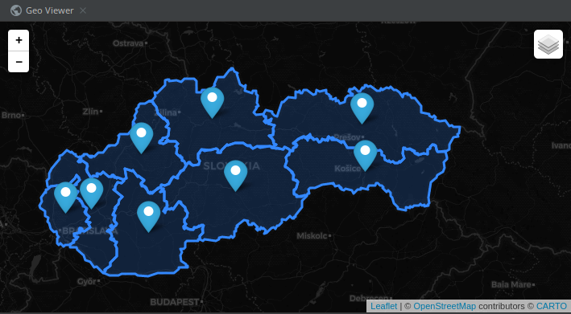
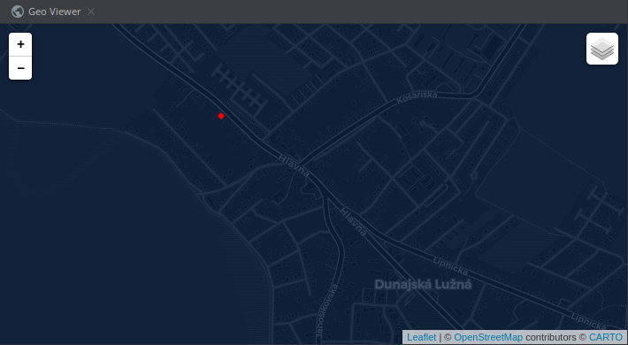
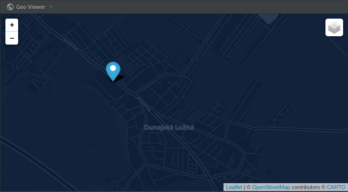
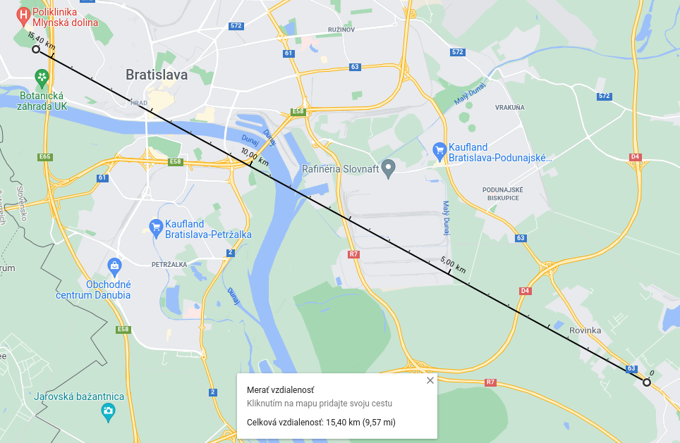
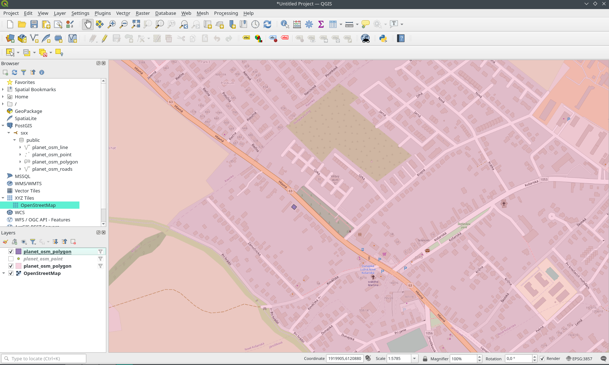
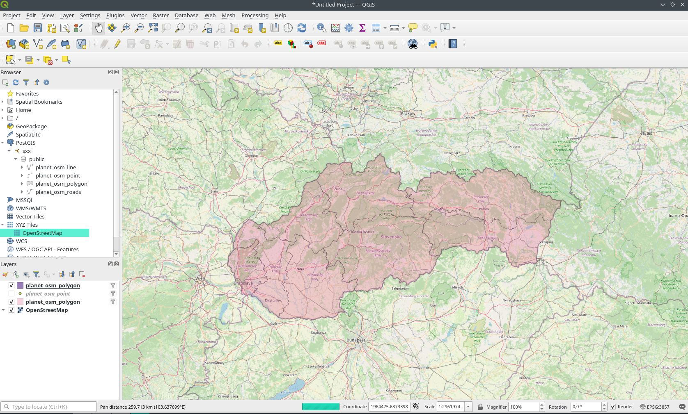

#uloha 1
```
osmconvert slovakia.osm.pbf > sk.osm
osm2pgsql -s -G -U postgres -H 172.24.0.2 -d gis -W sk.osm 
```
#uloha 2
hadam myslite tieto suradnice, neviem ci je ktomu co povedat, `st_centroid` na ziskanie stredu a `st_x/y` na suradnicu

```
select name, st_x(st_centroid(st_transform(way, 4326))), st_y(st_centroid(st_transform(way, 4326))) from planet_osm_polygon where admin_level = '4';
```
| name | st\_y | st\_x |
| :--- | :--- | :--- |
| Žilinský kraj | 49.17752905768327 | 19.177321920857167 |
| Prešovský kraj | 49.12365172843566 | 21.224595461701075 |
| Košický kraj | 48.697384329067646 | 21.266256940241764 |
| Banskobystrický kraj | 48.51572816850651 | 19.50392492773534 |
| Trenčiansky kraj | 48.858495744243044 | 18.213384781976906 |
| Bratislavský kraj | 48.31741208363053 | 17.17906589756936 |
| Trnavský kraj | 48.35301464227907 | 17.534836530917197 |
| Nitriansky kraj | 48.142012225316684 | 18.310838647219338 |


#uloha 3
st_area pocita velkost `geography` plochy v 4326 v m^2 

```
select name,st_area(st_transform(way, 4326)::geography)/1000000 as area from planet_osm_polygon where admin_level = '4' order by area ;
```
| name | area |
| :--- | :--- |
| Bratislavský kraj | 2051.6740527689435 |
| Trnavský kraj | 4145.341158350747 |
| Trenčiansky kraj | 4501.797074561215 |
| Nitriansky kraj | 6341.249779583049 |
| Košický kraj | 6751.927549426961 |
| Žilinský kraj | 6806.9151049478 |
| Prešovský kraj | 8971.630508024544 |
| Banskobystrický kraj | 9454.543435236425 |

#uloha 4
pridanie nieje potrebne kedze sa tam uz nachadza
```
select 'Dom' as name,st_transform(way, 4326) from planet_osm_polygon where osm_id = 63143006 ;
```
| name | st\_transform |
| :--- | :--- |
| Dom | 0103000020E61000000100000005000000A1F48590F34031405389E22C360B4840FDB0941BFB403140C017FB0E340B48403AD0F9DF0041314043AD1665360B48400F98874CF940314070E3C379380B4840A1F48590F34031405389E22C360B4840 |



#uloha 5
hladame intersect polygonov
```
select kraj.name
from (select st_transform(way, 4326) as way from planet_osm_polygon where osm_id = 63143006) as dom,
     (select st_transform(way, 4326) as way, name from planet_osm_polygon where admin_level = '4') as kraj
where ST_INTERSECTS(dom.way, kraj.way);
```
| name |
| :--- |
| Bratislavský kraj |

#uloha 6
vlozime bod, `ST_SetSRID` ucri sur. sustavu, `st_transform` transformuje  

```
INSERT INTO planet_osm_point(way, name)
VALUES (st_transform(ST_SetSRID(st_makepoint('17.25376', '48.08760'), 4326), 3857), 'my loc');
```
```
select st_transform(way, 4326)
from planet_osm_point
where name = 'my loc';
```

#uloha 7
`st_within` nam povie ci geo 1. je uplne v geo 2.
```
select st_within(poloha.way, dom.way)
from (select st_transform(way, 4326) as way from planet_osm_polygon where osm_id = 63143006) as dom,
     (select st_transform(way, 4326) as way from planet_osm_point where name = 'my loc') as poloha;
```
| st\_within |
| :--- |
| true |

#uloha 8
```
select ST_Distance(fiit.way::geography, poloha.way::geography) / 1000 as distance
from 
    (select st_centroid(st_transform(way, 4326)) as way
    from planet_osm_polygon
    where name = 'Fakulta informatiky a informačných technológií STU') as fiit,
    
    (select st_transform(way, 4326) as way 
    from planet_osm_point where name = 'my loc') as poloha;
```
v km

| distance |
| :--- |
| 15.42634150946 |


#uloha 9


#uloha 10
#uloha 11
#uloha 12
#uloha 13
#uloha 14


